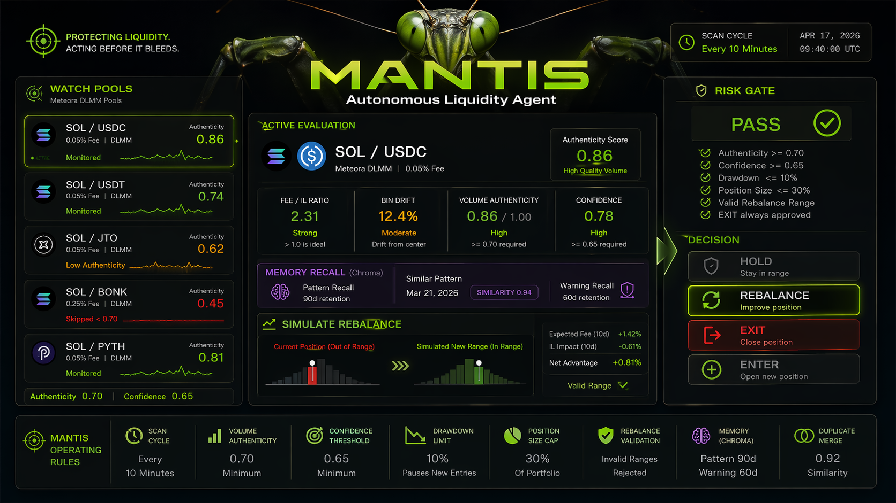
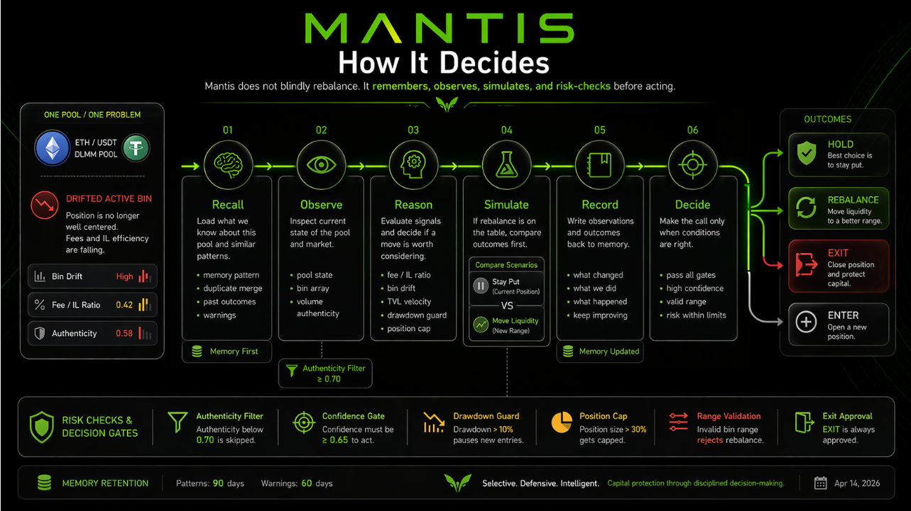

# Mantis


An autonomous liquidity agent that watches Meteora DLMM pools, reasons over live on-chain data, and rebalances positions before they bleed.

## Live Liquidity Board



Live operating view for Mantis: watched DLMM pools, fee/IL ratio, bin drift, volume authenticity, risk gates, and the agent's current HOLD, REBALANCE, EXIT, or ENTER decision.

## Decision Flow



How Mantis decides: recall pool memory, observe on-chain state, reason over fee and impermanent-loss pressure, simulate the rebalance, record the outcome, and pass the final action through risk gates.

---

## The problem

Concentrated liquidity earns fees only when the active price bin sits inside your range. When the market drifts — and it always does — your position silently collects impermanent loss instead. Most LPs either don't notice or react too late.

`mantis` fixes this with a Claude-powered agent that runs every 10 minutes, checks every pool in your watchlist, and either holds, shifts the range, or pulls liquidity entirely.

---

## How it thinks

Every cycle, the agent goes through the same sequence:

```
1. recall     → query memory for past patterns on this pool
2. observe    → fetch pool state, bin array, volume authenticity
3. reason     → compute fee/IL ratio, bin drift, TVL velocity
4. simulate   → if REBALANCE, estimate IL cost before committing
5. record     → write new observations back to memory
6. decide     → HOLD | REBALANCE | EXIT | ENTER
```

The decision is intercepted by a risk gate before anything happens on-chain. Confidence below threshold, drawdown above limit, or a position cap breach — any of these blocks execution and logs a warning to memory so future cycles are aware.

---

## Memory

The agent remembers. Every outcome — fee earned, IL incurred, bad pool flagged — gets stored in a Chroma vector database and retrieved by cosine similarity on the next relevant cycle. Entries expire automatically (90 days for patterns, 60 for warnings). Near-duplicate memories merge instead of pile up.

This is what makes it self-improving: it gets slower to enter pools it's been burned by before, and faster to recognize patterns it's profited from.

---

## Volume authenticity

Before any decision, the agent scores each pool's volume on a 0–1 scale. Volume/TVL ratio above 10x, fee rate outside the 0.02%–2% band, or low TVL with outsized volume all push the score down. Pools below 0.70 are skipped entirely. This alone filters most of the wash-traded noise on DLMM.

---

## Quickstart

```bash
git clone https://github.com/DeltaLogicLabs/mantis
cd mantis
bun install
bun run setup            # interactive .env wizard
docker-compose up -d     # starts Chroma
bun run dev              # paper trading by default
```

To run the historical simulation:

```bash
bun run backtest
```

---

## Configuration

Key `.env` variables:

| Variable | Default | Description |
|----------|---------|-------------|
| `WATCHLIST_POOLS` | — | Comma-separated pool addresses |
| `PAPER_TRADING` | `true` | Disable to execute on-chain |
| `MIN_POOL_TVL_USD` | `50000` | Skip pools below this TVL |
| `MIN_FEE_IL_RATIO` | `1.2` | Minimum fee/IL ratio to hold |
| `VOLUME_AUTH_THRESHOLD` | `0.70` | Skip pools below this authenticity score |
| `SCAN_INTERVAL_MS` | `600000` | Scan frequency (default 10 min) |
| `CONFIDENCE_THRESHOLD` | `0.65` | Minimum agent confidence to act |

---

## Risk gates

Decisions pass through six checks in order before any on-chain action:

1. Confidence below `CONFIDENCE_THRESHOLD` → reject
2. Max concurrent positions reached → reject ENTER
3. Portfolio drawdown > 10% → pause new entries
4. Position size > 30% of portfolio → cap and allow
5. Invalid bin range (inverted or > 100 bins wide) → reject REBALANCE
6. EXIT → always approved, no conditions

---

## Technical Spec

### IL Estimation — DLMM Bin Step Math

The fee/IL ratio uses the actual bin step to convert drift distance into a price ratio, then applies the standard CPMM IL formula:

```
priceRatio r = (1 + binStep/10_000)^binsDrifted
IL fraction  = 2√r / (1 + r) − 1
```

Prior approach multiplied drift ratio by a flat 0.2% coefficient, which underestimated IL on high-step pools (binStep 25+) and overestimated on tight-step pairs (binStep 1). The `binStep` value is read directly from `lbPair.binStep` via the `@meteora-ag/dlmm` SDK and passed through to the strategy.

### Bin Utilization Filter

`MIN_BIN_UTILIZATION` (default 0.30) blocks pools where fewer than 30% of fetched bins have non-zero reserves. One-sided pools where liquidity has clustered into a narrow band violate the distribution assumption used in the IL model. The check runs in `passesPreFilter` before any API call or agent invocation.

### Memory Merge Threshold

ChromaDB returns **cosine distance** (0 = identical, 2 = maximally dissimilar). The merge guard checks `distance < 1 − SIMILARITY_MERGE_THRESHOLD`. The threshold is set to 0.92, meaning `distance < 0.08` — near-duplicate observations only. Prior value of 0.70 was being used as if it were distance (wrong direction), merging entries with similarity as low as 30%.

### Recency-Weighted Memory Retrieval

`getRelevantContext` blends cosine similarity with a recency score:

```typescript
const recencyScore = Math.exp(-age / RECENCY_HALFLIFE_MS); // 30-day half-life
blended = simScore * 0.7 + recencyScore * 0.3
```

A 90-day-old warning scores 0.05 on the recency term vs 0.33 for a 30-day-old entry at identical cosine similarity — recent signals take precedence without discarding older ones entirely.

### Risk Gate Checks (in order)

1. Confidence below `CONFIDENCE_THRESHOLD` → reject
2. Max concurrent positions reached → reject ENTER
3. **Duplicate pool guard** → reject ENTER if same pool already held (use REBALANCE instead)
4. Portfolio drawdown > 10% → pause new entries
5. Position size > 30% of portfolio → cap and allow
6. Rebalance range > `MAX_REBALANCE_RANGE_BINS` → reject REBALANCE
7. EXIT → always approved

---

## Stack

- **Runtime**: Bun 1.2
- **Agent**: Claude Agent SDK (`stop_reason === "tool_use"` loop)
- **Memory**: ChromaDB, cosine distance merge threshold 0.08, 30-day recency decay
- **On-chain**: `@meteora-ag/dlmm` SDK, Helius RPC, Meteora REST API
- **Config**: Zod schema validation, hard exit on invalid env

---

## License

  ▎ MIT. Use it however you want.

