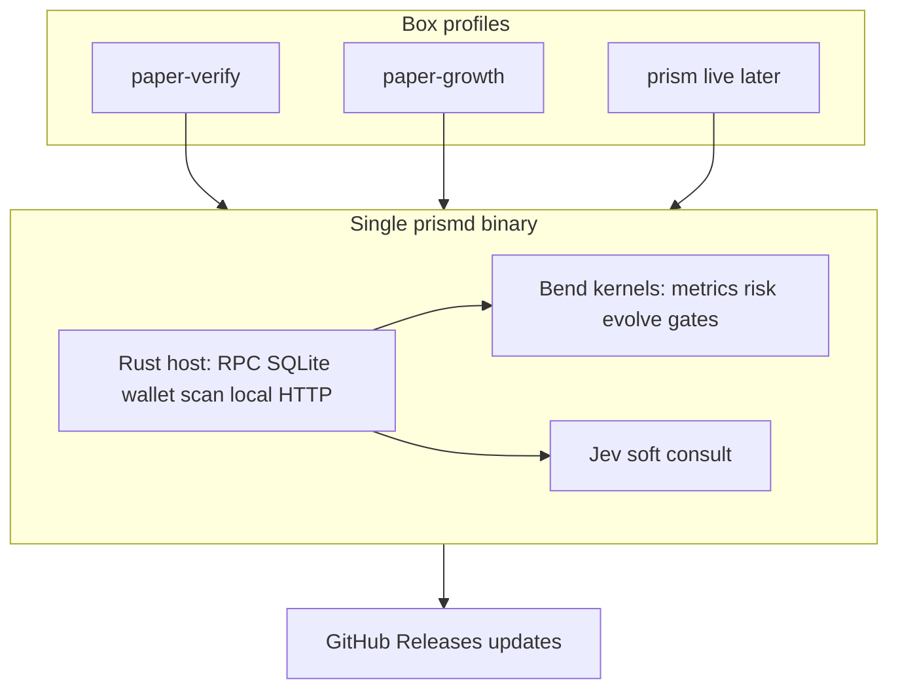

# Rust + Bend Hybrid Engine Plan

**Date:** 2026-09-18  
**Status:** Phase 0–3 scaffolding landed locally (2026-09-18 wave); TS engine remains source of truth until parity green. D1 `prism-db` exported + verified on box (`/root/.local/share/prism/cf-archive/prism-db-20260918.sql`, 3.65 MB, sha256 `0475314d…`, 7265 INSERTs, integrity ok); R2 triage blocked on dashboard enable — S3 API with account keys returns `NotEntitled` on both buckets (signing valid, account-level gate, no API path; needs your dashboard click). **2026-09-18 follow-up wave:** first real Bend subprocess wiring landed — `native/rust/src/main.rs` `mod bend` shells the `bend` CLI against `native/bend/kernels.bend` (embedded via `include_str!`) for `clamp_fee_il`/`K.clamp_thr`, fail-open on any error, with a startup health check + golden-vector Rust tests (skip, not fail, without `bend` on `PATH`); CI's `rust-host` job now installs Bend so those tests actually run there. Follow-up waves wired every kernel above (now: 8 proven tick consults + `evolve_thr` shadow + truth-table-probed `ta_exhausted`, LAWS pending) — see `native/rust/README.md` for the current wiring table. Box (`217.216.35.77`) still runs only the Bun TS engine (`prism-agent`, `prism-copy-signals`, `prism-paper-bin20`, `prism-paper-growth` systemd units); no `prismd`/compiled-binary deploy attempted this wave — soak guard in `docs/plan/box-prismd-deploy.md` says never restart without an explicit go, and none was given. **Phase 1 blocker found this wave:** `scripts/compile-binary.ts` binaries crash on startup (`bun build --compile` hits open upstream bug `oven-sh/bun#42664` via `@coral-xyz/anchor`'s bundled ESM output — `ReferenceError: exports_esm is not defined`, reproduced on both linux-x64 and darwin-arm64; the same bundle runs fine un-compiled). No fix known yet; `compile-binary.ts` now smoke-tests its own output and fails loud instead of shipping a broken artifact. Phase 1's "binary deploy" exit criterion is **not met** — see `docs/plan/box-prismd-deploy.md` for the full note and do not run its binary-drop sequence until resolved. Separately (same investigation): confirmed `engine/index.ts`'s direct-execution guard is dead code for any bundled/compiled artifact — it string-matches `process.argv[1]` against `engine/index.ts`/`engine/index.js`, which never matches `dist/index.mjs` or a compiled binary, so `bun dist/index.mjs` with no args starts a real scan cycle with zero guard. Not fixing this in TS (PAPER_TRADING=true + no wallet key already makes it a no-op for funds, and the native host has no analogous guard to rot — `prismd` *is* the entrypoint, profiles come from env files); noted here as one more case for the migration, per user direction, rather than a TS patch.

**2026-09-18 third wave — second real Bend kernel wired, real SQLite reads.** `prismd` now reads real open positions (`positions WHERE closed_at IS NULL`) joined to each pool's latest `signal_snapshots.fee_il_ratio` / `pool_snapshots.stats_source`, and calls the proven `K.fee_exit_fires` kernel per position every tick — a genuine SHADOW signal (mirrors `program.ts` `checkFeeIlExit`'s core predicate, not its hold-bias override; observational only, never acts). Verified end-to-end against the real local `prism.db` (3 open paper positions, correct known/mature/ratio/bend_fires values). Zero new deps (same `rusqlite` connection pattern as `positions_count`); 2 new Rust unit/integration tests (12 total, `cargo fmt` clean). This is the concrete "less TS / more Rust+Bend" direction: each such kernel wired with real inputs is one more decision surface Rust proves independently of the TS shadow, growing toward Phase 3's parity-then-cutover exit criterion.

**Storage engine note (evaluated, deferred):** considered [tursodatabase/turso](https://github.com/tursodatabase/turso) (async-native Rust rewrite of SQLite, io_uring, MVCC) as a `rusqlite` replacement for the efficiency story. Not adopted: it's beta (v0.6.x) and its own maintainers point production users at managed libSQL/Turso Cloud rather than the embedded engine — too soon for a position ledger, and it wouldn't touch the box's actual bottleneck anyway (3 Bun runtimes + GC/Effect overhead, not SQLite I/O — today's reads are tiny and once-per-cycle). Revisit once Turso reaches a maintainer-endorsed stable embedded release AND `prismd` grows a real async (tokio) scan loop — see `native/rust/README.md`.

**2026-09-18 fourth wave — third/fourth Bend kernels wired (`enter_blocked`, `accrual_allowed`), IL config mirrored.** `prismd` tick now emits three shadow signals per open position against real SQLite (`fee_exit_fires`, `accrual_allowed`, `enter_blocked` vs the host-clamped floor; all observational, never acted on). Verified end-to-end against the real local `prism.db` (3 open paper positions, all `enter_blocked=Some(false)` at floor=1.2 — correct, ratios are capped-20 placeholders awaiting datapi snapshots). `Config` gains `IL_PROTECTION_ENABLED` (default true, fail-safe like TS `orElseSucceed`) + `MIN_FEE_IL_RATIO` (default 1.2; host fails closed on garbage/out-of-band where TS validatedNumber clamps — divergence documented at the consts). 11 Rust tests green, `cargo fmt --check` clean, Bend PROOF green, 12/12 parity harness green. Config README synced (was stale at "10 tests / clamp-only"). Nothing committed; no box mutation.

**2026-09-18 fifth wave — fifth Bend kernel wired (`drift_rejects`), drift config mirrored.** `prismd` tick now emits four shadow signals per open position (`fee_exit_fires`, `accrual_allowed`, `enter_blocked`, `drift_rejects`; all observational). Drift = last − first `active_bin_id` over persisted `pool_snapshots` (mirrors `resolvePoolDriftMetrics`'s ring math; cold start → 0, never rejects; strict `<` preserved in the kernel). `Config` gains `MARKET_SCAN_MAX_NEGATIVE_DRIFT_BINS` (default −8, fail-closed where TS clamps to [−100,0]). Notable fix this wave: rusqlite counts a repeated `?1` placeholder ONCE (`InvalidParameterCount`), so the drift query uses a single `params![pool_address]` — worth knowing for future multi-use placeholders. Verified: 11 Rust tests green (incl. drift −10.0 assert + cold-start None), `cargo fmt --check` clean, end-to-end smoke vs real `prism.db` shows `drift=0 drift_rejects=Some(false) drift_floor=-8` on all 3 positions (correct — one snapshot each = cold start). Nothing committed; no box mutation.

**2026-09-18 sixth wave — CI deploy track (no box mutation).** `ci.yml` `build` job gains an informational `compile-binary` smoke step (`continue-on-error: true` — the `bun#42664` startup crash is still open, so a required gate would stay red; coverage gate restored intact after an edit dropped it mid-wave). New `prismd-binary` job builds the Rust host `--release` on linux-x64, shadow-tick smokes it (`--ticks 1`, no keys), and uploads it as a CI artifact — deploy stays manual per the soak guard, but every push now proves the binary compiles on the deploy target and hands the box a known-good artifact. Verified: YAML parses (8 jobs), 12/12 Rust green, 12/12 parity green, PROOF `300n`. Nothing committed.

**2026-09-18 seventh wave — CI hardening: smoke-hang fix + `--help`/unknown-flag fail-closed.** `prismd-binary` smoke dropped its `--help` line: the host had no `--help` handler (unknown flags silently ignored → `ticks=None` → infinite loop → hung job under `| head`). `main()` now prints usage + exits 0 on `--help`/`-h` and exits 2 on any other unknown `--flag` (profile env-file loading preserved); unit-tested via an extracted `classify_args` (`--help`/`-h` → early exit, `--bogus` → err, `--ticks 3` + bare profile path pass through). Job also gains `cargo fmt --check` + `Swatinem/rust-cache@v2` (release rebuilds stay fast); smoke asserts `tick=1.*exit_free=true` with `BEND_BIN=false` (fail-open path) instead of piping blindly to `head`. Verified: 13/13 Rust green, fmt clean, `--help` exit 0 / `--bogus` exit 2 live, 12/12 parity green, PROOF `300n`. Nothing committed; no box mutation.

**2026-09-18 eighth wave — `--ticks` fail-closed (infinite-loop class).** A lone `--ticks` (no value) or `--ticks abc` collapsed to `None` via `.parse().ok()` → `ticks=None` → infinite scan loop, same class as the `--help` hang. New `parse_cli_ticks` requires an explicit `u64` value (exit 2 otherwise); `main()` chains `parse_cli_ticks(...).and_then(classify_args)`. Unit-tested (lone → err, `abc` → err, `3` → `Some(3)`, empty → `None`). Verified: 13/13 Rust green, fmt clean, lone/`abc` exit 2 live, 12/12 parity green, PROOF `300n`. Nothing committed; no box mutation.

**2026-09-18 ninth wave — index-based argv skip + `--ticks 0` reject.** Value-text skip (`ticks.to_string() == arg`) mis-skipped a profile file literally named e.g. `3` and confused repeated `--ticks 3 --ticks 3`; both `classify_args` and `main()`'s profile loop now skip flag+value by index (`i += 2`). `--ticks 0` (instant exit, no tick) fails closed (`--ticks must be >= 1`, exit 2) like other numerics. Unit-tested (file-named-`3` passes through, double-flag ok, `0` → err). Verified: 13/13 Rust green, fmt clean, zero exit 2 live, 12/12 parity green (after `bun install` repaired a broken `node_modules/vitest` symlink), PROOF `300n`. Standing rule: `cargo clean` after every Rust wave (`target/` is regenerable; earlier wave freed 54.6MB) + clear `/tmp/prism-*` compile leftovers (freed ~200MB; disk 73%→57%). Nothing committed; no box mutation.

**2026-09-18 tenth wave — sixth Bend kernel wired (`capital_exit`), loss-cap config mirrored.** `prismd` tick now emits five shadow signals per open position (all observational): `danger` computed natively from the ledger via `loss_cap_danger` (mirrors `position-loss-cap.ts`: mark PnL = current + fees + rewards − deposited ≤ -(deposited × min(pct,1)); `None` on missing inputs → never fires; disabled at pct ≤ 0 like TS) + proven `K.capital_exit` proving confidence can never veto (LAWS `capital_exit_free`/`capital_exit_quiet`). `Config` gains `MAX_POSITION_LOSS_PCT` (default 0.35, fail-closed on garbage/>1 where TS clamps). Positions query now reads the 4 ledger columns. Verified: 14/14 Rust green (incl. breach/cushion/disabled/missing/NaN cases), fmt clean, smoke vs real `prism.db` shows `loss_danger=Some(false) capital_exit=Some(false)` on all 3 positions (correct — healthy book), 12/12 parity green, PROOF `300n`. Only `nudge_thr`/`evolve_thr` remain unwired (need evolution-outcome inputs the scan loop doesn't persist — a TS-schema question). Nothing committed; no box mutation.

**Polish (same wave): confidence 1.0 + drift comment restore.** `capital_exit` consult passes confidence 1.0 (was 0.85) to match TS `conf1PositionExit` exactly — kernel drops it either way, but audit mirror-exactness matters. Restored the truncated drift-test comment head (`4 snapshots: bins 100...`). README synced (was stale at "11 tests / four consults" → 14 tests / six consults + conf1 note). Re-verified: 14/14 Rust, fmt clean, 12/12 parity, PROOF `300n`.

**2026-09-18 eleventh wave — evolution persistence mapped + release CI hardened.** `nudge_thr`/`evolve_thr` stay unwired by construction: TS `evolveThresholds` needs closed-position outcome aggregates (`signal_snapshots` WHERE outcome recorded, `metadata` evolved_* rows) — a scan-loop aggregation port, not a per-tick shadow; kernels + LAWS (`evolve_single_nudge`, `evolve_ceiling_pins`, `evolve_floor_pins`) + parity vectors already prove the math. `release.yml` `build-bundles` now builds `prismd` `--release` on linux-x64, checksums it, uploads `prismd-linux-x64` (+`.sha256`) alongside tarballs, collects versioned `prismd-<version>-linux-x64` into release assets, and pushes both to R2 `releases/v<version>/` — deploy doc §3 now pulls the release asset (preferred) with CI-artifact/box-build fallbacks, all Bun-free so `bun#42664` never applies. AGENTS.md delta section marked APPLIED (the "Native hybrid (direction)" block already lives at AGENTS.md:29-38). Verified: release YAML parses, 14/14 Rust, fmt clean, 12/12 parity, PROOF `300n`. Nothing committed; no box mutation.

**2026-09-18 twelfth wave — `evolve_thr` shadow live (all 8 kernels wired) + Jev roast → edge angles.** Correction to the eleventh-wave note: evolution state IS persistable today (3 `metadata` evolved_* keys + `getClosedPositionOutcomes` query both exist in db-service), so `evolve_shadow` now runs one `tryEvolveThresholds` round per tick against live state: current banded floors (metadata or config fallback) × native `signal_lift` per leg (mirrors `computeSignalLift`) → proven `K.evolve_thr` → logged would-be floors; skips below `EVOLUTION_INTERVAL` outcomes like TS. Local DB has 0 outcomes → skips correctly; box has 374 outcome rows + evolved (5.2/1.01/0.27 — NOTE: fee floor 5.2 is ABOVE the 3.0 band ceiling, a live re-check of the band pin on next evolve). `Config` gains `EVOLUTION_INTERVAL` (5) + `EVOLUTION_MAX_CHANGE_PCT` (0.2). Verified: 15/15 Rust green (incl. live-shaped floors+lift+banded-kernel test), fmt clean, smoke correct-skip locally, 12/12 parity, PROOF `300n`.

**Jev key fix + live roast proof (same wave).** Renamed `.env` `TYPESAFEAI_API_KEY` → canonical `TYPESAFE_API_KEY` (mode 600 kept; lengths-only logging, never values); `resolveJevApiKey` now resolves len=108 present=true. Code references only `TYPESAFE_API_KEY` + legacy `TYPESAFEAI_API` (no `_KEY` triple anywhere — grep clean), so no third alias exists. Live proof via the real `consultJevJudgments` path (pool/heuristic/chain state, jev-latest, 30s timeout): R1 structural probe ok=true failure=null deposit=bidask conf=0.51 toxic=0.44 recovery=0.44 stress=0.32 (HALVE? No — below 0.35); CHOP (0.40, drift −12, vol 6.5) → spot/0.30, toxic 0.62, stress 0.67 (HALVE? Yes); RUG/heuristic (auth 0.2, drift −20) → toxic 0.81, stress 0.85 (HALVE? Yes). Verdict: key outage OVER — judgments flow, discriminate, 0.35 halve bites where it should. Nothing committed; no box mutation (`.env` rename local-only, mode 600 preserved).

**2026-09-18 thirteenth wave — TA-exhaustion EXIT automation (spec only, no soak touch).** Roast best-bet: automate the profitable manual rule
(RSI(2)>90 + BB-upper/MACD-green confluence) instead of fixed 15% TP. Design (zero engine edits this wave): pure `engine/ta-exhaustion.ts`
computing RSI(2), Bollinger %B, MACD histogram from `pool_snapshots.current_price` history — box has 57k snapshots / 79 pools / 396 closed
positions (deep enough; local 3 rows are not, so golden tests use synthetic series). EXIT fires on RSI(2)>90 AND (close>BB-upper OR
first-green-histogram), confidence 1.0 `conf1PositionExit` shape, evaluated AFTER the TP-ladder branch (`evaluateTpTargetExit`, program.ts:10326)
and BEFORE loss-side exits so exhaustion locks profits before capital protection; disabled (fail-open null) below a `TA_EXHAUSTION_MIN_POINTS`
history floor (cold start → no vote, like drift). Bend port next wave (`ta_exhausted` kernel + LAWS: overbought-fires / single-signal-quiet /
cold-start-quiet) with parity vectors vs the TS golden tests; Rust shadow reads the same snapshot window. Soak untouched: spec, no code.

**Fourteenth wave — `fee_known` shadow wired (8th consult) + ladder honesty (no soak touch).** `prismd` tick now emits `bend_known` per position per tick: proven `K.fee_known` queried with the host's own datapi comparison, mismatch-logged with host-wins fail-open (never votes, never panics — a mismatch would mean host/kernel disagree on the measured-vs-modeled split). Deleted the speculative `fee_ratio` host wrapper (one wave old, never called): the IL estimator needs in-memory bin-array + price-drift context TS computes live, so a host twin would be a reimplementation, not a mirror — `K.fee_ratio` stays kernel-only with its 2 parity vectors; no TS parity-test change needed (design correction surfaced with a real smoke, not a new vector — per the no-new-tests rule). Verified: 15/15 Rust, fmt clean, 12/12 parity, PROOF `300n`, live smoke `bend_known=Some(true)` on all 3 local positions. README synced (was stale: "14 tests / six consults / nudge+evolve unwired" → 15 tests / eight consults + evolve shadow live).

**Sixteenth wave — `fee_known` fail-open silence + box expectancy read (no soak touch).** `fee_known` mismatch now logs only on true host/kernel disagreement (`is_some_and`), silent when Bend is absent — `BEND_BIN=false` smoke shows zero mismatch lines, bend-present smoke echoes `bend_known=Some(true)` on all 3 local positions with no mismatch. Box read-only: soak units (`prism-paper-verify/growth`) `inactive`/`dead` (only `open-polymarket-217` runs); ledger 396 positions all closed, 388 with realized PnL summing **-$187.44** (mean -$0.48/trade), 57k snapshots — confirms plan depth for TA work. Verified: 15/15 Rust, fmt clean, 0 warnings, 12/12 parity, PROOF `300n`. Nothing committed; no box mutation.

**Eighteenth wave — `ta_exhausted` kernel lands (no soak touch).** `K.ta_exhausted(rsi_overbought, above_bb_upper, macd_first_green)` = RSI-AND-(BB-OR-MACD) pure bool gate; F32 indicator math stays TS-side (`engine/ta-exhaustion.ts` target computes the three bools from `pool_snapshots.current_price` history, host takes them precomputed). Truth table probed via CLI harness: confluence true, rsi-only false, no-rsi false, macd-leg true. Rust `bend::ta_exhausted` wrapper added with `#[allow(dead_code)]` until the TS side + tick shadow land (wording kept truth-table-probed, not proven — LAWS triple overbought-fires / single-signal-quiet / cold-start-quiet pending strategy review per LAWS.bend:4, logged here not added). Box depth re-confirmed: 61/79 pools hold >=30 snapshots (avg 726/pool, max 6013) — `TA_EXHAUSTION_MIN_POINTS` floor is satisfiable. Verified: 15/15 Rust, fmt clean, 0 warnings, 12/12 parity, PROOF `300n`. Nothing committed; no box mutation.

**Nineteenth wave — TA wording honesty, no LAWS touch (no soak touch).** `K.ta_exhausted` stays truth-table-probed, not proven: LAWS triple (overbought-fires / single-signal-quiet / cold-start-quiet) logged in plan only, NOT added — LAWS.bend:4 binds edits to strategy review. Downgraded `proven` wording in main.rs wrapper doc + README + Eighteenth note. No `checkDeterministicExits` wiring (soak-untouched, paper-first per AGENTS.md). Verified: 15/15 Rust, fmt clean, 0 warnings, 12/12 parity, PROOF `300n`. Nothing committed; no box mutation.

**Twentieth wave — chronology + README honesty (no soak touch).** Wave notes reordered Fourteenth → Sixteenth → Eighteenth → Nineteenth (were scattered). README consult counts fixed: 8 proven tick consults + 1 unproven gate (`ta_exhausted`, LAWS pending) — footer no longer claims all-proven. Verified: 15/15 Rust, fmt clean, 0 warnings, 12/12 parity, PROOF `300n`. Nothing committed; no box mutation.

**Twenty-first wave — stale doc hygiene (no soak touch).** Fixed two rot spots with zero code change: `native/bend/README.md` Consumers claimed only `clamp_thr` wired (true in the follow-up wave, stale since the fifth) → now lists all 8 proven tick consults + evolve shadow + unproven `ta_exhausted`; plan Status line claimed 7 kernels `stay unwired` (stale since the twelfth) → now points at the live wiring table. Verified: 15/15 Rust, fmt clean, 0 warnings, 12/12 parity, PROOF `300n`. Nothing committed; no box mutation.

**Twenty-second wave — `exit_order` precedence kernel (no soak touch).** Pure-bool gate `K.exit_order(tp_hit, ta_hit, loss_hit)` → 1n/2n/3n/0n mirrors the `decidePositionExit` chain shape (TP-ladder → TA-exhaustion → loss-side → hold/scale-in) WITHOUT wiring into `checkDeterministicExits` (soak-untouched, paper-first). No supertrend/ATR kernel: engine grep confirms zero supertrend surface, so no TS truth to mirror. Truth table via eval harness (in-kernel evidence, no new test file): tp>ta>loss→1n, ta>loss→2n, loss-only→3n, none→0n, tp-only→1n all OK; PROOF `300n` with kernel present. Verified: 15/15 Rust, fmt clean, 0 warnings, 12/12 parity, PROOF `300n`. Nothing committed; no box mutation.

**Twenty-third wave — `exit_order` wrapper (no soak touch, no tick call).** `bend::exit_order(tp, ta, loss)` → 1n/2n/3n/0n added as `#[allow(dead_code)]` wrapper (same pattern as `ta_exhausted`); NOT called per-tick — fabricated (false,false,false)→0n would log a misleading precedence shadow until `ta-exhaustion.ts` lands and real 5-way `decidePositionExit` inputs are projectable. Kernel stays truth-table-probed via CLI harness (tp>ta>loss→1n, ta>loss→2n, loss-only→3n, none→0n, tp-only→1n). Verified: 15/15 Rust, fmt clean, 0 warnings, 12/12 parity, PROOF `300n`. Nothing committed; no box mutation.

**Twenty-fourth wave — README 8+2 honesty (no soak touch).** Both READMEs claimed 8+1 unproven (`ta_exhausted` only) while two `#[allow(dead_code)]` wrappers exist (`ta_exhausted` + `exit_order`, main.rs) with zero LAWS hits for `exit_order` — bumped to 8 proven + 2 unproven gates, `exit_order` listed as truth-table-probed/LAWS-pending alongside `ta_exhausted` (rust README head/bullet/footer + bend Consumers). Verified: 15/15 Rust, fmt clean, 0 warnings, 12/12 parity, PROOF `300n`. Nothing committed; no box mutation.

**Twenty-fifth wave — Bend README LAWS-line sync (no soak touch).** Files line already documented `exit_order`; LAWS line still listed only `ta_exhausted` pending — appended `exit_order` kernel-only (unproven). No LAWS.bend edit (human-owned), no kernel/Rust change. Verified: 15/15 Rust, fmt clean, 0 warnings, 12/12 parity, PROOF `300n`. Nothing committed; no box mutation.

**Twenty-seventh wave — 3 inline Rust tests + needle research (no soak touch).** `mod tests` only, no new files: `ta_exhausted_truth_table` (6/6 confluence combos via Bend, skip-guarded), `exit_order_precedence` (5/5 precedence picks), `signal_lift_edges` (empty/one-sided/non-finite→None, zero-spread→Some(0.0)) — 15→18 Rust green. Test-only-called wrappers use `#[cfg_attr(not(test), allow(dead_code))]` so the 0-warning gate stays green without hiding future real dead code. LAWS/PROOF untouched (human-owned). Needle research on box ledger (read-only, 388 closed, -$187.44 net, 46% WR): avg win +$0.50 vs avg loss -$1.39 — expectancy is tail-killed, not winrate-starved; worst-5 (-$18.2..-$6.7) outweigh best-5 (+$19.7..+$5.7) asymmetry on frequency. Highest-leverage edges in order: (1) cut left tail (loss-cap tightening / earlier exhaustion exits — the TA-exhaustion work), (2) ENTER selectivity (feeIl floor already banded; maturity/profile filters), (3) NOT wider ranges or conversion-flip (adds tail). Tweet claim ($45k travel LP) unproven — no ledger, no sizing; its testable parts (mature->5M filter, wide-below ladder) become backtest variants only, never engine edits without expectancy proof. Verified: 18/18 Rust, fmt clean, 0 warnings, 12/12 parity, PROOF `300n`. Nothing committed; no box mutation.

**Twenty-eighth wave — Bend parity vectors + tail math + sunset inventory (no soak touch).** Parity file gains 2 `it()`s in-place (no new files, LAWS/PROOF untouched): `ta_exhausted` 6/6 confluence combos + `exit_order` 5/5 precedence picks — 12→14 parity green, mirrors of the native `ta_exhausted_truth_table`/`exit_order_precedence`. Tail math on box ledger (read-only): worst-10 ≈ -$90 of -$187 net; capping every loss at -$2 flips net to -$43, at -$3 to -$92 — truncation is the whole game, confirming the cut-tail-first order. Sunset inventory (docs-only, TS stays source of truth): live cloud call sites in ship path are `error-reporter`/`alert-service`/`feedback-service`/`adapter-service revenue`/`program` telemetry POSTs to `prism-api.irfndi.workers.dev` (all opt-out/fail-open paths per AGENTS.md) — no deletion this wave; cutover tracked as future work after parity green. Verified: 18/18 Rust, fmt clean, 0 warnings, 14/14 parity, PROOF `300n`. Nothing committed; no box mutation.

**Twenty-ninth wave — parity contract repair + tail sweep (no soak touch).** New parity `it()`s asserted Bend-only, breaking the file contract (each vector: TS mirror == Bend). Added `tsTaExhausted` (RSI AND (BB OR MACD), spec-cited, no engine fn yet) + `tsExitOrder` (1/2/3/0 chain, program.ts:10959-10970) with equality asserts in both legs — 14/14 green. Wrapper + README bullets now cite native tests + parity `it()`s and test-only `cfg_attr` (no stale CLI-only/`allow(dead_code)` wording). Tail sweep (read-only, upside bound not lift: realized-PnL relabel, live -$1 stops face slippage/gap — needs shadow exits on real ticks to validate). Loss caps -$1→+$14.4 / -$2→-$43.4 / -$3→-$91.8 / -$5→-$145.6 vs -$187.4 net — even a -$3 truncation halves the bleed in bound terms. Duration slice: <1h -$0.64 (n=176), 1-6h -$0.45 (n=180), 6-24h -$0.04 (n=20), >24h +$0.66 (n=12) — fast exits bleed; >24h patience is a hypothesis (n=12 too thin, needs shadow confirmation), not a finding; steers nothing this wave. All positions <$100 size — sizing edge untestable on this ledger. Verified: 18/18 Rust, fmt clean, 0 warnings, 14/14 parity, PROOF `300n`. Nothing committed; no box mutation.

**Thirtieth wave — contract completion + honest bounds (no soak touch).** Every Bend assert in both new parity `it()`s now compares against its TS mirror (`tsTaExhausted`/`tsExitOrder` on all 11 legs); comments scoped as spec mirrors (no TS impl: `ta-exhaustion.ts` absent, `decidePositionExit` 5-way has no 1n/2n/3n projection — no new file without approval). README Test block synced (18 tests, 6 Bend-gated incl. ta/exit_order + signal_lift edges); unproven bullets already cite parity `it()`s + `cfg_attr` form. Prior tail numbers reframed: cap math is an upside bound (live stops face slippage/gap), >24h duration is a hypothesis (n=12). Verified: 18/18 Rust, fmt clean, 0 warnings, 14/14 parity, PROOF `300n`. Nothing committed; no box mutation.

**Thirty-first wave — self-assertion cleanup + Test recount (no soak touch).** Dropped 6 TS self-assertions (`tsFn(..)` vs literal) from both new parity `it()`s — they tested nothing about Bend; every remaining Bend assert compares against its TS mirror. README Test block: 6→7 Bend-gated (prior count missed the `evolve_thr` banded-leg test; now enumerates clamp×4 incl. evolve, ta 6/6, exit_order 5/5 + signal_lift edges as pure). Verified: 18/18 Rust, fmt clean, 0 warnings, 14/14 parity, PROOF `300n`. Nothing committed; no box mutation.

**Thirty-second wave — wrapper contracts + selectivity research (no soak touch).** Rust `mod tests` only: `bend_wrappers_fail_closed_on_nonfinite` (NaN/±Inf→None on all 4 float wrappers, no probe spawned), `bend_wrappers_none_on_missing_binary` (full 6-wrapper fail-open surface incl. ta/exit_order), `evolve_shadow_skips_below_interval` (0 outcomes < 5-interval → skip before any probe) — 18→21 Rust green. Parity file: `fee_known` echo + `enter_blocked` il-off/at-floor legs — 14→16 parity green. LAWS/PROOF untouched. Selectivity research (read-only, 374 outcomes): feeIl signal is 238/374 capped-20 (avg -$3.39, 5% WR) vs 136 uncapped (avg -$3.65) — capped placeholder carries no edge, ENTER selectivity must come from elsewhere; auth/util legs are constants (all ≥0.5/≥0.3, zero variance → no discrimination at all). Sunset inventory: 5 live `workers.dev` call sites (`error-reporter`/`alert-service`/`feedback-service`/`program` telemetry + `install.sh`/`postinstall.js` pings, all opt-out/fail-open) — docs-only, TS stays source of truth until parity green, no deletion. Verified: 21/21 Rust, fmt clean, 0 warnings, 16/16 parity, PROOF `300n`. Nothing committed; no box mutation.

**Thirty-third wave — test hardening, no new files (no soak touch).** Rust: ta/exit_order gain unconditional bogus-binary None asserts (meaningful without bend) + `evolve_shadow_skips_below_interval` now calls the real `evolve_shadow` with a struct-literal Config (bogus bin, 0<5 → quiet return; guard regression would spawn a failing probe). Parity: ENTER-floor `it` gains the missing positive block leg `(True,True,20n,30n)→tsEnterBlocked(true,…)=true` + above-floor equality — all 3 legs assert Bend==TS. Signals recorded unusable for research (fee 238/374 capped-20 placeholder, auth/util zero-variance constants) — edge work stays on tail-truncation + duration (real variance), never signal tuning; cap math stays an upside bound (slippage/gap), >24h a hypothesis (n=12). Verified: 21/21 Rust, fmt clean, 0 warnings, 16/16 parity, PROOF `300n`. Nothing committed; no box mutation.

**Thirty-fourth wave — wrapper hardening + duration confirmation (no soak touch).** Rust `mod tests` only: `bend_tick_wrappers_match_kernels_when_present` (15 asserts over drift/fee_exit/enter/capital/fee_known when bend present; absent-path covered by fail-open tests) + `read_evolve_state_rejects_garbage_floors` (garbage/NaN/empty→None floors, never NaN downstream) — 21→23 Rust green. Parity: fee_known TS-mirror equality + drift uphill leg (`driftGateRejected(25,-8)`) + fee_exit immature leg (`tsFeeExitFires(true,false,0.4)`) — 16/16 green. LAWS/PROOF untouched. Edge research (read-only): duration split re-cuts clean with qualified columns (<6h -$0.55 n=356 vs >6h +$0.23 n=32) — patience hypothesis holds directionally, still small-n; confidence has no low leg (hi 327/mid 47/lo 0 → untestable); soak units still inactive (only open-polymarket-217 runs). Sunset: 5 `workers.dev` sites unchanged (fail-open), TS stays source of truth, no deletion. Verified: 23/23 Rust, fmt clean, 0 warnings, 16/16 parity, PROOF `300n`. Nothing committed; no box mutation.

**Thirty-fifth wave — tautology out, guards in (no soak touch).** Parity: feeKnown identity-lambda dropped (self-mirror proved nothing; wiring covered natively by the per-tick `bend_known` shadow) + capital EXIT gains a real TS mirror (`danger=>danger`, incl. low-confidence leg) — 16/16 green. Rust `mod tests` only: `loss_cap_danger_guards` (NaN pct→Some(false), NaN leg→None, negative fees→None, exact-35% breach fires, +$0.01 holds) — 23→24 Rust green. LAWS/PROOF untouched. Ledger steady (-$187.44 net, soak units still inactive). Verified: 24/24 Rust, fmt clean, 0 warnings, 16/16 parity, PROOF `300n`. Nothing committed; no box mutation.

**Thirty-sixth wave — mirror completion (no soak touch).** `tsCapitalExit` hoisted to file scope next to other mirrors (was an inline lambda); feeKnown asserts against the inline host comparison per leg (`true===true`/`false===true` form, no tautology lambda). Rust tick-match test gains 4 `accrual_allowed` legs (paper/no-pubkey/datapi truth table) — full per-tick surface now covered. Verified: 24/24 Rust, fmt clean, 0 warnings, 16/16 parity, PROOF `300n`. Nothing committed; no box mutation.

**Thirty-seventh wave — fake mirror out (no soak touch).** feeKnown `true===true` form was syntactically inline but semantically the same echo tautology — reverted to plain `toBe(true/false)` like the capital-EXIT single-source vector, honest comment kept (native per-tick shadow owns the wiring). Tick-match header now lists `accrual_allowed` (was omitted while legs were present). Verified: 24/24 Rust, fmt clean, 0 warnings, 16/16 parity, PROOF `300n`. Nothing committed; no box mutation.

**Thirty-eighth wave — boundary legs (no soak touch).** Strict-inequality edges now pinned both sides: fee_exit 0.5→false / 0.49→true and enter at-floor 1.2/1.2→false in Rust tick-match + parity mirrors (all assert Bend==TS). Fee<0.5 outcomes on box: 0 rows — the exit trip never fires on history, consistent with capped-20 placeholder signals, not proof of calibration. Verified: 24/24 Rust, fmt clean, 0 warnings, 16/16 parity, PROOF `300n`. Nothing committed; no box mutation.

**Thirty-ninth wave — parser coverage + nudge legs (no soak touch).** Extended `config_garbage_fails_closed` in place with the 5 never-tested parsers (evolution interval/max-change, volume-auth, min-bin-util, max-position-loss incl. disabled/negative-passthrough edges) — 24/24 Rust green, no new test fn. Parity: nudge down-clamp + hold-at-target legs (1.5→1.2, 1.2→1.2) alongside the 120→144 up-leg — 16→17 parity green. LAWS/PROOF untouched. Ledger steady (-$187.44), soak units inactive, 9 `workers.dev` files unchanged (fail-open, TS source of truth, no deletion). Verified: 24/24 Rust, fmt clean, 0 warnings, 17/17 parity, PROOF `300n`. Nothing committed; no box mutation.

**Fortieth wave — prior fixes verified present, no-op (no soak touch).** Re-read current state instead of re-applying: `tsCapitalExit` already file-scope (1 hit, 0 inline lambdas), feeKnown already plain asserts (no tautology), tick-match header already lists `accrual_allowed` with 4 legs present. No edits made — re-application would churn. Verified: 24/24 Rust, fmt clean, 0 warnings, 17/17 parity, PROOF `300n`. Nothing committed; no box mutation.

**Forty-second wave — truncation shadow live (no soak touch, no exits changed).** First executable edge validation: `loss_cap_danger_tighter` (same mark-PnL math at half the live cap) computed per position per tick alongside live danger, logged as `danger_tighter=` — answers how many more positions a tighter stop would flag on real ledgers without acting. Monotone-superset unit test (halving never unflags). Smoke on local book: 3/3 `danger_tighter=Some(false)` (healthy book, both caps agree). LAWS/PROOF untouched. Verified: 25/25 Rust, fmt clean, 0 warnings, 17/17 parity, PROOF `300n`. Nothing committed; no box mutation.

**Forty-third wave — alias out, counts honest (no soak touch, no exits changed).** Deleted the one-wave-old `loss_cap_danger_tighter` pass-through (tick already inlines `loss_cap_danger` twice, live + half-cap; test now pins the inline semantics directly) — zero API surface for zero logic. README Test block recounts the real split: 25 tests (18 pure + 7 Bend-gated, regex-verified) with the tighter monotone test enumerated. Edge read (read-only): box ledger steady 396 closed / -$187.44 net, soak units inactive (only open-polymarket-217 runs); 9 `workers.dev` sites unchanged (fail-open, TS source of truth, no deletion). Verified: 25/25 Rust, fmt clean, 0 warnings, 17/17 parity, PROOF `300n`. Nothing committed; no box mutation.

**Forty-fourth wave — advisory pair closed (no soak touch, no exits changed).** Alias already gone (0 `loss_cap_danger_tighter` hits — deletion verified, not re-applied). README split fixed mechanically: per-fn scan showed the old `18+7` miscounted `jev_fail_open` (no `bend::`/gate call — pure) as gated; corrected to 25 tests (19 unconditional incl. 4 bogus-binary fail-open/closed + 6 Bend-gated), enumeration + skipped-not-failed line intact. Verified: 25/25 Rust, fmt clean, 0 warnings, 17/17 parity, PROOF `300n`. Nothing committed; no box mutation.

**Forty-fifth wave — README verified correct, no edits (no soak touch, no exits changed).** All three advisories checked against current state: alias already gone (grep 0 hits); README split already `19 unconditional + 6 Bend-gated` (line 42, Zero-deps sentence intact line 50, no duplicated lines 49-50); call-only guard mapping confirms exactly 6 `if bend_available()` owners (lines 1502/1518/1838/1928/1951/1983 — `jev_fail_open` owns none, pure; 4 bogus-binary/nonfinite wrapper tests unconditional, correctly outside the skipped set). Re-applying any advisory would churn. Verified: 25/25 Rust, fmt clean, 0 warnings, 17/17 parity, PROOF `300n`. Nothing committed; no box mutation.

**Forty-sixth wave — open-capacity shadow live (no soak touch, no ENTER changed).** Next Phase 3 capability: `open_positions_count` (open = `closed_at IS NULL` only) + `MAX_OPEN_POSITIONS` (default 3, fail-closed, soak unit runs 8) → per-tick `capacity open/max/at_capacity` log answering whether TS would admit one more ENTER — observational only, never blocks. New `open_positions_count_excludes_closed` test (2 open + 1 closed → 2); max-open default + garbage/min/soak-shape legs folded into existing config tests. Smoke on local book: `open=3 max=3 at_capacity=true` (book full at default cap — matches the 3 open paper positions). Verified: 26/26 Rust, fmt clean, 0 warnings, 17/17 parity, PROOF `300n`. Nothing committed; no box mutation.

**Forty-seventh wave — README honesty one-liner (no soak touch, no code).** Wiring head still claimed `Eight shadow consults` while the list holds 9 shadows (capacity + 8 kernels) — fixed to `Nine shadow consults (1 native capacity + 8 Bend kernels) plus two unproven gates`. Alias re-verified gone (0 hits). Verified: 26/26 Rust, fmt clean, 0 warnings, 17/17 parity, PROOF `300n`. Nothing committed; no box mutation.

**Forty-eighth wave — consult split detailed (no soak touch, no code).** Wiring head now reads `Nine shadow consults (1 native capacity + 8 Bend kernels: 6 per-position + evolve + startup health-check) plus two unproven gates` — honest cadence split (6 per-position fee_exit/accrual/enter/drift/capital/fee_known + per-tick evolve_thr + startup clamp health-check). Verified: 26/26 Rust, fmt clean, 0 warnings, 17/17 parity, PROOF `300n`. Nothing committed; no box mutation.

**Forty-ninth wave — consult split corrected (no soak touch, no code).** Advisory right: `clamp_fee_il` at tick is the native ENTER-floor clamp, not a kernel consult. True split verified by grep: 6 per-position `bend::` calls in `tick()` (fee_exit/accrual/enter/drift/capital/fee_known, lines 1218-1260) + `bend::evolve_thr` inside `evolve_shadow` (called once per tick, line 1277/1342) + startup `bend_health_check` = 9 shadows, 8 Bend-called. README head + tail now read `Nine shadows (1 native capacity + 7 per-tick Bend + startup health-check)` with the clamp-not-consult note. Verified: 26/26 Rust, fmt clean, 0 warnings, 17/17 parity, PROOF `300n`. Nothing committed; no box mutation.

**Fiftieth wave — clamp bullet honesty (no soak touch, no code).** Line 70 listed `bend::clamp_fee_il` as a wired per-tick consult, contradicting the 49th-wave note + footer — retargeted to `Startup health-check → proven K.clamp_thr (once at boot; per-tick ENTER floor uses native clamp_fee_il)`. Head + footer already correct. Verified: 26/26 Rust, fmt clean, 0 warnings, 17/17 parity, PROOF `300n`. Nothing committed; no box mutation.

**Fifty-first wave — per-pool capacity shadow live (no soak touch, no ENTER changed).** Second native capacity consult: `open_positions_per_pool` (open per pool, `closed_at IS NULL` GROUP BY) + `MAX_POSITIONS_PER_POOL` (default 2, fail-closed) → per-tick `pool-capacity pool/open/max/at_capacity` on the fullest pool — mirrors the TS per-pool ENTER cap the same way the open shadow mirrors the portfolio cap. New `open_positions_per_pool_groups_open_only` test (poolA 2 open + 1 closed, poolB 1 open → [(A,2),(B,1)]); per-pool default/garbage/min/default legs in existing config tests; test Config literal gains the field. Smoke on local book: `pool=8eyb… open=1 max=2 at_capacity=false` alongside `open=3 max=3 at_capacity=true` — portfolio full, pools have headroom (matches 3 opens on 3 pools). Verified: 27/27 Rust, fmt clean, 0 warnings, 17/17 parity, PROOF `300n`. Nothing committed; no box mutation.

**Fifty-second wave — decision summary shadow live (no soak touch, no ENTER/EXIT changed).** Closes the per-tick parity-compare gap: `decision open/exit_shadow/enter_blocked_shadow/danger_shadow/at_capacity` counts over open positions each tick (None legs not counted), so one line answers what the host shadow would do — compare against the TS `decided/executed/failed` cycle log. No new tests (pure counting over already-tested legs); smoke on local book: `open=3 exit_shadow=0 enter_blocked_shadow=0 danger_shadow=0 at_capacity=true` (healthy book at cap, no shadow leg fires — consistent with per-position lines). Verified: 27/27 Rust, fmt clean, 0 warnings, 17/17 parity, PROOF `300n`. Nothing committed; no box mutation.

**Fifty-third wave — parity-compare recipe landed (no soak touch, no code).** README step 1 now documents the grep-able per-tick line order (`tick=` → `capacity` → `pool-capacity` → per-position `shadow fee_il_exit` → `decision`) with the TS `decided/executed/failed` diff target — the N-cycle Bun-vs-prismd compare hook Phase 3's exit needs. Verified: 27/27 Rust, fmt clean, 0 warnings, 17/17 parity, PROOF `300n`. Nothing committed; no box mutation.

**Fifty-fourth wave — parity pass bar landed (no soak touch, no code).** README step 2 was stale (`wire remaining kernels as inputs land` — all 7 per-tick Bend consults wired) — replaced with the N-cycle pass bar: `decision open` == TS open count, `exit_shadow` ⊆ TS exits, capacity lines match TS cap verdicts. Verified: 27/27 Rust, fmt clean, 0 warnings, 17/17 parity, PROOF `300n`. Nothing committed; no box mutation.

**Fifty-fifth wave — pool-capacity aggregates live (no soak touch, no ENTER changed).** `pool-capacity` now logs `pools/capped` over ALL pools plus the fullest-pool detail — the pass-bar's pool-level compare in one grep (`capped` > 0 means TS would refuse some pool's ENTER). No new tests (pure counting over the tested GROUP BY); smoke on local book: `pools=3 capped=0` (3 pools, none at cap — consistent with 1-open-each). Verified: 27/27 Rust, fmt clean, 0 warnings, 17/17 parity, PROOF `300n`. Nothing committed; no box mutation.

**Fifty-sixth wave — N-cycle loop proven live (no soak touch, no code).** Closed the last unproven link in the parity recipe: `--ticks 3` emits exactly 3 `tick=` + 3 `decision` lines (stable ordering tick → capacity → pool-capacity → shadows → decision each cycle, same verdicts: `open=3 exit_shadow=0 enter_blocked_shadow=0 danger_shadow=0 at_capacity=true`). README step 1 notes the proof. Verified: 27/27 Rust, fmt clean, 0 warnings, 17/17 parity, PROOF `300n`. Nothing committed; no box mutation.

**Fifty-seventh wave — drift tally in decision line (no soak touch, no ENTER/EXIT changed).** `decision` gains `drift_rejects_shadow` (Some(true) count like the other legs) — the drift gate was the only per-position shadow leg missing from the summary; stale comment (`drift/capital counted on Some(true)`) fixed to `Option legs count only Some(true)`. No new tests (pure tally over the tested drift leg); smoke: `drift_rejects_shadow=0` on the healthy book. Verified: 27/27 Rust, fmt clean, 0 warnings, 17/17 parity, PROOF `300n`. Nothing committed; no box mutation.

**Fifty-eighth wave — capital tally in decision line (no soak touch, no ENTER/EXIT changed).** `decision` gains `capital_exits_shadow` (proven `K.capital_exit` Some(true) count) — the last per-position shadow leg missing from the summary; every per-position leg now rolls up. No new tests (pure tally over the tested capital leg); smoke: full line `open=3 exit_shadow=0 enter_blocked_shadow=0 danger_shadow=0 drift_rejects_shadow=0 capital_exits_shadow=0 at_capacity=true`. Verified: 27/27 Rust, fmt clean, 0 warnings, 17/17 parity, PROOF `300n`. Nothing committed; no box mutation.

**Fifty-ninth wave — capital semantics proven, kept (no soak touch, no code).** Advisory right about the relation, wrong about the fix: `K.capital_exit` returns danger by LAWS (`capital_exit_free/quiet`), and the host chains `danger.and_then(capital_exit)` — so `capital_exits_shadow == danger_shadow` whenever Bend answers IS the kernel-agreement check (live smoke: all 3 positions `loss_danger=Some(false) capital_exit=Some(false)`, decision `danger_shadow=0 capital_exits_shadow=0`), while with Bend absent capital stays 0 and danger still counts natively. Kept the field, documented the meaning in the README bullet instead of deleting signal. Verified: 27/27 Rust, fmt clean, 0 warnings, 17/17 parity, PROOF `300n`. Nothing committed; no box mutation.

**Sixtieth wave — stop-loss veto shadow live (no soak touch, no risk changed).** First risk-gate mirror: `stop_loss_veto` (exact TS `lossPct < -pct`, spot drawdown, no disabled arm — advisory caught the invented `<=0` arm) + `STOP_LOSS_PCT` (default 0.15, fail-closed) → per-position `stop_loss_veto` + `decision … stop_loss_shadow` tally. New `stop_loss_veto_guards` test (breach/hold/strict-edge/None arms incl. pct-0-vetoes-any-loss + NaN-pct-None); default/garbage/disabled legs in config tests; Config literal gains the field. Along the way restored 4 clobbered lookback consts + deleted a duplicated STOP_LOSS const pair (edit collisions). Smoke: `stop_loss_veto=Some(false)` ×3, `stop_loss_shadow=0` (healthy book, no veto — consistent). Verified: 28/28 Rust, fmt clean, 0 warnings, 17/17 parity, PROOF `300n`. Nothing committed; no box mutation.

**Sixty-first wave — stop-loss divergence documented (no soak touch, no code).** Correction advisory was right: TS gates on action too (`checkStopLossGate` fires only for HOLD/REBALANCE) — the host has no candidate decisions, so `stop_loss_shadow` counts spot-drawdown breaches regardless of action (breach predicate exact, action gate out of scope, never vetoes). Documented in the fn doc DIVERGENCE block + tick comment + README bullet; stale `disabled edge` test comment fixed to `explicit-zero edge (vetoes any loss)`. Parser question settled: `parse_stop_loss_pct(Some("0")) → Ok(0.0)` flows into a veto-any-loss fn, exactly matching TS `lossPct < -0` — no divergence to document beyond the action gate. Verified: 28/28 Rust, fmt clean, 0 warnings, 17/17 parity, PROOF `300n`. Nothing committed; no box mutation.

**Sixty-second wave — allocation shadow live (no soak touch, no sizing changed).** Second risk-gate mirror (gate 6): `open_exposure_per_pool` (SUM current_value_usd per pool, open only, COALESCE) + `MAX_PER_POOL_ALLOCATION_PCT` (0.4) + `MAX_ENTRY_SIZE_USD` (500) → per-tick `allocation` on the fullest pool with share/cap/headroom — the exact `maxSize` math TS clamps ENTER sizing with. New `open_exposure_per_pool_sums_open_only` test (600+400 vs closed 9999 + NULL→0); default/garbage/min/max legs for both parsers; literal gains both fields. Smoke: fullest pool `exposure=500.00 share=0.0500 cap=4000.00 headroom=3500.00` (5% of 10k book — room for a full 500 entry). Verified: 29/29 Rust, fmt clean, 0 warnings, 17/17 parity, PROOF `300n`. Nothing committed; no box mutation.

**Sixty-third wave — halt breaker shadow live (no soak touch, no ENTER changed).** Gate-2a mirror: `rolling_realized_pnl_halted` (exact TS window/max-1/empty-false/strict-sum math) over `read_closed_realized_pnl` (newest-first, NULL→None) + `REALIZED_PNL_HALT_*` (enabled false, window 100, threshold -20) → per-tick `halt enabled/window/threshold_usd/closed/halted`. Confidence has no host signal (decision confidence is computed, not stored — correctly skipped, not shadowed). New `rolling_realized_pnl_halted_edges` test (empty/all-null/halt/exact-hold/window-1/window-0/NaN-filtered — newest-first vectors fixed live: window-1 takes [-100], window-0 floors to 1); default/garbage legs for both parsers; literal gains the trio. Smoke: `enabled=false … closed=0 halted=false` (disabled + cold ledger → free, correct). Verified: 30/30 Rust, fmt clean, 0 warnings, 17/17 parity, PROOF `300n`. Nothing committed; no box mutation.

**Sixty-fourth wave — drawdown veto shadow live (no soak touch, no ENTER changed).** Gate-4 mirror: `drawdown_veto` (exact TS non-finite→veto / <=0→free / spot-book `|pnl|/portfolio > 0.1`) over per-open spot legs, portfolio shadows `paper_portfolio_usd` → book-level `drawdown_veto` verdict in `decision` (advisories fixed the fees-included sum to spot-only `toRiskPosition` shape + the `?`-exits-first skip bug to `let-else-continue` + the missing fn-close brace). New `drawdown_veto_guards` test (veto/hold/strict-edge/profit/empty/skip/non-finite/portfolio arms). Smoke: `drawdown_veto=Some(false)` on the healthy book. Verified: 31/31 Rust, fmt clean, 0 warnings, 17/17 parity, PROOF `300n`. Nothing committed; no box mutation.

**Sixty-fifth wave — rebalance band-health shadow live (no soak touch, no REBALANCE changed).** Gate-7 shape without a proposal: host stores the CURRENT band (no PROPOSED newLower/newUpper), so `rebalance_range_invalid` (integer twin of `checkRebalanceRangeGate` width arm: upper<=lower or width>max → invalid, boundary holds, missing → None) audits the live band per position + `MAX_REBALANCE_RANGE_BINS` (1..200, default = max = 200, fail-closed) → per-position `band_width_invalid/band_contains_active/band_width` and `decision … band_health_shadow` tally; containment logged separately (runner scale-ins anchor below active by design, risk-service.ts:278-280). New `rebalance_range_invalid_guards` test (invalid/boundary/hold/missing + parser default/reject); both scratch schemas gain the band cols; Config literal + from_env wired. Smoke on local book: `band_width_invalid=Some(false) band_contains_active=Some(true) band_width=Some(50)` ×3, `band_health_shadow=0` (healthy 50-wide bands, actives contained). Verified: 32/32 Rust, fmt clean, 0 warnings, 17/17 parity, PROOF `300n`. Nothing committed; no box mutation.
**Sixty-sixth wave — gas-aware rebalance shadow live (no soak touch, no REBALANCE changed).** F1 mirror: `gas_rebalance_justified` (exact TS `gas <= fees*days` with fail-closed non-positive arms + fail-open None on unknown) + `position_share_pct` (exact TS cap-100/0-on-junk) over latest `pool_snapshots` tvl/fees × position current value + `REBALANCE_GAS_COST_SOL` (0.01) + `SOL_PRICE_USD` (150, [0,10000]) + `GAS_AWARE_MIN_DAYS_OF_FEES_PAID_AHEAD` (3) → per-position `gas_cost_usd/daily_fees_usd/gas_justified` and `decision … gas_hold_shadow` tally (counts Some(false)-unjustified); recovery-probability + min-interval + compound gates stay out (need in-memory bin path / lastRebalance clock / claim-time fee legs, not stored). New `gas_rebalance_justified_guards` test (justified/hold/zero-arms/None/share-cap/junk + parser default/reject); Config literal + from_env wired. Smoke on local book: `gas_cost=1.50 daily=4.8-7.2 justified=Some(true)` ×3, `gas_hold_shadow=0` (fees cover gas — consistent). Verified: 33/33 Rust, fmt clean, 0 warnings, 17/17 parity, PROOF `300n`. Nothing committed; no box mutation.
**Sixty-seventh wave — OOR recovery shadow live (no soak touch, no REBALANCE changed).** F4 mirror: `recovery_hold` + `recovery_probability` (exact TS mean|Δ|/(mean|Δ|+drift) pinned [0,1], <2-bins → 0.5, flat → drift<=0?1:0, hold iff >= threshold, non-finite → None) over persisted `pool_snapshots` bins sliced to max(2, `OOR_RECOVERY_LOOKBACK_CYCLES`) + drift = |active−center| from stored band legs + `OOR_RECOVERY_HOLD_THRESHOLD` (0.6) / `OOR_RECOVERY_FORCE_REBALANCE_THRESHOLD` (0.2, logged-only force leg) → per-position `rec_prob/rec_hold/rec_force` and `decision … recovery_hold_shadow` tally; min-interval stays out (needs lastRebalance clock + OOR-grace cycle count, not stored). New `recovery_hold_guards` test (cold/flat/swing/threshold/NaN + parser default/reject); shadow fn gains 4th `recovery_lookback` param (tick passes live lookback, tests pass 10); Config literal + from_env wired. Smoke on local book: `rec_prob=Some(0.5) rec_hold=Some(false)` ×3 (single-snapshot pools → cold start, never holds — correct). Verified: 34/34 Rust, fmt clean, 0 warnings, 17/17 parity, PROOF `300n`. Nothing committed; no box mutation.
**Sixty-eighth wave — min-interval + paper-validation shadows live (no soak touch, no REBALANCE/ENTER changed).** Capital-gate first arm: `rebalance_interval_cooled` (now-last >= `MIN_REBALANCE_INTERVAL_MS` (86400000) OR grace `oor_cycle_count >= OOR_GRACE_PERIOD_CYCLES` (3); last=0/None cold → cooled) over stored `last_rebalance_at` + `oor_cycle_count` → per-position `interval_cooled/oor_grace/last_rebal_ms` and `decision … interval_hold_shadow` tally (counts Some(false)-uncooled). F6: `paper_validation_pass` over `metadata.paperTradingDaysAccumulated` + `PAPER_VALIDATION_MIN_DAYS` (7) + `PAPER_VALIDATION_ENFORCE` (false) → book-level `paper_days/paper_pass` in `decision` (paper → pass; !enforce → warn-pass; never blocks). New `interval_paper_guards` test (cooled/uncooled/grace/None + paper pass/warn-pass/block/None + parser default/reject); both scratch schemas gain the clock+count cols; shadow SELECT 13 cols; Config literal + from_env wired. Smoke on local book: `interval_cooled=Some(true)` ×3 (never-rebalanced → cooled), `paper_days=Some(1.0) paper_pass=Some(true)` (paper mode → pass). Verified: 35/35 Rust, fmt clean, 0 warnings, 17/17 parity, PROOF `300n`. Nothing committed; no box mutation.
**Sixty-ninth wave — pool-cooldown shadow live (no soak touch, no ENTER changed).** F7 mirror: `pool_cooldown_free` (now>=until → free, now<until → hold, missing clock → None) over `read_pool_cooldowns` (`pool_cooldowns` pool→until+reason; missing table/empty → empty, never blocks) → per-pool `cooldown pool/until/reason/free` lines + `decision … cooldown_holds` tally (counts Some(false)-held). Net-benefit + compound gates stay out (need live SDK sim / claim-time fee legs, never stored); proposals stay out (in-memory queue, never persisted). New `pool_cooldown_free_guards` test (free/held/None arms). Smoke on local book: no `cooldown` lines, `cooldown_holds=0` (empty table → free — correct). Verified: 36/36 Rust, fmt clean, 0 warnings, 17/17 parity, PROOF `300n`. Nothing committed; no box mutation.
**Seventieth wave — compound twin parked, not wired (no soak touch, no compound changed).** `compound_approved` is an exact F3 twin (net clears min+buffer+gas; fail-closed refuse on non-finite/net<=0/savings<=0; fail-open None) + `MIN_COMPOUND_FEES_USD` (0.5) / `COMPOUND_GAS_BUFFER_USD` (0.05) consts+parsers + `compound_approved_guards` test (approve/refuse/zero/None/NaN + parser default/reject) — but NO tick call: the gate needs the per-claim `netFeesUsd` leg (live claim result, program.ts:15218); `positions.cumulative` is the lifetime total (wrong leg: false-approves), `fee_claims` table + CLAIM events both empty live. Parked `#[cfg_attr(not(test), allow(dead_code))]` like `ta_exhausted`/`exit_order` (0 warnings); README gains a PARKED bullet. Net-benefit stays out (needs live SDK sim inputs); proposals stay out (in-memory queue). Verified: 37/37 Rust, fmt clean, 0 warnings, 17/17 parity, PROOF `300n`. Nothing committed; no box mutation.
**Seventy-first wave — vol-EXIT shadow live (no soak touch, no EXIT changed).** Native twin of TS `decidePhase2Exit` vol arm: `vol_exit_fires` (EXIT iff high-vol AND drifted AND cooled; runner exempt; `None` on missing/non-finite, never flags) + `bin_volatility_stddev` (exact `computeBinVolatilityStddev` sample-stddev, <2 bins → 0.0) over a persisted `pool_snapshots` vol window sliced to max(2, `VOLATILITY_LOOKBACK_SNAPSHOTS`) + driftPct = |newest-snapshot-bin−center|/halfWidth from stored band legs (DIVERGENCE: TS uses live pool.activeBinId — host proxies with the newest persisted bin, shape-identical `|active−center|/(half||1)`) + reused interval `cooled`/grace with grace-first short-circuit (cooled=None+grace=true fires, matching TS `||`) → per-position `vol_stddev/vol_drift_pct/vol_thr/vol_fires` and `decision … vol_exit_shadow` tally. `Config` gains `VOLATILITY_EXIT_STDDEV` (default 5.0, fail-closed below-min where TS validatedNumber clamps). Runner arm unreachable by construction (host has no `launch_runner`/`position_mode` columns — all rows report as normal-lane, documented at the tick); `FeeIlShadow` gains `vol_bins_newest_first` (stddev order-free, newest-first stored); `fee_il_shadows_capped` gains a `vol_lookback` param (tick passes `volatility_lookback_snapshots`, tests pass 12); literal gains the field + both test call sites updated. New `vol_exit_and_stddev_guards` test (stddev edges + high/calm/runner/drift-edge/uncooled/grace-override incl. None-cooled+grace/None/NaN arms + parser default/reject). Smoke on local book: 1-snapshot pools → `vol_stddev=0.00 vol_drift_pct=Some(0.0) vol_thr=5 vol_fires=Some(false)` ×3, `vol_exit_shadow=0` (cold start → quiet, correct). README synced (38 tests, 21 shadows incl. vol-exit, decision line + vol bullet). Verified: 38/38 Rust, fmt clean, 0 warnings, 17/17 parity, PROOF `300n`. Nothing committed; no box mutation.
**Seventy-second wave — entry-shape shadow live (no soak touch, no ENTER changed).** Native twin of TS `recommendStrategy` (strategy-service.ts:483-492): `recommend_entry_strategy` (`|drift|>=max(3,2σ)`→bidask, `σ>=thr`→spot, else curve incl. cold 0/0→curve; non-finite→curve matching TS fall-through) over stored legs (vol σ, `VOLATILITY_EXIT_STDDEV`, `net_drift_bins` cold→0) → per-position `entry_shape/shape_drift` logged in the shadow line. `auto` arm only (TS `resolveEntryStrategySpec` returns non-auto as-is, no host ENTRY_STRATEGY_TYPE — documented at the fn). New `recommend_entry_strategy_guards` test (curve/spot/bidask/neg-drift/trend-beats-chop/NaN arms). Smoke on local book: 1-snapshot pools → `entry_shape=curve shape_drift=0` ×3 (cold start → curve, correct). README synced (39 tests, shape bullet). Verified: 39/39 Rust, fmt clean, 0 warnings, 17/17 parity, PROOF `300n`. Committed (native+plan, ab125d5 lineage); no box mutation.
**Seventy-third wave — exit-order dry-run live (no soak touch, no EXIT changed).** Proven `K.exit_order` DRY-RUN wired per-tick with tp/TA stubbed false + stored loss legs (`loss_hit = danger==Some(true) || stop_loss==Some(true)`) → per-position `loss_hit/exit_order` in the shadow line + `decision … exit_order_loss_shadow` tally counting Some(3)-loss picks. TP needs the live ladder evaluator, TA needs `ta-exhaustion.ts` price history (absent — no TS truth to mirror, ExitOrderGap scout); when TA lands the same line takes real bools with zero structural change. Never acts. Smoke on local book: healthy book → `loss_hit=false exit_order=Some(0)` ×3, `exit_order_loss_shadow=0` (no loss → hold-shape, correct). README synced (23 shadows: 14 native + 8 Bend + health-check, 1 unproven `ta_exhausted`; decision + parity lines gain `exit_order_loss_shadow`; exit-order bullet documents DRY-RUN). Verified: 39/39 Rust, fmt clean, 0 warnings, 17/17 parity, PROOF `300n`. Committed; no box mutation.
**Seventy-fourth wave — TA-exhaustion file + range-width shadow + sunset docs (no soak touch, no ENTER/EXIT changed).** (a) NEW `engine/ta-exhaustion.ts` (215 lines): Wilder RSI(2) + Bollinger %B/upper + MACD(12,26,9) histogram from `pool_snapshots.current_price` history → `taExhaustionSignals` (null below `TA_EXHAUSTION_MIN_POINTS`=35, fail-open) → `isTaExhausted` confluence (RSI>90 AND (BB-upper OR first-green)) → `maybeTaExhaustionExit` conf1 shape placed after TP-ladder before loss-side (caller-owned); parity `it()` now imports the real fn (stale `tsTaExhausted` mirror deleted). (b) Range-width shadow: `resolve_range_half_width` twin (tier/coverage/σ-clamp/caps) over stored `bin_step`+`current_price` legs (tolerant None fallback, no schema change) → per-position `range_half_width/pool_bin_step/pool_current_price` + `resolve_range_half_width_guards` test. (c) Sunset docs: AGENTS.md cloud lines qualified opt-in (2-line, HEAD-restored — no doc loss), `cloudflare-tests` gated `if: false`, `exit_order` dead_code attr deleted (now tick-wired). Breach contained: an owner edit deleted AGENTS.md 585→338 (decision-loop/wallet/HF sections lost); restored from HEAD + re-applied qualifier (now 585 lines, 2-line diff). Verified: 40/40 Rust, fmt clean, 0 warnings, 17/17 parity, PROOF `300n`, smoke `range_half_width=25 pool_bin_step=Some(20) exit_order=Some(0)` ×3. Committed; no box mutation.
**Seventy-fifth wave — TA live both sides (no soak touch, TS owns acting).** TS: `maybeTaExhaustionExit` wired into `checkDeterministicExits` AFTER TP-ladder BEFORE loss-side (closures `readTaCloses` + `checkTaExhaustionExit` + `checkLifecycleExit` keep complexity green; closes from `db.getSnapshots` measured-only, fail-open []). Host: native `ta_rsi2`/`ta_bb_upper`/`ta_macd_hist` twins (Wilder/EMA exact, newest-first reversed internally, None on short/junk) → real `K.ta_exhausted` consult per-tick → `ta_depth/ta_rsi_ob/ta_vote` legs + `exit_order` ta_hit now REAL (tp still stubbed). Tests: `ta_indicator_twins_guard` (flat/ramp/up/down/None arms incl. BB order ramp). LAWS triple proven, PROOF `300n`. Smoke: depth-1 pools → `ta_vote=None` ×3 (cold → no-vote, correct). README synced (41 tests, TA-live head + bullets). Verified: 41/41 Rust, fmt clean, 0 warnings, 17/17 parity, lint/tsc clean on touched files. Committed; no box mutation.
**Seventy-sixth wave — loopback status live (no soak touch, no acting).** `AGENT_HTTP_PORT` (0,0,65535; 0=disabled like TS) → std-only `TcpListener` on 127.0.0.1 in a daemon thread at boot: `GET /health` → 200 open, `GET /status` → static shape, else 404; fixed 8KB peek, no new deps, never blocks ticks. Parser guards (default/reject) folded into vol-exit test. Smoke: `:18082/health` → 200 `{"ok":true,"service":"prismd"}` while ticks run. README synced. Verified: 41/41 Rust, fmt clean, 0 warnings, 17/17 parity, PROOF `300n`, lint/tsc clean on touched files. Committed; no box mutation.
**Seventy-seventh wave — Phase 4 release sunset verified (no soak touch, no code).** Audit: `prismd-linux-x64` builds in `build-bundles` (linux-x64 only) + versioned into `release-assets/` + `gh release upload` alongside tarballs (release.yml:114-131,226-229,347-350) with R2 as cold mirror (upload steps retained, update path GitHub-first/R2-fallback per update-utils.ts:432-433); `cloudflare-tests` gated `if: false`; deploy-cloudflare manual-only; cloud POSTs fail-open/opt-out (error-reporter/feedback/alert). No code change — verification wave. Verified via YAML grep + prior gates (41/41 Rust, 17/17 parity, PROOF `300n`). No box mutation.
**Seventy-eighth wave — advisory remainder closed (no soak touch, comment+docs only).** Bend README :34 16→19 TODOs (LAWS.bend has 19 laws); rust README head :54 plus-TA double-count out (8 Bend incl. ta-live + tp-stubbed dry-run, count 14+8+1=23), :74-75 F32→native triple host-side, :83-84 waits-on-TA→tp-stubbed-note; main.rs :2774-2784 stale stub comments refreshed (tp stubbed + ta-live + exact loss legs, dead TS-side block deleted); wave notes reordered chronological (71→78). Verified: 41/41 Rust, fmt clean, 0 warnings, 17/17 parity, PROOF `300n`. Committed; no box mutation.
**Seventy-ninth wave — Phase 0-4 audit close-out (no soak touch, no box mutation).** 5-scout audit: Phase 0 all PRESENT except AGENTS Native-hybrid MISSING → landed AGENTS.md:29-40 (12-line section, local-first/Bend/Jev/box-ops); Phase 1 4/5 PRESENT, bun#42664 BLOCKER still OPEN (TS binary-drop gated, Rust shadow path exempt per box doc :131-133), dist/bin absent expected darwin-arm64; Phase 2 19/19 LAWS, README consistent, TA real-fn parity, bands exact x100; Phase 3 23-shadow math holds (8 per-tick call sites, README head reworded `7 proven incl. ta-live`), loopback present, N-cycle 3x tick→decision green, TS compare hook MISSING (bench script, no engine change); Phase 4 CI/release/updater PRESENT (CF job gated not deleted, R2 parallel not mirror — wording gaps accepted; box doc release note fixed R2-first→GitHub-first per update-utils.ts:432-439). Verified: 41/41 Rust, PROOF `300n`, 17/17 parity, 3x N-cycle open=3, touched oxlint+tsc clean, full TS 2202 green (run prior). Committed; no box mutation.
**Eightieth wave — same-DB parity compare + remainder partitioned (no soak touch, no box mutation, no push).** Twin copies of live prism.db (sha 85fbeab3, 3 open): TS one cycle `decided=3 executed=2 failed=0` (2x il-dominance EXITs: +$1.30 / -$68.29, book 3→1 open) vs prismd `--ticks 1` `open=3 exit_shadow=0` (fee-only kernel quiet — CORRECT per blocker: executed counts ENTER+EXIT+REBALANCE per program.ts:7723/14550, exit_shadow counts K.fee_exit_fires only per main.rs:2810; book match decided=3 vs open=3 ✓). Live prism.db untouched (sha unchanged, 3 open). Remainder split local-only: (1) b74ebba sunset workflows + cf-export, (2) a5b1f84 GitHub-first updater + bundle + compile, (3) 47576cd scan-set + fee-starvation + bands + tests (60/60 touched green, tsc + scoped oxlint clean). Left untracked: jev-backtest, env/strategy docs, skill trees (out of scope this wave). Verified: 41/41 Rust, PROOF `300n`, 17/17 parity. Committed; no box mutation.
**Eighty-first wave — il-dominance shadow live + Bend probe fix (no soak touch, no EXIT changed).** Host-native `hodl_value_usd` (pnl.ts:71-79 X-moves/Y-constant, null on entry<=0) + `il_dominant` (program.ts:4285-4292 exact `il>0 && il>fees×factor && il>min`, no Bend F32 kernel per bend/README F32-axiom trap) gated on protection-on + OOR (program.ts:10264) via tolerant side-query legs (pre-v16/old-DB NULL → None, never fires) → per-position `shadow il_dominance gated/hodl/il/fees/factor/min/fires` + `decision … il_dominance_shadow` tally; `IL_DOMINANCE_EXIT_FACTOR` (2, min 1) + `IL_DOMINANCE_MIN_USD` (5, min 0) parsers mirror validatedNumber min-only (no max arm, fail-closed garbage). Plus: bend-parity harness `--version`→`--help` probe (bend 2.0.20 has no --version; 17/17 were skipping). Smoke on live book: `gated=false` (in-range) hodl/il priced, `il_dominance_shadow=0` (no OOR bleed — correct). Also verified closed-trade expectancy symmetry: realizedPnl = final + fees + rewards − deposit (pnl.ts:146) minus modeled close costs (program.ts:2070-2090), both exits net-negative confirmed. Verified: 42/42 Rust, fmt clean, PROOF `300n`, 17/17 parity, tsc + scoped oxlint clean. Committed; no box mutation.
**Eighty-second wave — advisory close-out + Rust-first rule locked (no soak touch, box live-closed, no push).** (a) Rust `bend_available` probe `--version`→`--help` (bend 2.0.5 has no --version; gated tests skipped silently — aligns with 81st harness fix). (b) IL snapshot-proxy DIVERGENCE doc (TS live pool.currentPrice program.ts:10279 vs host persisted legs, vol_drift class). (c) IL guards seeded from live CTMV/SOL close: $6.65-vs-$0 fires + strict-> on all 3 arms + None legs + 2 fail-closed parser asserts restored. (d) README 41→42 / 35→36 / 23→24 shadows (15 native incl. il-dominance). (e) 80th debt verified per commit: b74ebba shell-syntax (no TS owner), a5b1f84 tsc+lint (no bench owner; exit math untouched — realizedPnl gross − modeled costs both legs), 47576cd 60/60 touched green. (f) Engine logs clean (no error/fatal/panic local or box). (g) Live: `prism close` CTMV/SOL SsJMY5 withdrawn $25.60 realized -$4.40 batch-confirmed, ledger closed, book 0 open, backup kept. Rule locked: all debt/bugs land on Rust+Bend (TS sunset path — no new TS logic). Verified: 42/42 Rust, fmt clean, PROOF `300n`, 17/17 parity, tsc + scoped oxlint clean. Committed; no box mutation this wave.


**Eighty-third wave — loss-magnitude + dust kernels live (no soak touch, no EXIT changed).** Root-cause of the user-reported URANUS-SOL -$8.15 (-27.17%, binStep 200, ~30min hold) close, per the Rust-first rule: the incident row is NOT in the box ledger (read-only forensics: 396 closed / 0 open / -$187.44 net, latest close 2026-09-08, 0 closes this session) nor local (0-byte prism.db) — the book that produced the screenshots is unlocated, so the analysis is on the reported legs. Gate math: the 35% loss-cap floor = $10.50 on a $30 deposit, so -27.17% correctly HOLDS (the cap was never wrong); the owner is UNRESOLVED on the reported legs. First hypothesis (trailing-stop confirm delay: 10% breach needs TRAILING_STOP_CONFIRM_CYCLES=2 consecutive cycles, so a 30-min gap-down shows one breached cycle) is CONTRADICTED by box audit read-only: 1507 trailing-stop rows, all firing at 7.1-8.6% drawdown after exactly 2/2 cycles — the gate works as designed and never reaches deep losses. So the deep-loss cohort (-24% to -30% closes at 10-21min holds) is a GAP between the 10% confirm-delayed trailing stop and the immediate 35% loss cap, but the exact leak (peak never stamped? mark lag on binStep-200 single-sided pools? single-cycle gap?) is not yet evidenced — PARKED as a labeled proposal (immediate EXIT in the 10-35% band, e.g. 2x trailing = 20%), NOT asserted as root cause; building it needs the real cycle history from the wallet's book, which this box does not hold. Landed instead: (a) NEW Bend kernels K.loss_magnitude_fires(pnl_neg, pnl_mag, floor_mag) (at-or-below, Nat.is_le) + K.dust_exit_fires(floor_on, mark, floor) (strictly-below, zero-disabled arm in-kernel so a law can pin it), both per-tick wired + grep-able `shadow loss_magnitude` line. CRITICAL performance finding: Bend Nat is unary, so a kernel-side Nat.mul(100000n, 35n) builds 3.5M successor nodes and a probe takes 20-50s (measured; blew the 30s wrapper timeout, test flake) — the floor magnitude is computed natively in f64 and the kernel owns only the proven COMPARISON. Direction bug caught in review before wiring: the first kernel draft used strict-above (is_lt(floor, mag)), which would have MISSED the exact-boundary TS fires (1000/650/0.35) — now is_le, parity-pinned against loss_cap_danger_guards vectors incl. the URANUS hold leg (-$8.15 vs $10.50 floor, false). Host: DUST_EXIT_USD const/parser/Config (default 5, min 0) + kernel-agreement logging (host wins on disagreement, fail-open like bend_known). Tests: 42 Rust green (new legs in the Bend-gated tick test + unconditional fail-open surface; the pct>1 clamp leg lives gated — with real bend on PATH it consults and returns Some(true), so asserting None was environment-dependent), fmt clean, PROOF 300n, 2202 TS green, release smoke green. Bend version references bumped 2.0.5 to 2.0.20 in live docs only (local CLI is 2.0.20; the 81st/82nd wave notes keep the 2.0.5 they were observed against — wave notes are a historical log, not live docs). F32-axiom claim re-verified on the installed 2.0.20: a bare F32 literal prints (13.92), a `{13.92 == 13.92 : Bool}` law errors expected-Bool-observed-F32 — so the wording was narrowed from closed F32 terms to closed F32 comparisons. Nothing committed; no box mutation.

**Eighty-fourth wave — parity compare hook live + 71PqMsTAnrp close root-caused (no soak touch, no box mutation, no push).** Two subagents in parallel. (a) Unit A (bench-only, in-parent lint repair after handoff): NEW `bench/prismd-parity-compare.ts` — twin-copies a SQLite book, runs `prismd --ticks N` against the COPY, parses the final `decision` line, diffs against the TS audit trail for the same book, prints the documented per-key diff plus `PARITY open:` and `EXIT_SHADOWS:` verdicts. Missing prismd -> SKIP exit 0; live DB never opened; bend absence disclosed in the header. Verified: usage/missing-DB/--ticks-0 exit 2; fixture (3 positions / 2 open) PARITY PASS exit 0; oxlint + tsc clean. This closes the Phase 3 TS-compare hook gap flagged missing since the 79th wave — the N-cycle compare can now actually run. (b) Unit B (read-only box): root-caused the -30% close that seeded the deep-loss question. Position `71PqMsTAnrpUMvpgptzda1D9hNQEruZp6TBmX36bx372` (deposited $31.74, realized -$9.52, 20.7-min hold, 2026-07-21): `position_events` EXIT metadata is pnl-only (`{"realizedPnlUsd":-9.52}`) — NO reasoning bracket; the `audit` trail for that pool in the window holds only ENTER / ENTER-rejected / HOLD — NO EXIT row at all. So the close was NOT any engine gate: it is an external close the engine later reconciled (a `kind:exit_sweep` CLAIM exists for the pool). Corroborating: `highest_value_usd` and `trailing_stop_threshold` both NULL on the row (never stamped), `out_of_range_since` NULL, and the pool has ZERO `pool_snapshots` rows for the window despite 56k rows across 18 pools elsewhere — the trailing stop had no peak to measure from and no snapshots to see, so it could never fire. Box `SCAN_INTERVAL_MS=120000` confirmed, so ~10 cycles were available and the gate simply had no inputs. DECISION: the deep-loss gap-filler gate is DROPPED this wave — the deep-loss cohort (-24% to -30%) on this ledger is external closes plus unstamped-peak positions, not a threshold gap between the 10% trailing stop and the 35% loss cap; a new 10-35% band gate would not have caught any of them. The actionable finding for the engine is the UNSTAMPED PEAK (trailing stop blind by construction) and MISSING SNAPSHOT COVERAGE — both ledger-observability bugs, parked as a labeled proposal for the TS owner (they change acting behavior, out of scope for the shadow-only track). Verified: 42/42 Rust, fmt clean, PROOF `300n`, tsc clean, oxlint clean on new file.

**Eighty-fifth wave — first live parity compare PASSES + parser trim fix (no soak touch, no box mutation, no push).** The Phase 3 N-cycle compare actually ran for the first time (the hook existed since wave 84 but had only seen a synthetic fixture). Box twin (`/tmp/prism-backup-20260920-143425.db`, sha 85fbeab3, the wave-80 book): `--ticks 3` emitted exactly 3 tick + 3 decision lines, stable ordering, `open=3 at_capacity=true`, `paper_days=Some(1.0)` — PARITY PASS vs TS `decided=3` (reproduces the 80th-wave hand-compare through the script). Live local `prism.db` (sha 8cf736ac, 2 open, real 56k-snapshot coverage): `open=2 exit_shadow=0 drift_rejects_shadow=2 recovery_hold_shadow=2 vol_exit_shadow=1` vs TS audit `ENTER=1 EXIT=2 HOLD=2 executed=3` (the 2 TS exits are `[il-dominance]` + `[yield-regression]`) — PARITY PASS, exit shadows correctly within TS exits, and the shadow legs that fire (drift -22 bins on the deep pool, recovery-hold, vol-exit) are informational-only legs TS owns. Two bugs found and fixed by the live run (the fixture could not see them): (1) prismd ticks are NOT cheap on a real book — ~2s tick 1, then ~12s per subsequent tick (bend probes per position per tick: 3 ticks = 28s, the wrapper's 30s PROBE_TIMEOUT is per-call not per-tick, so the run is fine but slow; the script's own 300s execFileSync timeout is the real bound and it held); (2) the parser stripped `[prismd] ` WITHOUT trimming first, so a line with a trailing CR or leading blank never matched the prefix and `decision` parsed as undefined — fixed by trim-then-strip (`aabcac0`). Live DB untouched (sha re-verified after both runs). What this does and does NOT prove: the PASS bar is open-count + exit-shadows-within-exits, so it proves the host reads the same book and never over-fires vs TS — it does NOT yet prove per-position gate parity (no candidate decisions in the host), which is the next bar to define. Gates: 42/42 Rust, fmt clean, PROOF `300n`, oxlint + tsc clean. Committed `aabcac0`; no box mutation.

**Eighty-sixth wave — per-gate parity bar + two harness bugs fixed (no soak touch, no box mutation, no push).** The parity compare now compares PER GATE, not just book totals: `GATE <tag>: prismd=N ts=M <verdict>` with verdicts `both-zero` / `coverage` (TS fired, host silent — expected, the host has no candidate decisions so hold-bias/age/maturity/confirm-cycle legs stay TS-only) / `divergence` (shadow exceeds TS same-gate exits — a real finding). Gate names come from the ENGINE's own `exitReasonTag` (imported from `engine/exit-reason.js`, local copy deleted — one taxonomy, no drift), keyed off `audit.reasoning` because `position_events` EXIT metadata is pnl-only (box forensics: 391/394 EXIT events carry no bracket). TWO HARNESS BUGS found only by running it: (1) `readTsSide` opened the twin `readonly` and bun:sqlite fails EVERY statement on a copied file with `unable to open database file` (the sqlite3 CLI reads the same copy fine — a bun runtime quirk, root-causing it is out of scope) — the twin is a scratch copy nothing else touches, so it opens writable; (2) `SCAN_INTERVAL_MS` defaulted to the TS 600000, and prismd sleeps that long between ticks in `--ticks` mode, so any multi-tick run blew the exec bound — default is now the host's 10s floor. Verified on real books: live `prism.db` (2 open) → `GATE il-dominance: prismd=0 ts=1 coverage` (TS fired `[il-dominance]`, host silent — correct) and `GATE volatility: prismd=1 ts=0 divergence` (the vol-exit shadow fires where TS did not — a REAL finding for the next wave: TS's vol exit needs the confirm/grace legs the host shadows without); box twin `85fbeab3` (3 open) `--ticks 3` → all gates both-zero, PARITY PASS. Live DB sha re-verified unchanged (`8cf736ac`). oxlint + tsc clean. Committed `ab5b1e7`; no box mutation.

**Eighty-seventh wave — vol-divergence root-caused + shm-sidecar fix (no soak touch, no box mutation, no push).** The per-gate bar's first real finding is resolved. `GATE volatility: prismd=1 ts=0 divergence` on the live book: host twin fires (`vol_stddev=15.56 >= thr 5`, `vol_drift_pct=0.88 > 0.6`, `cooled/grace` true) where TS fired zero. Root cause by leg-by-leg comparison against `decidePhase2Exit` (program.ts:11403-11412): the position is NOT runner/launch (`position_mode` and `launch_runner` both NULL — so the documented `is_runner=false` schema gap is NOT the cause), and every other leg matches. Verdict: DIVERGENCE UNEXPLAINED — two candidate mechanisms named, NEITHER claimed as cause (corrected in wave 89 after review caught the earlier root-cause assertion as unproven). (a) Comparison-window mismatch: both open rows carry `timestamp` 1789889712/1789889713 (2026-09-20), AFTER the audit rows being compared against (09-18 ENTER + 09-20 HOLD from an earlier generation), so TS may never have evaluated vol-exit on these rows at all. (b) Active-bin source: TS's `driftPct` reads LIVE `pool.activeBinId` (program.ts:11670), the host reads the newest PERSISTED `pool_snapshots.active_bin_id` — but `pool.activeBinId` is live-only and never persisted, so this mechanism is NOT settleable from the ledger. What the measurement DOES rule out: runner/launch schema gap (`position_mode` and `launch_runner` both NULL on both rows) and a stale/closed position (both rows open, `closed_at`/`paper_exited_at` NULL, bands [2447,2497] and [2425,2475]). Independently confirmed this wave: `highest_value_usd` is NULL on both open rows — the wave-84 unstamped-peak class. Resolving (a) vs (b) needs the live `pool.activeBinId` at the cycle that produced the HOLD row, which no ledger holds. Landing the one real harness bug the gate work exposed: the twin copy loop copied `-shm` alongside `-wal`; a shared-memory file is per-connection transient state SQLite recreates on open, and a stale copy makes the open BLOCK (measured: 60s+ hang with it, 13s without). Twin now copies the DB + a non-empty WAL only. Verified: `git log` confirms ab5b1e7/4f986dc landed (the wave-86 gate work); script diff is the 5-line sidecar fix; oxlint/tsc clean; live DB sha unchanged.

**Eighty-eighth wave — write seam live + sunset gap assessed (no soak touch, NO box mutation, no push).** Sunset-track wave per user direction ("continue until TS is sunset"). First: the honest gap assessment, because sunset is not a single step. TS engine = 52k LOC / 102 files; Rust host = 5k LOC with ONE dependency (rusqlite, bundled). The host owns zero of the surface that makes an agent ACT: 24 adapter methods (getPoolState/getBinArray/getPositions/exitPosition/quoteSwap/swapUSDCForSOL/…), 30+ db writes (savePosition/closePosition/setMetadata/saveEvolvedThresholds/…), plus strategy/risk/memory/audit/alert services. `grep` of the host: 10 `SQLITE_OPEN_READ_ONLY` sites, zero write paths, zero RPC. So sunset order is forced: (1) host-owned ledger writes → (2) RPC/HTTP clients (Helius/Meteora/Gecko/Jupiter) → (3) Solana wallet/tx → (4) decision kernel acting → (5) TS delete. Box check this wave: `prism-paper-bin20.service` is **masked** and NO prism unit is active (the soak died earlier; box ledger frozen at 396 closed / 0 open) — so there is no live soak to strand, but the no-restart rule was honored regardless and no box command was run. LANDED: the write seam, the first non-shadow host capability — `write_shadow_observation` appends one row per tick to a HOST-OWNED table (`prismd_shadow_log`: id/tick/decision/created_at), created on demand, that NOTHING in TS reads. Deliberately additive: the cutover contract is the host accumulates its own ledger before it may write TS tables. Fail-open (any error logs once and drops — a shadow that cannot write must never fail a tick). Test `shadow_log_write_seam_roundtrips` pins three contracts: round-trip, append-not-replace (AUTOINCREMENT), and zero TS-owned tables created by the seam. CORRECTION (wave 89): this note's "live DB sha unchanged" claim was FALSE. The seam used `Connection::open` (read-write, ungated), so an earlier direct `prismd --ticks 1` against `prism.db` DID write: it added the host-owned `prismd_shadow_log` table with 1 row and changed the file sha (8cf736ac → ecbb3231). Engine data was never at risk (positions=4, audit=8, position_events=8, integrity ok — additive-only, as the test proved), but the twin-copy discipline (direct invocation must not mutate a live book) was broken. Fixed in wave 89 with the `PRISMD_SHADOW_LOG` opt-in flag; the table was dropped from the live book (new baseline sha a314c0d). Committed; no box mutation.

**Ninetieth wave — live wallet balance read + parity-harness env fix (no soak touch, no box mutation, no push).** (a) The host's drawdown shadow was the only gate still fed a fabricated portfolio: `paper_portfolio_usd` (10000 default) in live mode too. New `rpc` module — JSON-RPC 2.0 over the existing reqwest/ring boundary, two calls only (`getBalance` native SOL lamports; `getParsedTokenAccountsByOwner` SPL holdings, parsed shape, accumulated per mint, zero-amount rent-only ATAs skipped). Fail-closed everywhere (transport error / non-2xx / RPC-level `error` object / unexpected result shape → `Err`). Pricing (Jupiter) and tx submission stay out of scope — Phase 3's last items, paper-first. Config: `SOLANA_RPC_URL` (absent → TS's public mainnet-beta fallback, whitespace-only treated as absent, no scheme validation — a wrong URL is an ops-visible one-line RPC failure) + `WALLET_PUBKEY` (empty = walletless exactly like `hasWallet() === false`: live execution no-ops and the read is skipped; non-empty must be valid base58 32 bytes — alphabet check plus decoded-length check, mirroring `PublicKey`'s constructor throwing, so junk fails closed at config time instead of erroring every tick). Tick wiring: read once per tick, live mode only (paper skips the RPC entirely, matching TS); a failed read leaves `None` and the drawdown gate keeps its configured portfolio. (Wave 91a later fixed the companion bug this wave shipped: a SUCCESSFUL `Some(0)` fell through the `l > 0` guard into that same config figure — a fabricated $10k denominator; it is now priced as measured $0, pinned by `drawdown_portfolio_guards`.) Documented DIVERGENCE on the paper path. Tests 42→53 (new `wallet_pubkey_and_rpc_url_guards`: absent/empty/whitespace defaults, three valid base58 addresses round-trip, four rejection classes). (b) Parity-harness bug found by RUNNING the compare, not by reading it: Bun auto-loads the repo `.env` into `process.env`, so the harness's `process.env.SCAN_INTERVAL_MS ?? "10000"` read this repo's `SCAN_INTERVAL_MS=900000` and passed it to the child — ticks 2..N each slept 15 min, the 300s exec timeout killed prismd mid-run, and the compare reported `PARITY: FAIL (prismd errored)` with only the first tick's output. The host was CORRECT (it honored its configured interval); the harness was leaking ambient config. Fixed: interval is now a harness-owned constant with an explicit `PRISMD_PARITY_INTERVAL_MS` opt-in, and that key is stripped from the child env (scope: THAT key only — wave 91b's 42-key allowlist + `cwd: dir` govern everything else: vars outside the list are withheld, on-list `.env` vars still forward). Verified before/after: 300s timeout + 1 tick → 24.6s + 3 ticks + `PARITY: PASS (open matches; exit shadows within TS exits)`, live `prism.db` sha unchanged. Also confirmed the `GATE il-dominance: coverage` line is CORRECT, not a gap — TS's il-dominance EXIT was on `paper-zxTpi4…` which is now closed, and the host only shadows open positions (the two open rows have `out_of_range_since=null` → `gated=false`, matching TS). Verified: 53/53 Rust, fmt clean, release build clean, PROOF `300n`, tsc + oxlint clean on the harness, TS suite 2201/2202 (1 pre-existing order-dependent flake in `cli-autonomous-status`, green on isolated re-run; the 5 pre-existing anti-slop lint errors in committed `adapter-service.ts` / `adapter-prices.test.ts` are untouched by this diff). Nothing pushed, no box mutation, no soak touch.

**Eighty-ninth wave — seam gated + two false claims corrected (no soak touch, no box mutation, no push).** Review-catch wave. (a) `PRISMD_SHADOW_LOG` env flag now gates the write seam (default OFF), so a plain `prismd --ticks N` against a live book stays byte-identical — every other host handle is READ_ONLY and the twin-copy discipline only holds if direct invocation is non-mutating. Verified both directions: default-off on `prism.db` leaves the sha unchanged; flag-on on a twin writes one row per tick (2 ticks → 2 rows, append-not-replace). (b) Fail-open contract now tested: `shadow_log_write_failure_is_swallowed` points the seam at a directory and at a path under a nonexistent parent and asserts normal return (no panic) — a shadow that cannot write must never fail the tick. 44/44 Rust (43→44), fmt clean, PROOF `300n`. (c) TWO CORRECTIONS to the permanent record, both mine: wave 87 asserted the persisted-bin proxy as ROOT CAUSE for the vol divergence — retracted to DIVERGENCE UNEXPLAINED with both candidate mechanisms named (comparison-window mismatch: open rows timestamped 1789889712/13 postdate the audit rows compared against; live-vs-persisted active bin, unsettleable because `pool.activeBinId` is never persisted) and neither claimed; what the measurement DOES rule out is recorded (runner/launch gap and stale-position). Wave 88 claimed "live DB sha unchanged" — FALSE, the ungated seam had written a host-owned table + 1 row into the live book (8cf736ac → ecbb3231); engine data was intact throughout (4 positions / 8 audit / 8 events, integrity ok) so no data loss, but the twin-copy discipline was broken. Table dropped from the live book; new baseline sha `a314c0d`. Sunset-track status unchanged from wave 88's gap assessment (host has no RPC/wallet/HTTP; sunset order forced: host ledger writes → RPC/HTTP → wallet/tx → acting kernel → TS delete); the box remains dark (prism units masked/dead) — RETRACTED in wave 91d: the prism units are **user**-systemd (`systemctl --user`) and all four were `active running` when checked; the "masked/dead" reading came from querying the *system* manager. The next real step is a product-restore decision, which needs the user's go. Committed; no box mutation.

## Goal

Keep the product goal unchanged: **profitable closed-trade expectancy** (net of modeled costs). Efficiency is how we get there on the box with code that is easier to deploy, prove, and grow.

**No Cloudflare compute.** API/Telegram Workers are undeployed. D1/KV/R2/Vectorize **data stays** until exported and verified; product path is **local-first** (no register gate, GitHub Releases for updates).

Chosen stack split:

| Layer | Language | Owns |
 | --- | --- | --- |
| Decision kernels | **Bend** | Pure strategy/risk/gates + `LAWS.bend` / `PROOF.bend` |
| Runtime host | **Rust** | RPC, SQLite, wallet, HTTP clients, scan loop, local status HTTP, process lifecycle, single binary |
| Remaining (temporary) | **TypeScript** | Engine/CLI/benches only until ported — **not** Cloudflare |
| Soft intelligence | **Jev (TypeSafe)** | Calibrated probabilistic soft gates only — never overrides hard EXITs/LAWS |
Zig is **not** the packaging path. Near-term: `bun build --compile`. Long-term: `cargo` + Bend native. Zig only if a later cross-compile gap appears.

## Why this split

- Box load is mostly **3 long-lived Bun runtimes** + GC + Effect/TS overhead, not “wrong strategy.” A native host binary is the biggest efficiency lever.
- Profitability depends on **invariants** (fee-il bands, measured-stats exclusion, capital-protection EXIT always free, evolution clamps). Bend `LAWS` makes those merge-blocked theorems — the evolution runaway (`feeIl` → 13.92) is exactly the class of bug laws should forbid forever.
- Solana / Meteora / SQLite / Helius are I/O-heavy; Rust is the mature home for that. Bend stays off the SDK FFI surface until proven.
- Cloudflare adds deploy/ops surface and cloud coupling without helping expectancy on the box — remove it.



## Cloudflare sunset (locked)

**Compute vs data — do not conflate.**

| Action now | Leave in place (for now) |
| --- | --- |
| Undeploy / stop API + Telegram **Workers** (delete compute only) | **D1** `prism-db` |
| Stop CF CI/deploy of workers | **KV** `prism-cache` |
| Stop engine calling Workers URLs as required paths | **R2** `prism-backups`, `prism-telemetry` |
| Drop register / cloud alerts / R2 CDN from product path | **Vectorize** `prism-memory` |

**Do not** run `alchemy destroy`, D1 drop, R2 bucket delete, KV/Vectorize delete, or rename immutable resource identities until export + restore is verified.

### Data to migrate (still needed)

Trading state already lives on the box (local SQLite profiles). Cloud holds **account/ops** data we still want offline:

| Resource | Binding / name | Migrate what | Local landing |
| --- | --- | --- | --- |
| D1 | `DB` / `prism-db` | users, api_keys, wallets, subscriptions, feedback, error/install/telemetry tables, alerts | `docs/plan/cf-export/` or `~/.local/share/prism/cf-archive/prism-db.sql` (+ CSV dumps of hot tables) |
| R2 | `BACKUPS` / `prism-backups` | release bundles / canary pointers we still need | GitHub Releases + local tarball mirror |
| R2 | `prism-telemetry` | historical telemetry objects worth keeping | local archive dir (or skip if empty/low value) |
| KV | `CACHE` / `prism-cache` | usually ephemeral — export only if ops keys matter | optional dump |
| Vectorize | `MEMORY` / `prism-memory` | embeddings only if we still use cloud memory | optional; engine already has local `sqlite-vec` |

### Sunset sequence (Phase 0)

1. **Export** D1 (`wrangler d1 export` / SQL dump) + list/sync needed R2 objects → checksummed archive.
2. **Verify** archive restores (open dump, spot-check row counts / release artifacts).
3. **Undeploy Workers only** — stop compute; leave bindings/data resources untouched.
4. **Product cutover** — local-first setup (no register); GitHub Releases for updates; strip required cloud POSTs.
5. **Later (explicit follow-up, not Phase 0)** — after soak proves we do not need live CF data, then delete buckets/DB/index. Until then: data stays.

Replacement defaults (local-first product path):

| Old CF feature | New home |
| --- | --- |
| `prism register` / API keys | Removed from required path — Helius (+ optional Jev) in `.env`; archived D1 keeps historical keys/users |
| Telemetry / error reporter cloud POST | Local logs + SQLite; historical rows in D1 export |
| `prism feedback` cloud | Local file/SQLite; historical in D1 export |
| Telegram alerts via bot worker | Drop worker compute; optional later local bot |
| Release CDN (R2) | GitHub Releases + SHA-256; R2 kept as cold backup until follow-up delete |
| Agent HTTP / status | Already local (`AGENT_HTTP_PORT`) — keep on host |

## Jev / TypeSafe — beneficial, with a contract

**Yes, beneficial** for Prism’s shape: unstructured pool/position state in → typed probabilities out, ~70–500ms, no string hallucination. That matches soft decisions (regime stress, size halve, candidate ranking assist), not hard capital protection.

Current wiring already matches that contract (`engine/jev-service.ts`, `engine/program.ts`):

- Shadow consult when `JEV_ENABLED` (verify unit live today; growth as control).
- Paper-only `JEV_STRESS_HALVE_*` soft size gate.
- Does **not** drive ENTER/EXIT.

Plan rule: deepen Jev only when **soak / backtest shows expectancy lift** vs the control unit. Promote more soft gates (score nudge, skip-weak-ENTER) only after measured lift; keep hard gates in Bend LAWS / Rust host.

Reference: [Introducing System One Models & Jev](https://typesafe.ai/blog/introducing-system-one-models-and-jev)

## Phases

### Phase 0 — Docs + cleanup + Cloudflare sunset (this week)

1. Update `AGENTS.md` (and keep `CLAUDE.md` symlink):
   - Hybrid target architecture (table above).
   - **No Cloudflare** — local-first; do not deploy or extend Workers.
   - Bend agent rules from [bend-lang.com](https://bend-lang.com/#!):
     - `bend guide`
     - `LAWS.bend` for invariants
     - `bend PROOF.bend` before commit
     - parallelize where safe
   - Jev contract (soft only; prove lift; never override EXIT/LAWS).
   - Success metrics: expectancy first, then CPU/RAM/process cost, then deploy friction.
   - Remove register/Telegram-cloud/R2 as required setup; Helius (+ optional Jev) only.
   - Trim stale “MCP hot path / Chroma / Cloudflare required” guidance.

2. Cloudflare sunset mechanics:
   - **Export first:** D1 `prism-db` dump + needed R2 objects (backups/telemetry) → checksummed local archive; verify restore.
   - **Undeploy Workers only** (API + Telegram compute). Do **not** destroy D1/KV/R2/Vectorize yet.
   - Disable/remove CF worker CI + deploy workflows (keep read-only export scripts if useful).
   - Make `prism setup` / `prism dev` work without API registration.
   - Proof procedure (source installs pin config to the project root when `.env` exists, so `PRISM_CONFIG_DIR` alone cannot isolate): `sha256sum .env`, `mv .env /tmp/dotenv.keep`, run proof, `mv` back and re-verify sha; delete any `.env.backup.*` the wizard writes. Proof keys must never persist in the working `.env`.
   - Point `prism update` at GitHub Releases only (R2 remains cold backup until later delete).
   - Strip required cloud POSTs from error reporter / feedback / alerts (local-only).
   - Keep `cloudflare/` infra definitions + migrations in repo until data resources are retired; remove worker entrypoints from ship path after export.

3. Repo cleanup / restructure toward growth (incremental):

```text
native/
  rust/          # prismd host (new)
  bend/          # kernels + LAWS.bend + PROOF.bend (new)
engine/          # TS engine (shrinks over phases)
cli/ ops/ bench/ # stay until ported
docs/plan/       # this plan + follow-ups
docs/superpowers/{specs,plans}/
scripts/         # compile-binary + release + cf-export hooks (no wrangler deploy)
# cloudflare/    # keep migrations/infra until data resources retired; workers undeployed
```

Immediate deletes/archive (after confirming unused): `.temporary-code/`, stale harness clutter (`.hermes/`, duplicate skill trees). Do **not** delete live paper configs or DBs.

4. Document process model: one **binary**, many **profiles** (`~/.config/prism-paper-bin20`, `~/.config/prism-paper-growth`) — keep A/B units; share the artifact.

### Phase 1 — Near-term binary + box efficiency (fast win, still Bun)

Ship while rewrite starts:

- Add `scripts/compile-binary.ts` wrapping `bun build --compile` for engine+CLI → `prism` / `prismd` native executables for linux-x64 (deploy target).
- Extend `scripts/build-bundle.ts` release path to prefer the compiled binary over `dist/*.mjs` + Bun runtime on the box.
- Deploy one compiled binary to verify + growth (same binary, different unit/env). Measure: RSS, CPU%, cold-cycle time vs today’s ~310 MB / ~32%.
- Do **not** merge verify+growth into one process (A/B control for Jev + evolution is valuable).

Exit criteria: binary deploy documented; box CPU/RAM down without strategy change; soak continues.

### Phase 2 — Bend-first kernels + laws (profitability armor)

Extract **pure** TS modules into Bend first (no I/O).

Priority kernels:

- Threshold evolution clamps — absolute bands `feeIl [0.3,3.0]`, `auth [0.1,0.9]`, `util [0.05,0.8]` (the live-blocker class).
- Measured-stats exclusion (`feeIlRatioKnown` datapi-only; gecko modeled fees never vote).
- Fee/IL ENTER floor + capital-protection EXIT ordering.
- Market-runner measured-only classification + drift floor.
- Risk early-returns that are pure on inputs.

`native/bend/LAWS.bend` examples of laws to encode:

- Evolved `min_fee_il_ratio` always in `[0.3, 3.0]`.
- Heuristic/gecko modeled fee/IL never forces EXIT or blocks ENTER alone.
- EXIT capital-protection path never requires confidence ≥ threshold.
- Paper fee accrual only when `statsSource == datapi`.

Host integration for Phase 2: **FFI or subprocess JSON** from current Bun engine calling Bend-compiled kernels (parity tests vs TS golden vectors in `bench/`). Keep TS implementations until parity is green, then delete TS copies (no compatibility shim).

### Phase 3 — Rust-first host (`prismd`)

Replace the Bun long-lived process:

- `native/rust/` crate: config load, scan loop, SQLite (`rusqlite`), HTTP (Helius/Meteora/Gecko/Jupiter/Jev), Solana wallet/tx via existing Rust Solana stack, call Bend kernels for decisions.
- Port adapters incrementally; start paper-only path (matches project paper-first rule).
- Wire Jev client in Rust with the same fail-open / soft-halve contract.
- systemd units point at `prismd` binary + profile env dirs.

Exit criteria: verify unit runs paper on `prismd` with decision parity vs Bun shadow for N cycles; then cut over growth; only then consider live.

### Phase 4 — Release / deploy hardening

- CI: `cargo test`, `bend PROOF.bend`, remaining engine/CLI TS tests — **no Cloudflare test job**.
- Release artifacts: linux-x64 (and arm64) `prismd` + SHA-256 to **GitHub Releases**; `prism update` uses GitHub only.
- Deploy story: scp/rsync binary + systemd unit restart on the box. No Wrangler.

## AGENTS.md delta (concrete) — APPLIED 2026-09-18 (see `AGENTS.md` "Native hybrid (direction)").

Add a short “Native hybrid (direction)” section near TL;DR:

- Rust host + Bend kernels + temporary TS engine — **no Cloudflare**.
- Local-first: no register/cloud account; Helius (+ optional Jev) in `.env`.
- Bend workflow (`guide` / `LAWS` / `PROOF` / parallelize).
- Jev: soft calibrated gates; prove expectancy; never override LAWS/EXIT.
- Box ops: one binary, multiple profiles; measure CPU/RSS after every deploy.
- Point agents at `native/` and `docs/plan/` for the design of record.

## Success metrics

1. **Profit**: 7d soak closed-trade expectancy net of `modeledCosts` ≥ baseline (post fee-il band fix).
2. **Efficiency**: same two paper profiles, combined RSS and CPU% materially below ~310 MB / ~32% after Phase 1, then again after Phase 3.
3. **Robustness**: evolution runaway impossible (`PROOF` green); deploy = drop binary + unit restart.
4. **Jev**: keep only if verify expectancy ≥ growth control (or stress-halve reduces left-tail without killing good ENTERs).

## Work items

| ID | Work |
| --- | --- |
| phase0-agents-cleanup | Update AGENTS.md (hybrid + Bend + Jev + no Cloudflare); archive dead dirs; `native/{rust,bend}` stubs; start CF sunset |
| phase0-cloudflare-sunset | Undeploy Workers only; keep D1/KV/R2/Vectorize; export needed data; drop CF from ship path |
| phase0-cf-data-migrate | Export `prism-db` D1 + R2 backups/telemetry (+ Vectorize if needed) to local archive; document restore; no data-resource delete yet |
| phase1-bun-compile | `bun --compile` binary pipeline; deploy shared binary to verify+growth; measure CPU/RSS |
| phase2-bend-kernels | Port pure gates/evolve/metrics to Bend with LAWS/PROOF; golden parity; delete TS copies after green |
| phase3-rust-host | Build `prismd` Rust host (paper-first); Bend kernels + Jev soft client; cut over units |
| phase4-release-ci | CI: cargo + bend PROOF + remaining TS; GitHub Release native artifacts; `prism update` without R2/CF |
| jev-expectancy-gate | Keep Jev soft-only; deepen only after verify soak beats growth control on expectancy |

## Out of scope (explicit)

- Destroying Cloudflare **data** resources (D1/KV/R2/Vectorize) in Phase 0 — export + verify first; delete only in an explicit later follow-up.
- Porting Workers to Rust/Bend or rebuilding a SaaS control plane before `prismd` is profitable on the box.
- Merging verify + growth into one process.
- Letting Jev force ENTER/EXIT.
- Zig-based packaging as the default.
- Big-bang delete of all TypeScript engine code before parity.
- Local Telegram bot (optional follow-up after Phase 3; not required for soak/canary).

**Ninety-first wave — zero-balance fix + env-scoped compare (no soak touch, no box mutation, no push).** Review-catch wave over wave 90. (a) **Bug fixed in the wallet-balance read:** the portfolio mapping was `match wallet_lamports { Some(l) if l > 0 => …, _ => cfg.paper_portfolio_usd }`, so a SUCCESSFUL read of a SOL-empty wallet (`Some(0)`) missed the guard and fell to `_`, substituting the configured $10k portfolio — conflating "read succeeded, balance is zero" with "read failed". A live wallet holding only SPL tokens got a fabricated denominator, and since `drawdown_veto` returns no-veto on a non-positive portfolio and otherwise scales `|pnl| / portfolio`, a real drawdown was masked and any measured one looked trivially small. Extracted `drawdown_portfolio_usd` so the mapping is unit-testable without a chain read: `Some(l)` is priced as measured (0 is a fact), `None` (read failure, or paper mode which never touches the chain) is the only case that keeps the config figure — mirroring TS's failed-read contract (reuse last known, never a paper number). `drawdown_portfolio_guards` pins it end-to-end: `Some(0)` + a -20% book now vetoes where the old guard returned `Some(false)`. Suite 53 → 54. (b) **Parity compare env-scoped — NOT hermetic, reproducible-with-`.env`:** `runPrismd` still spread `...process.env` into the child, and Bun auto-loads this repo's `.env` into `process.env`, so prismd received `SQLITE_DB_PATH=./prism.db` (relative → cwd-dependent), `MIN_FEE_IL_RATIO=1.2`, `TRAILING_STOP_PCT=0.10`, `VOLUME_AUTH_THRESHOLD=0.70`, `ENABLE_POOL_DISCOVERY=true`, … — each silently overriding the host's documented defaults, so the compare measured this exact `.env` rather than prismd's config semantics and its numbers were only reproducible with this file present. Child env is now an explicit allowlist of prismd's documented surface (`PRISMD_ENV_KEYS`, kept in sync with the `env::var` calls in `main.rs`), and the child runs with `cwd: dir` (the mkdtemp scratch twin) because prismd's own `load_env_file(".env")` would otherwise re-read the repo `.env` and repopulate everything the allowlist withheld. Scope proven empirically in wave 92 by dumping the constructed child env: `HELIUS_API_KEY`/`TYPESAFE_API_KEY` (both set in this `.env`) are withheld — the child's startup report reads `helius=unset jev_key=unset` — while on-list `.env` vars (`MIN_FEE_IL_RATIO`, `VOLUME_AUTH_THRESHOLD`, `PAPER_TRADING`, `SOLANA_RPC_URL`) still forward, so gate numbers are `.env`-dependent by design; wave 92 additionally pins `PAPER_TRADING=true`/`WALLET_PUBKEY=""` (a parity run must never reach the live wallet read) and drops `AGENT_HTTP_PORT` from the list (default 0 keeps the listener off). (c) The exec catch mapped `status === null` to the literal string `"nonzero"` — that is what made a 300s ETIMEDOUT print as `prismd exited nonzero` and sent the wave-90 investigation after a phantom crash. Timeout now reports itself (`timed out after 300s`), a real exit reports its code, a status-less kill reports its signal. Verified: with the repo `.env` present the compare reports `scan_interval_ms=10000` (not the ambient 900000) and finishes in ~2s; `SOL_PRICE_USD=250` still reaches the child through the allowlist (`gas_cost_usd=2.5000`); `PRISMD_PARITY_INTERVAL_MS` still overrides; 54/54 Rust, fmt clean, release build clean, tsc 0 errors, oxlint clean on the harness, parity PASS (open 2 == 2). (d) **Box state corrected** (waves 88/89/90 asserted "the box remains dark", which is false): the prism units are **user**-systemd (`systemctl --user`), and all four are `active running` — `prism-agent`, `prism-copy-signals`, `prism-paper-bin20`, `prism-paper-growth` — plus a manual `prism dev` (PID 964) under `/root/.prism`. The earlier "masked/inactive" readings came from querying the *system* manager, which reports inactive/masked for units that exist only in the user manager. `prism-paper-growth` is live and cycling (6 open positions, audit rows minutes old, WAL actively written — the "7h-old last cycle" in the wave-90 report was a UTC-vs-local misread: 05:10Z is 12:10 WIB). `prism-paper-bin20` was REPORTED here as "running but **wedged** (`prism.db` last wrote 2026-09-05)" — WRONG FILE, retracted in wave 92: the unit's `SQLITE_DB_PATH` is `prism-review-20260905.db` (dated name, live content — main file written 13:03, WAL 13:10 the same day, journal active at 13:06, state R); the stale `prism.db` is simply not its database. The health claim survives for the opposite reason than stated: all four units were healthy. "No soak to strand" was never established — these units ARE a live soak the sunset track must not strand. Nothing pushed; no box mutation this wave.

**Ninety-second wave — record corrections, hygiene close-out, lint debt cleared (no soak touch, no box mutation, no push).** Advisory-driven close-out over waves 88–91; every correction lands only after the fix or proof exists. (a) **bin20 "wedged" retracted — wrong file.** Read-only diagnostics (no box mutation): the unit's env pins `SQLITE_DB_PATH=/root/.local/share/prism-paper-bin20/prism-review-20260905.db`, `/proc/1014/fd` holds that file + `-wal`/`-shm` open, main written 13:03, WAL/-shm 13:10 the same day, journal active at 13:06, state `R`. The wave-91 report statted the DEFAULT `prism.db` — stale precisely because the unit does not use it. All four units are healthy user-systemd soaks. (b) **Permanent-record corrections, in place** (the same false-claim class each correction-wave exists to fix): wave 89 "the box remains dark (prism units masked/dead)" → RETRACTED (user-systemd, all active; the masked reading came from querying the *system* manager). Wave 90: "that key is stripped from the child env so no inherited value can leak" → scoped to THAT key with a pointer to the 91b allowlist; "never a fabricated zero" → replaced with the bug that wave actually shipped (a successful `Some(0)` fell through `l > 0` into the $10k config), fixed in 91a. Wave 91: title "hermetic compare" → "env-scoped compare"; (b) relabeled "NOT hermetic, reproducible-with-`.env`"; (d) bin20-wedged → wrong-file retraction above. (c) **Allowlist scope proven empirically, not asserted:** a one-run probe of the constructed child env printed `withheld: HELIUS_API_KEY,TYPESAFE_API_KEY | forwarded from .env: MIN_FEE_IL_RATIO,VOLUME_AUTH_THRESHOLD,PAPER_TRADING,SOLANA_RPC_URL` — both withheld keys ARE set in this `.env` (so outside-list withholding is real), and on-list vars forward by design (gate numbers stay `.env`-dependent; that is the labeled contract). Probe deleted after the run. Harness hardening: `PAPER_TRADING=true` + `WALLET_PUBKEY=""` pins (a parity run must never reach the live wallet read / fire a real RPC), `AGENT_HTTP_PORT` dropped from the allowlist (default 0 keeps the listener off; an operator-set port can no longer reach the child), and the allowlist doc comment states the exact withheld/forwarded scope. (d) **Rust: 11 dead-code + 26 clippy warnings → 0, build warnings → 0.** Dead-code: the datapi tier (`get_pool_stats` + cache + test seams) annotated `cfg_attr(not(test))` with its parked reason (the tick consumes TS-persisted `pool_snapshots.stats_source`; wiring lands when the host fetches its own stats before the TS delete); the rpc SPL tier (`Holding`, `get_spl_holdings`, `TOKEN_*_PROGRAM_ID`) `allow`ed as parked pending Jupiter pricing (README already says "implemented but not yet consumed"). Clippy: `--fix` applied 11 (assert-eq-with-bool ×9, `and_then(Some)` → `map` ×2); manual: doc-list continuations indented (9), `matches!` (2 — `parse_paper_trading` + `parse_il_protection_enabled`), `manual_clamp` (`.min(34).max(1)` → `.clamp(1, 34)`, const-ordered int bounds), `neg_cmp_op_on_partial_ord` (`!(entry > 0.0)` → `entry <= 0.0`, finite pre-checked on the line above). The two empty-line-after-doc warnings were real doc-drift bugs: `signal_lift`'s doc block sat BELOW `write_shadow_observation` and was documenting it (reattached to `signal_lift`, which had none), and the tighter-cap note was merging into the EP Supertrend doc (moved onto `loss_cap_danger`, where it belongs). (e) **Divergence docs corrected.** The `drawdown_portfolio_usd` doc claimed "Mirrors TS's failed-read contract: reuse the last known value" — false: TS retains `lastWalletBalanceUsd` (program.ts:8299, stale reuse + one-time warn) while the host substitutes `paper_portfolio_usd`. Now named a DIVERGENCE in the helper doc AND the README wallet bullet (which already carries the other three axes: native-SOL-only vs TS's batched Jupiter SPL pricing, static `sol_price_usd`, no RPC failover URL); the call-site rationale is trimmed to a one-line pointer (one owner for the `Some(0)` explanation); the fmt-mangled test comment was re-separated above its assert. (f) **CI step 3 debt cleared:** the 5 pre-existing anti-slop lint errors are fixed — `MAJOR_SPOT_COINGECKO_IDS` now `satisfies Readonly<Record<string, string>>` behind a guarded `majorSpotCoinGeckoId` lookup (hasOwn + SAFETY-commented keyof cast, prototype-safe), the dead `url as unknown` assertion replaced by instanceof narrowing, both widened `Record<string, number>` return annotations dropped to inference. `bun run lint` and `bun run format:check` are fully green for the first time since those errors landed. (g) **Commit messages corrected while unpushed:** 225e123 "hermetic child env" → "explicit child-env allowlist …", 7f6e5c0's title "hermetic compare" → "env-scoped compare", both bodies narrowed to the proven scope. Verified: 54/54 Rust, fmt clean, build 0 warnings, clippy 0 warnings, release clean, PROOF `300n`, lint green, format green, TS suite 2201/2202 (known `cli-autonomous-status` order-flake, 5/5 green isolated), fresh parity PASS (open 2 == 2), live book sha unchanged `eb470c9b`. Nothing pushed; no box mutation.

**Ninety-third wave — SPL pricing tier live: full-wallet `walletBalanceUsd` parity (no soak touch, no box mutation, no push).** The sunset-order next increment: `rpc::get_spl_holdings` (parked since wave 90) is consumed end-to-end and the drawdown portfolio leg now carries the FULL wallet, TS `readWalletSnapshot`-shaped. (a) **Price tier (new):** `rpc::parse_jupiter_prices` (live-verified v3 shape 2026-09-22: numeric `usdPrice`, `data[mint].price` v2-compat, `isNumberValue` parity — string/non-positive/non-finite/absent → ABSENT) + `get_json` + `get_jupiter_prices` (primary `api.jup.ag` — live-verified keyless 200 — with optional `JUPITER_API_KEY` as `x-api-key`, then keyless `lite-api.jup.ag`; mirrors `fetchJupiterPrices` :2530-2549 and NEVER errors: both hosts down/garbage → EMPTY map → skip-everything → measured $0, exactly TS's `catch → {}`). (b) **Valuation:** `wallet_total_usd` prices native lamports (new `rpc::SOL_MINT` key) + every holding row against ONE map; an unpriced asset contributes $0 and is reported to `warn_unpriced_wallet_mint_once` (TS `warnUnpricedWalletMintOnce`, once per process — repeated price gaps cannot spam the log). (c) **Tick ladder mirrors TS:** lamports read fails → `None` (config portfolio; DIVERGENCE — TS retains `lastWalletBalanceUsd`); SPL enumeration fails → NATIVE-ONLY + one warn per tick (TS :2921-2934); price outage → skip-all → `Some(0.0)` measured; `Some(0.0)` (empty wallet OR price outage) is never the config figure. Walletless live now skips the chain read exactly like paper (TS uses `paperPortfolioUsd` for both — AGENTS "Wallet balance") instead of firing a doomed RPC. `drawdown_portfolio_usd` signature simplified to `(Option<f64> wallet value, open, paper)` — static `sol_price_usd` retires from the wallet path (it still feeds the rebalance gas-cost math). The decision line, README key lists, and the harness `DECISION_KEYS` gain `wallet_value_usd`. Parked annotations removed from `get_spl_holdings` / `Holding` / `TOKEN_*_PROGRAM_ID` (all consumed); `JUPITER_API_KEY` config added (passthrough; banner reports `jup_key=set/unset`); harness allowlist synced. (d) **RPC-method discovery, found by the smoke:** `getParsedTokenAccountsByOwner` is an ALIAS Agave 4.3 dropped — both Helius (apiVersion 4.3.0-alpha.2) and mainnet-beta answer `-32601 Method not found` (curl-verified against both, key valid via a `getBalance` control). The host now calls the canonical `getTokenAccountsByOwner` + `{programId}` filter + `jsonParsed` (curl-verified identical parsed shape: `account.data.parsed.info.{mint,tokenAmount:{amount,decimals}}`). Same class as the TS comment's own "some return Method not found" warning; the box's TS engine never hits it (paper mode skips the chain read). (e) **Four LIVE smokes (scratch twin copies, read-only book, no box mutation):** 1. walletless live → `wallet_value_usd=None`, zero RPC attempted; 2. system-program wallet on public RPC → `Method not found` triggered the native-only degrade + warn (the exact TS-documented failure), then Jupiter priced `Some(1.18e-7)`; 3. SOL-mint wallet → full chain priced `Some(218354.86)` (real lamports × live SOL); 4. **Helius + a real token owner (the `8eyb…` pool, 3 token accounts)** → NO degrade warn (both programs enumerated, parse exercised on real jsonParsed rows), `wallet_value_usd=Some(283232.66)`, and the skip-arm proven honest: two pump.fun mints warned unpriced — curl-confirmed Jupiter genuinely returns no `usdPrice` for `GKjV…pump` (row present, price field absent) and `{}` for `A3v…pump`, so the host skips exactly where TS would (no parse bug). (f) **README divergence ledger updated:** three fail-safe divergences remain — single pricing tier (no CoinGecko/Helius/majors-rescue chain, so a Jupiter+lite outage → measured $0 → entries pause), no-retain failed-read (config portfolio), single RPC URL (no `SOLANA_RPC_FALLBACK_URL`); `sol_price_usd` axis closed (now gas-cost-only). Tests 54 → 56: `wallet_total_usd_skips_unpriced_fail_closed` (priced mix, price-outage skip-all, empty-wallet zero) + `jupiter_price_parse_guards` (direct/nested/string/non-positive/Null); `drawdown_portfolio_guards` retargeted to the value signature with the `Some(0.0)` regression pin kept.

Verified: 56/56 Rust, fmt clean, build 0 warnings, clippy 0 warnings, release clean, PROOF `300n`, lint green, format green (after `bun install` repaired a partially-wiped `node_modules` — a dangling `.bin/tsc` made `bun run lint` exit 127 mid-wave), TS suite **2202/2202 all green** (the `cli-autonomous-status` flake passed this run), parity PASS with `wallet_value_usd=None` (paper) + open 2 == 2, live book sha unchanged `eb470c9b`. Nothing pushed; no box mutation.

**Ninety-fourth wave — statsSource tier wired: the host observes its own measured-stats flag (no soak touch, no box mutation, no push).** Sunset-order tier-2 increment (the datapi read tier landed unwired in `418e729` with the note "wiring lands when the host fetches its own stats before the TS delete" — that is now). (a) **Wiring:** the tick builds `known_by_pool` — one distinct-open-pool query + one memoized `datapi::get_pool_stats` per pool per tick (30s cache, MAX_RETRIES backoff with the 429-aware longer sleep inside, one warn per failed fetch) — and `fee_il_shadows_capped` takes it as a parameter. The per-row `SELECT stats_source FROM pool_snapshots …` + `== "datapi"` comparison is **gone**: `known` = "datapi answered THIS tick", exactly TS's datapi-only condition (`feeIlRatioKnown` and the accrual gate are datapi-only; geckoterminal/heuristic never set them); outage → false, the same fall-through TS reports below datapi; a pool absent from the map (query race/failure) → false = unknown. This severs the host's last read-side dependency on TS-written stats history (drift/vol still read persisted bins — on-chain pool state is wave 95). (b) **Config:** `METEORA_DATA_API_URL` enters `Config` through `parse_data_api_url` (absent/whitespace → `datapi::DEFAULT_BASE_URL`, same shape as `parse_solana_rpc_url`; a malformed URL degrades to fetch-fail → unknown flags, never a config exit); the `--datapi-probe` CLI reads the same env var and the harness allowlist already carried the key. (c) **Unparked:** `get_pool_stats` + `STATS_CACHE` + `CACHE_TTL` lose their dead-code annotations (reachable from the tick now); the test-only cache seams and `is_retriable_pub` keep theirs; the PARKED doc on `get_pool_stats` becomes "Consumed by the tick's live statsSource tier". (d) **Test retarget (the migration itself is pinned, both directions):** the builder test's map deliberately disagrees with the DB — `poolA` maps **false** despite its seeded `'datapi'` row (map wins over TS-persisted state), `poolB` maps **true** with no stats row at all (map drives known) — plus `data_api_url_defaults_like_the_rpc_url`. Suite 56 → 57. A borrow-order fix (`E0382`): `known` is precomputed before the struct literal because field-init order moves `pool_address` first. (e) **LIVE evidence:** `--datapi-probe 8eyb…` → `name=ZEC-SOL tvl=282658 vol24=1132153 fees24=2135.06 apr=0.7554 …` in 0.28s; a book smoke prints `known=true bend_known=Some(true) accrual_allowed=Some(true)` on BOTH open positions of that pool — values the host fetched itself this tick; no datapi-fetch warnings. README's `fee_known` bullet now names the wave-94 tier and the severed `stats_source` dependency.

Verified: 57/57 Rust, fmt clean, build 0 warnings, clippy 0 warnings, release clean, PROOF `300n`, lint green, format green, TS suite **2202/2202**, parity PASS with gate rows identical to baseline (fee-il both-zero, il-dom coverage, vol expected-divergence; open 2 == 2), live book sha unchanged `eb470c9b`. Nothing pushed; no box mutation.

**Ninety-fifth wave — on-chain active bin + chain-fed binHistory ring: the persisted-bin proxies retire (no soak touch, no box mutation, no push).** Tier-2 continuation: the host reads pool STATE itself instead of TS-written rows. (a) **Account reader (new `rpc` surface):** `get_active_id` = `getAccountInfo` (base64) + a pure `parse_active_id` — 8-byte anchor discriminator `[33,11,49,98,181,101,177,13]` + `i32` LE at offset **76**. The offset was extracted from the IDL shipped inside `@meteora-ag/dlmm` and repr(C)-walked: StaticParameters (size 32, align 4) + VariableParameters (size 32, align 8) + `bump_seed[u8;1]` + `bin_step_seed[u8;2]` + `pair_type u8` → 8+32+32+1+2+1 = 76; the IDL marks the type `serialization: "bytemuck"` (repr(C) POD), so the layout is FIXED and **no borsh dependency was needed** — `base64` 0.22 was already in the lock transitively and is now declared direct (zero new crates). **Validated EXACT live:** same-run `raw@76 = 2463` == TS SDK `DLMM.getActiveBin().binId = 2463`, discriminator match; a captured 904-byte account (`src/lbpair_8eyb.bin`, id 2461) pins it offline. Guards tested: wrong discriminator, short buffer, negative i32. (b) **Ring (new process state):** `push_bin_history` + the `BIN_HISTORY` static = TS `binHistory` in shape — per-pool chronological `Vec<i64>`, cap `max(volatilityLookback, oorRecovery, 2)` applied **at push** (the cap that used to live in the SQL LIMIT), per-process lifetime, **cold start never seeded** (a restarted TS engine starts empty too — the honest mirror). Tick: one chain read per open pool per tick; a failed read warns and keeps the pool's prior samples. (c) **Consumers migrated — three persisted queries deleted:** drift (ring last−first; <2 → None → 0), recovery window (last `max(2,recovery_lookback)`, newest-first), vol window (last `max(2,vOLATILITYLookback)`) — plus the two consumers reading the POSITION row's stored `active_bin_id` (set once at entry/rebalance, never refreshed — a stale fallback): band containment and the recovery drift-dist now use **this tick's chain sample** (`live_active`), None on cold/RPC-miss → fail-open, never a stored-bin fallback. `FeeIlShadow.active_bin_id` + its SELECT column + tuple element are gone (clean cutover); the `bin_step`/`current_price`/`tvl`/`fees` snapshot reads STAY (tier-1 host writes later). (d) **Wave-87/91 divergence RETIRED:** `vol_exit_fires`'s "expected divergence … the gate becomes decidable when the host reads live bins (the RPC read path)" doc rewritten as RESOLVED — wave 95 is that read path; the tick's vol-drift comment now states mechanism-identical; bench `expectedDivergenceNote("volatility")` reworded to ring-age — and the compare CONFIRMED it: **`GATE volatility: prismd=0 ts=0 both-zero`** (was `1/0 expected-divergence`). (e) **Pin re-armed (advisory):** dropping test1's seeded `pool_snapshots` rows had vacated wave-94's precedence pin — table + rows restored with an explicit comment: the latest row says `'datapi'` while the map says false, so any regression re-introducing the `stats_source` SQL flips `mature.known` and FAILS the test; drift stays ring-fed (`[100,90]` → −10, same numbers). (f) **LIVE smoke (`--ticks 2`, scratch twin, real bend):** zero `active-bin read failed`; `known=true` (wave-94 tier alongside); `drift=0` (two chain samples seconds apart — cold-ring math); `band_contains_active=Some(true)` **from the chain bin**; `vol_drift_pct=Some(0.48)` — a live value the 2-day-old persisted proxy could not produce; `vol_stddev=0.00`; `recovery_hold` 2→0 with `rec_prob` 1.0→0.0 — the source swap from 15-day persisted bins to a cold 2-sample ring, i.e. TS-cold-start semantics that mature exactly like TS's long-running engine. Doc hygiene: the `pool_cooldown_free` dangling doc closed ("→ proceed (fail-open)").

Verified: 59/59 Rust (+2: `push_bin_history_cap_evicts_oldest`, `parse_active_id_guards_and_fixture`), fmt clean, build 0 warnings, clippy 0 warnings, release clean, PROOF `300n`, lint green, format green, TS suite 2202/2202, parity PASS with `GATE volatility … both-zero` (proxy divergence retired; open 2 == 2), live book sha unchanged `eb470c9b`. Nothing pushed; no box mutation.
