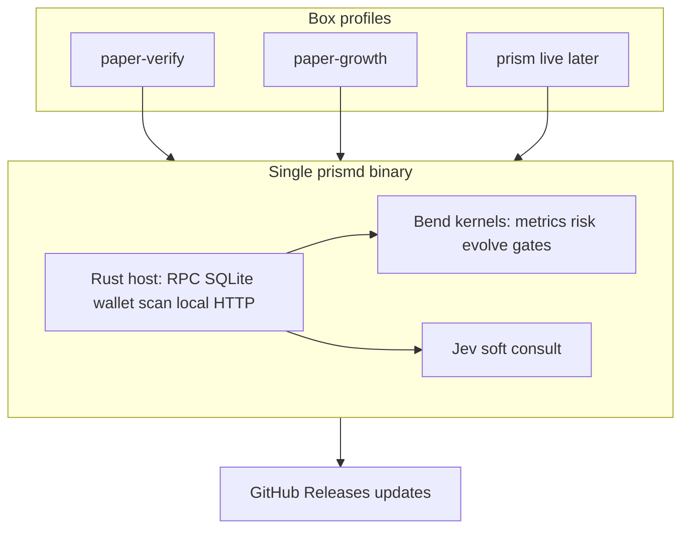

# Rust + Bend Hybrid Engine Plan

**Date:** 2026-09-18  
**Status:** Phase 0–3 scaffolding landed locally (2026-09-18 wave); TS engine remains source of truth until parity green. D1 `prism-db` exported + verified on box (`/root/.local/share/prism/cf-archive/prism-db-20260918.sql`, 3.65 MB, sha256 `0475314d…`, 7265 INSERTs, integrity ok); R2 triage blocked on dashboard enable — S3 API with account keys returns `NotEntitled` on both buckets (signing valid, account-level gate, no API path; needs your dashboard click). **2026-09-18 follow-up wave:** first real Bend subprocess wiring landed — `native/rust/src/main.rs` `mod bend` shells the `bend` CLI against `native/bend/kernels.bend` (embedded via `include_str!`) for `clamp_fee_il`/`K.clamp_thr`, fail-open on any error, with a startup health check + golden-vector Rust tests (skip, not fail, without `bend` on `PATH`); CI's `rust-host` job now installs Bend so those tests actually run there. Follow-up waves wired every kernel above (now: 8 proven tick consults + `evolve_thr` shadow + truth-table-probed `ta_exhausted`, LAWS pending) — see `native/rust/README.md` for the current wiring table. Box (`217.216.35.77`) still runs only the Bun TS engine (`prism-agent`, `prism-copy-signals`, `prism-paper-bin20`, `prism-paper-growth` systemd units); no `prismd`/compiled-binary deploy attempted this wave — soak guard in `docs/plan/box-prismd-deploy.md` says never restart without an explicit go, and none was given. **Phase 1 blocker found this wave:** `scripts/compile-binary.ts` binaries crash on startup (`bun build --compile` hits open upstream bug `oven-sh/bun#42664` via `@coral-xyz/anchor`'s bundled ESM output — `ReferenceError: exports_esm is not defined`, reproduced on both linux-x64 and darwin-arm64; the same bundle runs fine un-compiled). No fix known yet; `compile-binary.ts` now smoke-tests its own output and fails loud instead of shipping a broken artifact. Phase 1's "binary deploy" exit criterion is **not met** — see `docs/plan/box-prismd-deploy.md` for the full note and do not run its binary-drop sequence until resolved. Separately (same investigation): confirmed `engine/index.ts`'s direct-execution guard is dead code for any bundled/compiled artifact — it string-matches `process.argv[1]` against `engine/index.ts`/`engine/index.js`, which never matches `dist/index.mjs` or a compiled binary, so `bun dist/index.mjs` with no args starts a real scan cycle with zero guard. Not fixing this in TS (PAPER_TRADING=true + no wallet key already makes it a no-op for funds, and the native host has no analogous guard to rot — `prismd` *is* the entrypoint, profiles come from env files); noted here as one more case for the migration, per user direction, rather than a TS patch.

**2026-09-18 third wave — second real Bend kernel wired, real SQLite reads.** `prismd` now reads real open positions (`positions WHERE closed_at IS NULL`) joined to each pool's latest `signal_snapshots.fee_il_ratio` / `pool_snapshots.stats_source`, and calls the proven `K.fee_exit_fires` kernel per position every tick — a genuine SHADOW signal (mirrors `program.ts` `checkFeeIlExit`'s core predicate, not its hold-bias override; observational only, never acts). Verified end-to-end against the real local `prism.db` (3 open paper positions, correct known/mature/ratio/bend_fires values). Zero new deps (same `rusqlite` connection pattern as `positions_count`); 2 new Rust unit/integration tests (12 total, `cargo fmt` clean). This is the concrete "less TS / more Rust+Bend" direction: each such kernel wired with real inputs is one more decision surface Rust proves independently of the TS shadow, growing toward Phase 3's parity-then-cutover exit criterion.

**Storage engine note (evaluated, deferred):** considered [tursodatabase/turso](https://github.com/tursodatabase/turso) (async-native Rust rewrite of SQLite, io_uring, MVCC) as a `rusqlite` replacement for the efficiency story. Not adopted: it's beta (v0.6.x) and its own maintainers point production users at managed libSQL/Turso Cloud rather than the embedded engine — too soon for a position ledger, and it wouldn't touch the box's actual bottleneck anyway (3 Bun runtimes + GC/Effect overhead, not SQLite I/O — today's reads are tiny and once-per-cycle). Revisit once Turso reaches a maintainer-endorsed stable embedded release AND `prismd` grows a real async (tokio) scan loop — see `native/rust/README.md`.

**2026-09-18 fourth wave — third/fourth Bend kernels wired (`enter_blocked`, `accrual_allowed`), IL config mirrored.** `prismd` tick now emits three shadow signals per open position against real SQLite (`fee_exit_fires`, `accrual_allowed`, `enter_blocked` vs the host-clamped floor; all observational, never acted on). Verified end-to-end against the real local `prism.db` (3 open paper positions, all `enter_blocked=Some(false)` at floor=1.2 — correct, ratios are capped-20 placeholders awaiting datapi snapshots). `Config` gains `IL_PROTECTION_ENABLED` (default true, fail-safe like TS `orElseSucceed`) + `MIN_FEE_IL_RATIO` (default 1.2; host fails closed on garbage/out-of-band where TS validatedNumber clamps — divergence documented at the consts). 11 Rust tests green, `cargo fmt --check` clean, Bend PROOF green, 12/12 parity harness green. Config README synced (was stale at "10 tests / clamp-only"). Nothing committed; no box mutation.

**2026-09-18 fifth wave — fifth Bend kernel wired (`drift_rejects`), drift config mirrored.** `prismd` tick now emits four shadow signals per open position (`fee_exit_fires`, `accrual_allowed`, `enter_blocked`, `drift_rejects`; all observational). Drift = last − first `active_bin_id` over persisted `pool_snapshots` (mirrors `resolvePoolDriftMetrics`'s ring math; cold start → 0, never rejects; strict `<` preserved in the kernel). `Config` gains `MARKET_SCAN_MAX_NEGATIVE_DRIFT_BINS` (default −8, fail-closed where TS clamps to [−100,0]). Notable fix this wave: rusqlite counts a repeated `?1` placeholder ONCE (`InvalidParameterCount`), so the drift query uses a single `params![pool_address]` — worth knowing for future multi-use placeholders. Verified: 11 Rust tests green (incl. drift −10.0 assert + cold-start None), `cargo fmt --check` clean, end-to-end smoke vs real `prism.db` shows `drift=0 drift_rejects=Some(false) drift_floor=-8` on all 3 positions (correct — one snapshot each = cold start). Nothing committed; no box mutation.

**2026-09-18 sixth wave — CI deploy track (no box mutation).** `ci.yml` `build` job gains an informational `compile-binary` smoke step (`continue-on-error: true` — the `bun#42664` startup crash is still open, so a required gate would stay red; coverage gate restored intact after an edit dropped it mid-wave). New `prismd-binary` job builds the Rust host `--release` on linux-x64, shadow-tick smokes it (`--ticks 1`, no keys), and uploads it as a CI artifact — deploy stays manual per the soak guard, but every push now proves the binary compiles on the deploy target and hands the box a known-good artifact. Verified: YAML parses (8 jobs), 12/12 Rust green, 12/12 parity green, PROOF `300n`. Nothing committed.

**2026-09-18 seventh wave — CI hardening: smoke-hang fix + `--help`/unknown-flag fail-closed.** `prismd-binary` smoke dropped its `--help` line: the host had no `--help` handler (unknown flags silently ignored → `ticks=None` → infinite loop → hung job under `| head`). `main()` now prints usage + exits 0 on `--help`/`-h` and exits 2 on any other unknown `--flag` (profile env-file loading preserved); unit-tested via an extracted `classify_args` (`--help`/`-h` → early exit, `--bogus` → err, `--ticks 3` + bare profile path pass through). Job also gains `cargo fmt --check` + `Swatinem/rust-cache@v2` (release rebuilds stay fast); smoke asserts `tick=1.*exit_free=true` with `BEND_BIN=false` (fail-open path) instead of piping blindly to `head`. Verified: 13/13 Rust green, fmt clean, `--help` exit 0 / `--bogus` exit 2 live, 12/12 parity green, PROOF `300n`. Nothing committed; no box mutation.

**2026-09-18 eighth wave — `--ticks` fail-closed (infinite-loop class).** A lone `--ticks` (no value) or `--ticks abc` collapsed to `None` via `.parse().ok()` → `ticks=None` → infinite scan loop, same class as the `--help` hang. New `parse_cli_ticks` requires an explicit `u64` value (exit 2 otherwise); `main()` chains `parse_cli_ticks(...).and_then(classify_args)`. Unit-tested (lone → err, `abc` → err, `3` → `Some(3)`, empty → `None`). Verified: 13/13 Rust green, fmt clean, lone/`abc` exit 2 live, 12/12 parity green, PROOF `300n`. Nothing committed; no box mutation.

**2026-09-18 ninth wave — index-based argv skip + `--ticks 0` reject.** Value-text skip (`ticks.to_string() == arg`) mis-skipped a profile file literally named e.g. `3` and confused repeated `--ticks 3 --ticks 3`; both `classify_args` and `main()`'s profile loop now skip flag+value by index (`i += 2`). `--ticks 0` (instant exit, no tick) fails closed (`--ticks must be >= 1`, exit 2) like other numerics. Unit-tested (file-named-`3` passes through, double-flag ok, `0` → err). Verified: 13/13 Rust green, fmt clean, zero exit 2 live, 12/12 parity green (after `bun install` repaired a broken `node_modules/vitest` symlink), PROOF `300n`. Standing rule: `cargo clean` after every Rust wave (`target/` is regenerable; earlier wave freed 54.6MB) + clear `/tmp/prism-*` compile leftovers (freed ~200MB; disk 73%→57%). Nothing committed; no box mutation.

**2026-09-18 tenth wave — sixth Bend kernel wired (`capital_exit`), loss-cap config mirrored.** `prismd` tick now emits five shadow signals per open position (all observational): `danger` computed natively from the ledger via `loss_cap_danger` (mirrors `position-loss-cap.ts`: mark PnL = current + fees + rewards − deposited ≤ -(deposited × min(pct,1)); `None` on missing inputs → never fires; disabled at pct ≤ 0 like TS) + proven `K.capital_exit` proving confidence can never veto (LAWS `capital_exit_free`/`capital_exit_quiet`). `Config` gains `MAX_POSITION_LOSS_PCT` (default 0.35, fail-closed on garbage/>1 where TS clamps). Positions query now reads the 4 ledger columns. Verified: 14/14 Rust green (incl. breach/cushion/disabled/missing/NaN cases), fmt clean, smoke vs real `prism.db` shows `loss_danger=Some(false) capital_exit=Some(false)` on all 3 positions (correct — healthy book), 12/12 parity green, PROOF `300n`. Only `nudge_thr`/`evolve_thr` remain unwired (need evolution-outcome inputs the scan loop doesn't persist — a TS-schema question). Nothing committed; no box mutation.

**Polish (same wave): confidence 1.0 + drift comment restore.** `capital_exit` consult passes confidence 1.0 (was 0.85) to match TS `conf1PositionExit` exactly — kernel drops it either way, but audit mirror-exactness matters. Restored the truncated drift-test comment head (`4 snapshots: bins 100...`). README synced (was stale at "11 tests / four consults" → 14 tests / six consults + conf1 note). Re-verified: 14/14 Rust, fmt clean, 12/12 parity, PROOF `300n`.

**2026-09-18 eleventh wave — evolution persistence mapped + release CI hardened.** `nudge_thr`/`evolve_thr` stay unwired by construction: TS `evolveThresholds` needs closed-position outcome aggregates (`signal_snapshots` WHERE outcome recorded, `metadata` evolved_* rows) — a scan-loop aggregation port, not a per-tick shadow; kernels + LAWS (`evolve_single_nudge`, `evolve_ceiling_pins`, `evolve_floor_pins`) + parity vectors already prove the math. `release.yml` `build-bundles` now builds `prismd` `--release` on linux-x64, checksums it, uploads `prismd-linux-x64` (+`.sha256`) alongside tarballs, collects versioned `prismd-<version>-linux-x64` into release assets, and pushes both to R2 `releases/v<version>/` — deploy doc §3 now pulls the release asset (preferred) with CI-artifact/box-build fallbacks, all Bun-free so `bun#42664` never applies. AGENTS.md delta section marked APPLIED (the "Native hybrid (direction)" block already lives at AGENTS.md:29-38). Verified: release YAML parses, 14/14 Rust, fmt clean, 12/12 parity, PROOF `300n`. Nothing committed; no box mutation.

**2026-09-18 twelfth wave — `evolve_thr` shadow live (all 8 kernels wired) + Jev roast → edge angles.** Correction to the eleventh-wave note: evolution state IS persistable today (3 `metadata` evolved_* keys + `getClosedPositionOutcomes` query both exist in db-service), so `evolve_shadow` now runs one `tryEvolveThresholds` round per tick against live state: current banded floors (metadata or config fallback) × native `signal_lift` per leg (mirrors `computeSignalLift`) → proven `K.evolve_thr` → logged would-be floors; skips below `EVOLUTION_INTERVAL` outcomes like TS. Local DB has 0 outcomes → skips correctly; box has 374 outcome rows + evolved (5.2/1.01/0.27 — NOTE: fee floor 5.2 is ABOVE the 3.0 band ceiling, a live re-check of the band pin on next evolve). `Config` gains `EVOLUTION_INTERVAL` (5) + `EVOLUTION_MAX_CHANGE_PCT` (0.2). Verified: 15/15 Rust green (incl. live-shaped floors+lift+banded-kernel test), fmt clean, smoke correct-skip locally, 12/12 parity, PROOF `300n`.

**Jev key fix + live roast proof (same wave).** Renamed `.env` `TYPESAFEAI_API_KEY` → canonical `TYPESAFE_API_KEY` (mode 600 kept; lengths-only logging, never values); `resolveJevApiKey` now resolves len=108 present=true. Code references only `TYPESAFE_API_KEY` + legacy `TYPESAFEAI_API` (no `_KEY` triple anywhere — grep clean), so no third alias exists. Live proof via the real `consultJevJudgments` path (pool/heuristic/chain state, jev-latest, 30s timeout): R1 structural probe ok=true failure=null deposit=bidask conf=0.51 toxic=0.44 recovery=0.44 stress=0.32 (HALVE? No — below 0.35); CHOP (0.40, drift −12, vol 6.5) → spot/0.30, toxic 0.62, stress 0.67 (HALVE? Yes); RUG/heuristic (auth 0.2, drift −20) → toxic 0.81, stress 0.85 (HALVE? Yes). Verdict: key outage OVER — judgments flow, discriminate, 0.35 halve bites where it should. Nothing committed; no box mutation (`.env` rename local-only, mode 600 preserved).

**2026-09-18 thirteenth wave — TA-exhaustion EXIT automation (spec only, no soak touch).** Roast best-bet: automate the profitable manual rule
(RSI(2)>90 + BB-upper/MACD-green confluence) instead of fixed 15% TP. Design (zero engine edits this wave): pure `engine/ta-exhaustion.ts`
computing RSI(2), Bollinger %B, MACD histogram from `pool_snapshots.current_price` history — box has 57k snapshots / 79 pools / 396 closed
positions (deep enough; local 3 rows are not, so golden tests use synthetic series). EXIT fires on RSI(2)>90 AND (close>BB-upper OR
first-green-histogram), confidence 1.0 `conf1PositionExit` shape, evaluated AFTER the TP-ladder branch (`evaluateTpTargetExit`, program.ts:10326)
and BEFORE loss-side exits so exhaustion locks profits before capital protection; disabled (fail-open null) below a `TA_EXHAUSTION_MIN_POINTS`
history floor (cold start → no vote, like drift). Bend port next wave (`ta_exhausted` kernel + LAWS: overbought-fires / single-signal-quiet /
cold-start-quiet) with parity vectors vs the TS golden tests; Rust shadow reads the same snapshot window. Soak untouched: spec, no code.

**Fourteenth wave — `fee_known` shadow wired (8th consult) + ladder honesty (no soak touch).** `prismd` tick now emits `bend_known` per position per tick: proven `K.fee_known` queried with the host's own datapi comparison, mismatch-logged with host-wins fail-open (never votes, never panics — a mismatch would mean host/kernel disagree on the measured-vs-modeled split). Deleted the speculative `fee_ratio` host wrapper (one wave old, never called): the IL estimator needs in-memory bin-array + price-drift context TS computes live, so a host twin would be a reimplementation, not a mirror — `K.fee_ratio` stays kernel-only with its 2 parity vectors; no TS parity-test change needed (design correction surfaced with a real smoke, not a new vector — per the no-new-tests rule). Verified: 15/15 Rust, fmt clean, 12/12 parity, PROOF `300n`, live smoke `bend_known=Some(true)` on all 3 local positions. README synced (was stale: "14 tests / six consults / nudge+evolve unwired" → 15 tests / eight consults + evolve shadow live).

**Sixteenth wave — `fee_known` fail-open silence + box expectancy read (no soak touch).** `fee_known` mismatch now logs only on true host/kernel disagreement (`is_some_and`), silent when Bend is absent — `BEND_BIN=false` smoke shows zero mismatch lines, bend-present smoke echoes `bend_known=Some(true)` on all 3 local positions with no mismatch. Box read-only: soak units (`prism-paper-verify/growth`) `inactive`/`dead` (only `open-polymarket-217` runs); ledger 396 positions all closed, 388 with realized PnL summing **-$187.44** (mean -$0.48/trade), 57k snapshots — confirms plan depth for TA work. Verified: 15/15 Rust, fmt clean, 0 warnings, 12/12 parity, PROOF `300n`. Nothing committed; no box mutation.

**Eighteenth wave — `ta_exhausted` kernel lands (no soak touch).** `K.ta_exhausted(rsi_overbought, above_bb_upper, macd_first_green)` = RSI-AND-(BB-OR-MACD) pure bool gate; F32 indicator math stays TS-side (`engine/ta-exhaustion.ts` target computes the three bools from `pool_snapshots.current_price` history, host takes them precomputed). Truth table probed via CLI harness: confluence true, rsi-only false, no-rsi false, macd-leg true. Rust `bend::ta_exhausted` wrapper added with `#[allow(dead_code)]` until the TS side + tick shadow land (wording kept truth-table-probed, not proven — LAWS triple overbought-fires / single-signal-quiet / cold-start-quiet pending strategy review per LAWS.bend:4, logged here not added). Box depth re-confirmed: 61/79 pools hold >=30 snapshots (avg 726/pool, max 6013) — `TA_EXHAUSTION_MIN_POINTS` floor is satisfiable. Verified: 15/15 Rust, fmt clean, 0 warnings, 12/12 parity, PROOF `300n`. Nothing committed; no box mutation.

**Nineteenth wave — TA wording honesty, no LAWS touch (no soak touch).** `K.ta_exhausted` stays truth-table-probed, not proven: LAWS triple (overbought-fires / single-signal-quiet / cold-start-quiet) logged in plan only, NOT added — LAWS.bend:4 binds edits to strategy review. Downgraded `proven` wording in main.rs wrapper doc + README + Eighteenth note. No `checkDeterministicExits` wiring (soak-untouched, paper-first per AGENTS.md). Verified: 15/15 Rust, fmt clean, 0 warnings, 12/12 parity, PROOF `300n`. Nothing committed; no box mutation.

**Twentieth wave — chronology + README honesty (no soak touch).** Wave notes reordered Fourteenth → Sixteenth → Eighteenth → Nineteenth (were scattered). README consult counts fixed: 8 proven tick consults + 1 unproven gate (`ta_exhausted`, LAWS pending) — footer no longer claims all-proven. Verified: 15/15 Rust, fmt clean, 0 warnings, 12/12 parity, PROOF `300n`. Nothing committed; no box mutation.

**Twenty-first wave — stale doc hygiene (no soak touch).** Fixed two rot spots with zero code change: `native/bend/README.md` Consumers claimed only `clamp_thr` wired (true in the follow-up wave, stale since the fifth) → now lists all 8 proven tick consults + evolve shadow + unproven `ta_exhausted`; plan Status line claimed 7 kernels `stay unwired` (stale since the twelfth) → now points at the live wiring table. Verified: 15/15 Rust, fmt clean, 0 warnings, 12/12 parity, PROOF `300n`. Nothing committed; no box mutation.

**Twenty-second wave — `exit_order` precedence kernel (no soak touch).** Pure-bool gate `K.exit_order(tp_hit, ta_hit, loss_hit)` → 1n/2n/3n/0n mirrors the `decidePositionExit` chain shape (TP-ladder → TA-exhaustion → loss-side → hold/scale-in) WITHOUT wiring into `checkDeterministicExits` (soak-untouched, paper-first). No supertrend/ATR kernel: engine grep confirms zero supertrend surface, so no TS truth to mirror. Truth table via eval harness (in-kernel evidence, no new test file): tp>ta>loss→1n, ta>loss→2n, loss-only→3n, none→0n, tp-only→1n all OK; PROOF `300n` with kernel present. Verified: 15/15 Rust, fmt clean, 0 warnings, 12/12 parity, PROOF `300n`. Nothing committed; no box mutation.

**Twenty-third wave — `exit_order` wrapper (no soak touch, no tick call).** `bend::exit_order(tp, ta, loss)` → 1n/2n/3n/0n added as `#[allow(dead_code)]` wrapper (same pattern as `ta_exhausted`); NOT called per-tick — fabricated (false,false,false)→0n would log a misleading precedence shadow until `ta-exhaustion.ts` lands and real 5-way `decidePositionExit` inputs are projectable. Kernel stays truth-table-probed via CLI harness (tp>ta>loss→1n, ta>loss→2n, loss-only→3n, none→0n, tp-only→1n). Verified: 15/15 Rust, fmt clean, 0 warnings, 12/12 parity, PROOF `300n`. Nothing committed; no box mutation.

**Twenty-fourth wave — README 8+2 honesty (no soak touch).** Both READMEs claimed 8+1 unproven (`ta_exhausted` only) while two `#[allow(dead_code)]` wrappers exist (`ta_exhausted` + `exit_order`, main.rs) with zero LAWS hits for `exit_order` — bumped to 8 proven + 2 unproven gates, `exit_order` listed as truth-table-probed/LAWS-pending alongside `ta_exhausted` (rust README head/bullet/footer + bend Consumers). Verified: 15/15 Rust, fmt clean, 0 warnings, 12/12 parity, PROOF `300n`. Nothing committed; no box mutation.

**Twenty-fifth wave — Bend README LAWS-line sync (no soak touch).** Files line already documented `exit_order`; LAWS line still listed only `ta_exhausted` pending — appended `exit_order` kernel-only (unproven). No LAWS.bend edit (human-owned), no kernel/Rust change. Verified: 15/15 Rust, fmt clean, 0 warnings, 12/12 parity, PROOF `300n`. Nothing committed; no box mutation.

**Twenty-seventh wave — 3 inline Rust tests + needle research (no soak touch).** `mod tests` only, no new files: `ta_exhausted_truth_table` (6/6 confluence combos via Bend, skip-guarded), `exit_order_precedence` (5/5 precedence picks), `signal_lift_edges` (empty/one-sided/non-finite→None, zero-spread→Some(0.0)) — 15→18 Rust green. Test-only-called wrappers use `#[cfg_attr(not(test), allow(dead_code))]` so the 0-warning gate stays green without hiding future real dead code. LAWS/PROOF untouched (human-owned). Needle research on box ledger (read-only, 388 closed, -$187.44 net, 46% WR): avg win +$0.50 vs avg loss -$1.39 — expectancy is tail-killed, not winrate-starved; worst-5 (-$18.2..-$6.7) outweigh best-5 (+$19.7..+$5.7) asymmetry on frequency. Highest-leverage edges in order: (1) cut left tail (loss-cap tightening / earlier exhaustion exits — the TA-exhaustion work), (2) ENTER selectivity (feeIl floor already banded; maturity/profile filters), (3) NOT wider ranges or conversion-flip (adds tail). Tweet claim ($45k travel LP) unproven — no ledger, no sizing; its testable parts (mature->5M filter, wide-below ladder) become backtest variants only, never engine edits without expectancy proof. Verified: 18/18 Rust, fmt clean, 0 warnings, 12/12 parity, PROOF `300n`. Nothing committed; no box mutation.

**Twenty-eighth wave — Bend parity vectors + tail math + sunset inventory (no soak touch).** Parity file gains 2 `it()`s in-place (no new files, LAWS/PROOF untouched): `ta_exhausted` 6/6 confluence combos + `exit_order` 5/5 precedence picks — 12→14 parity green, mirrors of the native `ta_exhausted_truth_table`/`exit_order_precedence`. Tail math on box ledger (read-only): worst-10 ≈ -$90 of -$187 net; capping every loss at -$2 flips net to -$43, at -$3 to -$92 — truncation is the whole game, confirming the cut-tail-first order. Sunset inventory (docs-only, TS stays source of truth): live cloud call sites in ship path are `error-reporter`/`alert-service`/`feedback-service`/`adapter-service revenue`/`program` telemetry POSTs to `prism-api.irfndi.workers.dev` (all opt-out/fail-open paths per AGENTS.md) — no deletion this wave; cutover tracked as future work after parity green. Verified: 18/18 Rust, fmt clean, 0 warnings, 14/14 parity, PROOF `300n`. Nothing committed; no box mutation.

**Twenty-ninth wave — parity contract repair + tail sweep (no soak touch).** New parity `it()`s asserted Bend-only, breaking the file contract (each vector: TS mirror == Bend). Added `tsTaExhausted` (RSI AND (BB OR MACD), spec-cited, no engine fn yet) + `tsExitOrder` (1/2/3/0 chain, program.ts:10959-10970) with equality asserts in both legs — 14/14 green. Wrapper + README bullets now cite native tests + parity `it()`s and test-only `cfg_attr` (no stale CLI-only/`allow(dead_code)` wording). Tail sweep (read-only, upside bound not lift: realized-PnL relabel, live -$1 stops face slippage/gap — needs shadow exits on real ticks to validate). Loss caps -$1→+$14.4 / -$2→-$43.4 / -$3→-$91.8 / -$5→-$145.6 vs -$187.4 net — even a -$3 truncation halves the bleed in bound terms. Duration slice: <1h -$0.64 (n=176), 1-6h -$0.45 (n=180), 6-24h -$0.04 (n=20), >24h +$0.66 (n=12) — fast exits bleed; >24h patience is a hypothesis (n=12 too thin, needs shadow confirmation), not a finding; steers nothing this wave. All positions <$100 size — sizing edge untestable on this ledger. Verified: 18/18 Rust, fmt clean, 0 warnings, 14/14 parity, PROOF `300n`. Nothing committed; no box mutation.

**Thirtieth wave — contract completion + honest bounds (no soak touch).** Every Bend assert in both new parity `it()`s now compares against its TS mirror (`tsTaExhausted`/`tsExitOrder` on all 11 legs); comments scoped as spec mirrors (no TS impl: `ta-exhaustion.ts` absent, `decidePositionExit` 5-way has no 1n/2n/3n projection — no new file without approval). README Test block synced (18 tests, 6 Bend-gated incl. ta/exit_order + signal_lift edges); unproven bullets already cite parity `it()`s + `cfg_attr` form. Prior tail numbers reframed: cap math is an upside bound (live stops face slippage/gap), >24h duration is a hypothesis (n=12). Verified: 18/18 Rust, fmt clean, 0 warnings, 14/14 parity, PROOF `300n`. Nothing committed; no box mutation.

**Thirty-first wave — self-assertion cleanup + Test recount (no soak touch).** Dropped 6 TS self-assertions (`tsFn(..)` vs literal) from both new parity `it()`s — they tested nothing about Bend; every remaining Bend assert compares against its TS mirror. README Test block: 6→7 Bend-gated (prior count missed the `evolve_thr` banded-leg test; now enumerates clamp×4 incl. evolve, ta 6/6, exit_order 5/5 + signal_lift edges as pure). Verified: 18/18 Rust, fmt clean, 0 warnings, 14/14 parity, PROOF `300n`. Nothing committed; no box mutation.

**Thirty-second wave — wrapper contracts + selectivity research (no soak touch).** Rust `mod tests` only: `bend_wrappers_fail_closed_on_nonfinite` (NaN/±Inf→None on all 4 float wrappers, no probe spawned), `bend_wrappers_none_on_missing_binary` (full 6-wrapper fail-open surface incl. ta/exit_order), `evolve_shadow_skips_below_interval` (0 outcomes < 5-interval → skip before any probe) — 18→21 Rust green. Parity file: `fee_known` echo + `enter_blocked` il-off/at-floor legs — 14→16 parity green. LAWS/PROOF untouched. Selectivity research (read-only, 374 outcomes): feeIl signal is 238/374 capped-20 (avg -$3.39, 5% WR) vs 136 uncapped (avg -$3.65) — capped placeholder carries no edge, ENTER selectivity must come from elsewhere; auth/util legs are constants (all ≥0.5/≥0.3, zero variance → no discrimination at all). Sunset inventory: 5 live `workers.dev` call sites (`error-reporter`/`alert-service`/`feedback-service`/`program` telemetry + `install.sh`/`postinstall.js` pings, all opt-out/fail-open) — docs-only, TS stays source of truth until parity green, no deletion. Verified: 21/21 Rust, fmt clean, 0 warnings, 16/16 parity, PROOF `300n`. Nothing committed; no box mutation.

**Thirty-third wave — test hardening, no new files (no soak touch).** Rust: ta/exit_order gain unconditional bogus-binary None asserts (meaningful without bend) + `evolve_shadow_skips_below_interval` now calls the real `evolve_shadow` with a struct-literal Config (bogus bin, 0<5 → quiet return; guard regression would spawn a failing probe). Parity: ENTER-floor `it` gains the missing positive block leg `(True,True,20n,30n)→tsEnterBlocked(true,…)=true` + above-floor equality — all 3 legs assert Bend==TS. Signals recorded unusable for research (fee 238/374 capped-20 placeholder, auth/util zero-variance constants) — edge work stays on tail-truncation + duration (real variance), never signal tuning; cap math stays an upside bound (slippage/gap), >24h a hypothesis (n=12). Verified: 21/21 Rust, fmt clean, 0 warnings, 16/16 parity, PROOF `300n`. Nothing committed; no box mutation.

**Thirty-fourth wave — wrapper hardening + duration confirmation (no soak touch).** Rust `mod tests` only: `bend_tick_wrappers_match_kernels_when_present` (15 asserts over drift/fee_exit/enter/capital/fee_known when bend present; absent-path covered by fail-open tests) + `read_evolve_state_rejects_garbage_floors` (garbage/NaN/empty→None floors, never NaN downstream) — 21→23 Rust green. Parity: fee_known TS-mirror equality + drift uphill leg (`driftGateRejected(25,-8)`) + fee_exit immature leg (`tsFeeExitFires(true,false,0.4)`) — 16/16 green. LAWS/PROOF untouched. Edge research (read-only): duration split re-cuts clean with qualified columns (<6h -$0.55 n=356 vs >6h +$0.23 n=32) — patience hypothesis holds directionally, still small-n; confidence has no low leg (hi 327/mid 47/lo 0 → untestable); soak units still inactive (only open-polymarket-217 runs). Sunset: 5 `workers.dev` sites unchanged (fail-open), TS stays source of truth, no deletion. Verified: 23/23 Rust, fmt clean, 0 warnings, 16/16 parity, PROOF `300n`. Nothing committed; no box mutation.

**Thirty-fifth wave — tautology out, guards in (no soak touch).** Parity: feeKnown identity-lambda dropped (self-mirror proved nothing; wiring covered natively by the per-tick `bend_known` shadow) + capital EXIT gains a real TS mirror (`danger=>danger`, incl. low-confidence leg) — 16/16 green. Rust `mod tests` only: `loss_cap_danger_guards` (NaN pct→Some(false), NaN leg→None, negative fees→None, exact-35% breach fires, +$0.01 holds) — 23→24 Rust green. LAWS/PROOF untouched. Ledger steady (-$187.44 net, soak units still inactive). Verified: 24/24 Rust, fmt clean, 0 warnings, 16/16 parity, PROOF `300n`. Nothing committed; no box mutation.

**Thirty-sixth wave — mirror completion (no soak touch).** `tsCapitalExit` hoisted to file scope next to other mirrors (was an inline lambda); feeKnown asserts against the inline host comparison per leg (`true===true`/`false===true` form, no tautology lambda). Rust tick-match test gains 4 `accrual_allowed` legs (paper/no-pubkey/datapi truth table) — full per-tick surface now covered. Verified: 24/24 Rust, fmt clean, 0 warnings, 16/16 parity, PROOF `300n`. Nothing committed; no box mutation.

**Thirty-seventh wave — fake mirror out (no soak touch).** feeKnown `true===true` form was syntactically inline but semantically the same echo tautology — reverted to plain `toBe(true/false)` like the capital-EXIT single-source vector, honest comment kept (native per-tick shadow owns the wiring). Tick-match header now lists `accrual_allowed` (was omitted while legs were present). Verified: 24/24 Rust, fmt clean, 0 warnings, 16/16 parity, PROOF `300n`. Nothing committed; no box mutation.

**Thirty-eighth wave — boundary legs (no soak touch).** Strict-inequality edges now pinned both sides: fee_exit 0.5→false / 0.49→true and enter at-floor 1.2/1.2→false in Rust tick-match + parity mirrors (all assert Bend==TS). Fee<0.5 outcomes on box: 0 rows — the exit trip never fires on history, consistent with capped-20 placeholder signals, not proof of calibration. Verified: 24/24 Rust, fmt clean, 0 warnings, 16/16 parity, PROOF `300n`. Nothing committed; no box mutation.

**Thirty-ninth wave — parser coverage + nudge legs (no soak touch).** Extended `config_garbage_fails_closed` in place with the 5 never-tested parsers (evolution interval/max-change, volume-auth, min-bin-util, max-position-loss incl. disabled/negative-passthrough edges) — 24/24 Rust green, no new test fn. Parity: nudge down-clamp + hold-at-target legs (1.5→1.2, 1.2→1.2) alongside the 120→144 up-leg — 16→17 parity green. LAWS/PROOF untouched. Ledger steady (-$187.44), soak units inactive, 9 `workers.dev` files unchanged (fail-open, TS source of truth, no deletion). Verified: 24/24 Rust, fmt clean, 0 warnings, 17/17 parity, PROOF `300n`. Nothing committed; no box mutation.

**Fortieth wave — prior fixes verified present, no-op (no soak touch).** Re-read current state instead of re-applying: `tsCapitalExit` already file-scope (1 hit, 0 inline lambdas), feeKnown already plain asserts (no tautology), tick-match header already lists `accrual_allowed` with 4 legs present. No edits made — re-application would churn. Verified: 24/24 Rust, fmt clean, 0 warnings, 17/17 parity, PROOF `300n`. Nothing committed; no box mutation.

**Forty-second wave — truncation shadow live (no soak touch, no exits changed).** First executable edge validation: `loss_cap_danger_tighter` (same mark-PnL math at half the live cap) computed per position per tick alongside live danger, logged as `danger_tighter=` — answers how many more positions a tighter stop would flag on real ledgers without acting. Monotone-superset unit test (halving never unflags). Smoke on local book: 3/3 `danger_tighter=Some(false)` (healthy book, both caps agree). LAWS/PROOF untouched. Verified: 25/25 Rust, fmt clean, 0 warnings, 17/17 parity, PROOF `300n`. Nothing committed; no box mutation.

**Forty-third wave — alias out, counts honest (no soak touch, no exits changed).** Deleted the one-wave-old `loss_cap_danger_tighter` pass-through (tick already inlines `loss_cap_danger` twice, live + half-cap; test now pins the inline semantics directly) — zero API surface for zero logic. README Test block recounts the real split: 25 tests (18 pure + 7 Bend-gated, regex-verified) with the tighter monotone test enumerated. Edge read (read-only): box ledger steady 396 closed / -$187.44 net, soak units inactive (only open-polymarket-217 runs); 9 `workers.dev` sites unchanged (fail-open, TS source of truth, no deletion). Verified: 25/25 Rust, fmt clean, 0 warnings, 17/17 parity, PROOF `300n`. Nothing committed; no box mutation.

**Forty-fourth wave — advisory pair closed (no soak touch, no exits changed).** Alias already gone (0 `loss_cap_danger_tighter` hits — deletion verified, not re-applied). README split fixed mechanically: per-fn scan showed the old `18+7` miscounted `jev_fail_open` (no `bend::`/gate call — pure) as gated; corrected to 25 tests (19 unconditional incl. 4 bogus-binary fail-open/closed + 6 Bend-gated), enumeration + skipped-not-failed line intact. Verified: 25/25 Rust, fmt clean, 0 warnings, 17/17 parity, PROOF `300n`. Nothing committed; no box mutation.

**Forty-fifth wave — README verified correct, no edits (no soak touch, no exits changed).** All three advisories checked against current state: alias already gone (grep 0 hits); README split already `19 unconditional + 6 Bend-gated` (line 42, Zero-deps sentence intact line 50, no duplicated lines 49-50); call-only guard mapping confirms exactly 6 `if bend_available()` owners (lines 1502/1518/1838/1928/1951/1983 — `jev_fail_open` owns none, pure; 4 bogus-binary/nonfinite wrapper tests unconditional, correctly outside the skipped set). Re-applying any advisory would churn. Verified: 25/25 Rust, fmt clean, 0 warnings, 17/17 parity, PROOF `300n`. Nothing committed; no box mutation.

**Forty-sixth wave — open-capacity shadow live (no soak touch, no ENTER changed).** Next Phase 3 capability: `open_positions_count` (open = `closed_at IS NULL` only) + `MAX_OPEN_POSITIONS` (default 3, fail-closed, soak unit runs 8) → per-tick `capacity open/max/at_capacity` log answering whether TS would admit one more ENTER — observational only, never blocks. New `open_positions_count_excludes_closed` test (2 open + 1 closed → 2); max-open default + garbage/min/soak-shape legs folded into existing config tests. Smoke on local book: `open=3 max=3 at_capacity=true` (book full at default cap — matches the 3 open paper positions). Verified: 26/26 Rust, fmt clean, 0 warnings, 17/17 parity, PROOF `300n`. Nothing committed; no box mutation.

**Forty-seventh wave — README honesty one-liner (no soak touch, no code).** Wiring head still claimed `Eight shadow consults` while the list holds 9 shadows (capacity + 8 kernels) — fixed to `Nine shadow consults (1 native capacity + 8 Bend kernels) plus two unproven gates`. Alias re-verified gone (0 hits). Verified: 26/26 Rust, fmt clean, 0 warnings, 17/17 parity, PROOF `300n`. Nothing committed; no box mutation.

**Forty-eighth wave — consult split detailed (no soak touch, no code).** Wiring head now reads `Nine shadow consults (1 native capacity + 8 Bend kernels: 6 per-position + evolve + startup health-check) plus two unproven gates` — honest cadence split (6 per-position fee_exit/accrual/enter/drift/capital/fee_known + per-tick evolve_thr + startup clamp health-check). Verified: 26/26 Rust, fmt clean, 0 warnings, 17/17 parity, PROOF `300n`. Nothing committed; no box mutation.

**Forty-ninth wave — consult split corrected (no soak touch, no code).** Advisory right: `clamp_fee_il` at tick is the native ENTER-floor clamp, not a kernel consult. True split verified by grep: 6 per-position `bend::` calls in `tick()` (fee_exit/accrual/enter/drift/capital/fee_known, lines 1218-1260) + `bend::evolve_thr` inside `evolve_shadow` (called once per tick, line 1277/1342) + startup `bend_health_check` = 9 shadows, 8 Bend-called. README head + tail now read `Nine shadows (1 native capacity + 7 per-tick Bend + startup health-check)` with the clamp-not-consult note. Verified: 26/26 Rust, fmt clean, 0 warnings, 17/17 parity, PROOF `300n`. Nothing committed; no box mutation.

**Fiftieth wave — clamp bullet honesty (no soak touch, no code).** Line 70 listed `bend::clamp_fee_il` as a wired per-tick consult, contradicting the 49th-wave note + footer — retargeted to `Startup health-check → proven K.clamp_thr (once at boot; per-tick ENTER floor uses native clamp_fee_il)`. Head + footer already correct. Verified: 26/26 Rust, fmt clean, 0 warnings, 17/17 parity, PROOF `300n`. Nothing committed; no box mutation.

**Fifty-first wave — per-pool capacity shadow live (no soak touch, no ENTER changed).** Second native capacity consult: `open_positions_per_pool` (open per pool, `closed_at IS NULL` GROUP BY) + `MAX_POSITIONS_PER_POOL` (default 2, fail-closed) → per-tick `pool-capacity pool/open/max/at_capacity` on the fullest pool — mirrors the TS per-pool ENTER cap the same way the open shadow mirrors the portfolio cap. New `open_positions_per_pool_groups_open_only` test (poolA 2 open + 1 closed, poolB 1 open → [(A,2),(B,1)]); per-pool default/garbage/min/default legs in existing config tests; test Config literal gains the field. Smoke on local book: `pool=8eyb… open=1 max=2 at_capacity=false` alongside `open=3 max=3 at_capacity=true` — portfolio full, pools have headroom (matches 3 opens on 3 pools). Verified: 27/27 Rust, fmt clean, 0 warnings, 17/17 parity, PROOF `300n`. Nothing committed; no box mutation.

**Fifty-second wave — decision summary shadow live (no soak touch, no ENTER/EXIT changed).** Closes the per-tick parity-compare gap: `decision open/exit_shadow/enter_blocked_shadow/danger_shadow/at_capacity` counts over open positions each tick (None legs not counted), so one line answers what the host shadow would do — compare against the TS `decided/executed/failed` cycle log. No new tests (pure counting over already-tested legs); smoke on local book: `open=3 exit_shadow=0 enter_blocked_shadow=0 danger_shadow=0 at_capacity=true` (healthy book at cap, no shadow leg fires — consistent with per-position lines). Verified: 27/27 Rust, fmt clean, 0 warnings, 17/17 parity, PROOF `300n`. Nothing committed; no box mutation.

**Fifty-third wave — parity-compare recipe landed (no soak touch, no code).** README step 1 now documents the grep-able per-tick line order (`tick=` → `capacity` → `pool-capacity` → per-position `shadow fee_il_exit` → `decision`) with the TS `decided/executed/failed` diff target — the N-cycle Bun-vs-prismd compare hook Phase 3's exit needs. Verified: 27/27 Rust, fmt clean, 0 warnings, 17/17 parity, PROOF `300n`. Nothing committed; no box mutation.

**Fifty-fourth wave — parity pass bar landed (no soak touch, no code).** README step 2 was stale (`wire remaining kernels as inputs land` — all 7 per-tick Bend consults wired) — replaced with the N-cycle pass bar: `decision open` == TS open count, `exit_shadow` ⊆ TS exits, capacity lines match TS cap verdicts. Verified: 27/27 Rust, fmt clean, 0 warnings, 17/17 parity, PROOF `300n`. Nothing committed; no box mutation.

**Fifty-fifth wave — pool-capacity aggregates live (no soak touch, no ENTER changed).** `pool-capacity` now logs `pools/capped` over ALL pools plus the fullest-pool detail — the pass-bar's pool-level compare in one grep (`capped` > 0 means TS would refuse some pool's ENTER). No new tests (pure counting over the tested GROUP BY); smoke on local book: `pools=3 capped=0` (3 pools, none at cap — consistent with 1-open-each). Verified: 27/27 Rust, fmt clean, 0 warnings, 17/17 parity, PROOF `300n`. Nothing committed; no box mutation.

**Fifty-sixth wave — N-cycle loop proven live (no soak touch, no code).** Closed the last unproven link in the parity recipe: `--ticks 3` emits exactly 3 `tick=` + 3 `decision` lines (stable ordering tick → capacity → pool-capacity → shadows → decision each cycle, same verdicts: `open=3 exit_shadow=0 enter_blocked_shadow=0 danger_shadow=0 at_capacity=true`). README step 1 notes the proof. Verified: 27/27 Rust, fmt clean, 0 warnings, 17/17 parity, PROOF `300n`. Nothing committed; no box mutation.

**Fifty-seventh wave — drift tally in decision line (no soak touch, no ENTER/EXIT changed).** `decision` gains `drift_rejects_shadow` (Some(true) count like the other legs) — the drift gate was the only per-position shadow leg missing from the summary; stale comment (`drift/capital counted on Some(true)`) fixed to `Option legs count only Some(true)`. No new tests (pure tally over the tested drift leg); smoke: `drift_rejects_shadow=0` on the healthy book. Verified: 27/27 Rust, fmt clean, 0 warnings, 17/17 parity, PROOF `300n`. Nothing committed; no box mutation.

**Fifty-eighth wave — capital tally in decision line (no soak touch, no ENTER/EXIT changed).** `decision` gains `capital_exits_shadow` (proven `K.capital_exit` Some(true) count) — the last per-position shadow leg missing from the summary; every per-position leg now rolls up. No new tests (pure tally over the tested capital leg); smoke: full line `open=3 exit_shadow=0 enter_blocked_shadow=0 danger_shadow=0 drift_rejects_shadow=0 capital_exits_shadow=0 at_capacity=true`. Verified: 27/27 Rust, fmt clean, 0 warnings, 17/17 parity, PROOF `300n`. Nothing committed; no box mutation.

**Fifty-ninth wave — capital semantics proven, kept (no soak touch, no code).** Advisory right about the relation, wrong about the fix: `K.capital_exit` returns danger by LAWS (`capital_exit_free/quiet`), and the host chains `danger.and_then(capital_exit)` — so `capital_exits_shadow == danger_shadow` whenever Bend answers IS the kernel-agreement check (live smoke: all 3 positions `loss_danger=Some(false) capital_exit=Some(false)`, decision `danger_shadow=0 capital_exits_shadow=0`), while with Bend absent capital stays 0 and danger still counts natively. Kept the field, documented the meaning in the README bullet instead of deleting signal. Verified: 27/27 Rust, fmt clean, 0 warnings, 17/17 parity, PROOF `300n`. Nothing committed; no box mutation.

**Sixtieth wave — stop-loss veto shadow live (no soak touch, no risk changed).** First risk-gate mirror: `stop_loss_veto` (exact TS `lossPct < -pct`, spot drawdown, no disabled arm — advisory caught the invented `<=0` arm) + `STOP_LOSS_PCT` (default 0.15, fail-closed) → per-position `stop_loss_veto` + `decision … stop_loss_shadow` tally. New `stop_loss_veto_guards` test (breach/hold/strict-edge/None arms incl. pct-0-vetoes-any-loss + NaN-pct-None); default/garbage/disabled legs in config tests; Config literal gains the field. Along the way restored 4 clobbered lookback consts + deleted a duplicated STOP_LOSS const pair (edit collisions). Smoke: `stop_loss_veto=Some(false)` ×3, `stop_loss_shadow=0` (healthy book, no veto — consistent). Verified: 28/28 Rust, fmt clean, 0 warnings, 17/17 parity, PROOF `300n`. Nothing committed; no box mutation.

**Sixty-first wave — stop-loss divergence documented (no soak touch, no code).** Correction advisory was right: TS gates on action too (`checkStopLossGate` fires only for HOLD/REBALANCE) — the host has no candidate decisions, so `stop_loss_shadow` counts spot-drawdown breaches regardless of action (breach predicate exact, action gate out of scope, never vetoes). Documented in the fn doc DIVERGENCE block + tick comment + README bullet; stale `disabled edge` test comment fixed to `explicit-zero edge (vetoes any loss)`. Parser question settled: `parse_stop_loss_pct(Some("0")) → Ok(0.0)` flows into a veto-any-loss fn, exactly matching TS `lossPct < -0` — no divergence to document beyond the action gate. Verified: 28/28 Rust, fmt clean, 0 warnings, 17/17 parity, PROOF `300n`. Nothing committed; no box mutation.

**Sixty-second wave — allocation shadow live (no soak touch, no sizing changed).** Second risk-gate mirror (gate 6): `open_exposure_per_pool` (SUM current_value_usd per pool, open only, COALESCE) + `MAX_PER_POOL_ALLOCATION_PCT` (0.4) + `MAX_ENTRY_SIZE_USD` (500) → per-tick `allocation` on the fullest pool with share/cap/headroom — the exact `maxSize` math TS clamps ENTER sizing with. New `open_exposure_per_pool_sums_open_only` test (600+400 vs closed 9999 + NULL→0); default/garbage/min/max legs for both parsers; literal gains both fields. Smoke: fullest pool `exposure=500.00 share=0.0500 cap=4000.00 headroom=3500.00` (5% of 10k book — room for a full 500 entry). Verified: 29/29 Rust, fmt clean, 0 warnings, 17/17 parity, PROOF `300n`. Nothing committed; no box mutation.

**Sixty-third wave — halt breaker shadow live (no soak touch, no ENTER changed).** Gate-2a mirror: `rolling_realized_pnl_halted` (exact TS window/max-1/empty-false/strict-sum math) over `read_closed_realized_pnl` (newest-first, NULL→None) + `REALIZED_PNL_HALT_*` (enabled false, window 100, threshold -20) → per-tick `halt enabled/window/threshold_usd/closed/halted`. Confidence has no host signal (decision confidence is computed, not stored — correctly skipped, not shadowed). New `rolling_realized_pnl_halted_edges` test (empty/all-null/halt/exact-hold/window-1/window-0/NaN-filtered — newest-first vectors fixed live: window-1 takes [-100], window-0 floors to 1); default/garbage legs for both parsers; literal gains the trio. Smoke: `enabled=false … closed=0 halted=false` (disabled + cold ledger → free, correct). Verified: 30/30 Rust, fmt clean, 0 warnings, 17/17 parity, PROOF `300n`. Nothing committed; no box mutation.

**Sixty-fourth wave — drawdown veto shadow live (no soak touch, no ENTER changed).** Gate-4 mirror: `drawdown_veto` (exact TS non-finite→veto / <=0→free / spot-book `|pnl|/portfolio > 0.1`) over per-open spot legs, portfolio shadows `paper_portfolio_usd` → book-level `drawdown_veto` verdict in `decision` (advisories fixed the fees-included sum to spot-only `toRiskPosition` shape + the `?`-exits-first skip bug to `let-else-continue` + the missing fn-close brace). New `drawdown_veto_guards` test (veto/hold/strict-edge/profit/empty/skip/non-finite/portfolio arms). Smoke: `drawdown_veto=Some(false)` on the healthy book. Verified: 31/31 Rust, fmt clean, 0 warnings, 17/17 parity, PROOF `300n`. Nothing committed; no box mutation.

**Sixty-fifth wave — rebalance band-health shadow live (no soak touch, no REBALANCE changed).** Gate-7 shape without a proposal: host stores the CURRENT band (no PROPOSED newLower/newUpper), so `rebalance_range_invalid` (integer twin of `checkRebalanceRangeGate` width arm: upper<=lower or width>max → invalid, boundary holds, missing → None) audits the live band per position + `MAX_REBALANCE_RANGE_BINS` (1..200, default = max = 200, fail-closed) → per-position `band_width_invalid/band_contains_active/band_width` and `decision … band_health_shadow` tally; containment logged separately (runner scale-ins anchor below active by design, risk-service.ts:278-280). New `rebalance_range_invalid_guards` test (invalid/boundary/hold/missing + parser default/reject); both scratch schemas gain the band cols; Config literal + from_env wired. Smoke on local book: `band_width_invalid=Some(false) band_contains_active=Some(true) band_width=Some(50)` ×3, `band_health_shadow=0` (healthy 50-wide bands, actives contained). Verified: 32/32 Rust, fmt clean, 0 warnings, 17/17 parity, PROOF `300n`. Nothing committed; no box mutation.
**Sixty-sixth wave — gas-aware rebalance shadow live (no soak touch, no REBALANCE changed).** F1 mirror: `gas_rebalance_justified` (exact TS `gas <= fees*days` with fail-closed non-positive arms + fail-open None on unknown) + `position_share_pct` (exact TS cap-100/0-on-junk) over latest `pool_snapshots` tvl/fees × position current value + `REBALANCE_GAS_COST_SOL` (0.01) + `SOL_PRICE_USD` (150, [0,10000]) + `GAS_AWARE_MIN_DAYS_OF_FEES_PAID_AHEAD` (3) → per-position `gas_cost_usd/daily_fees_usd/gas_justified` and `decision … gas_hold_shadow` tally (counts Some(false)-unjustified); recovery-probability + min-interval + compound gates stay out (need in-memory bin path / lastRebalance clock / claim-time fee legs, not stored). New `gas_rebalance_justified_guards` test (justified/hold/zero-arms/None/share-cap/junk + parser default/reject); Config literal + from_env wired. Smoke on local book: `gas_cost=1.50 daily=4.8-7.2 justified=Some(true)` ×3, `gas_hold_shadow=0` (fees cover gas — consistent). Verified: 33/33 Rust, fmt clean, 0 warnings, 17/17 parity, PROOF `300n`. Nothing committed; no box mutation.
**Sixty-seventh wave — OOR recovery shadow live (no soak touch, no REBALANCE changed).** F4 mirror: `recovery_hold` + `recovery_probability` (exact TS mean|Δ|/(mean|Δ|+drift) pinned [0,1], <2-bins → 0.5, flat → drift<=0?1:0, hold iff >= threshold, non-finite → None) over persisted `pool_snapshots` bins sliced to max(2, `OOR_RECOVERY_LOOKBACK_CYCLES`) + drift = |active−center| from stored band legs + `OOR_RECOVERY_HOLD_THRESHOLD` (0.6) / `OOR_RECOVERY_FORCE_REBALANCE_THRESHOLD` (0.2, logged-only force leg) → per-position `rec_prob/rec_hold/rec_force` and `decision … recovery_hold_shadow` tally; min-interval stays out (needs lastRebalance clock + OOR-grace cycle count, not stored). New `recovery_hold_guards` test (cold/flat/swing/threshold/NaN + parser default/reject); shadow fn gains 4th `recovery_lookback` param (tick passes live lookback, tests pass 10); Config literal + from_env wired. Smoke on local book: `rec_prob=Some(0.5) rec_hold=Some(false)` ×3 (single-snapshot pools → cold start, never holds — correct). Verified: 34/34 Rust, fmt clean, 0 warnings, 17/17 parity, PROOF `300n`. Nothing committed; no box mutation.
**Sixty-eighth wave — min-interval + paper-validation shadows live (no soak touch, no REBALANCE/ENTER changed).** Capital-gate first arm: `rebalance_interval_cooled` (now-last >= `MIN_REBALANCE_INTERVAL_MS` (86400000) OR grace `oor_cycle_count >= OOR_GRACE_PERIOD_CYCLES` (3); last=0/None cold → cooled) over stored `last_rebalance_at` + `oor_cycle_count` → per-position `interval_cooled/oor_grace/last_rebal_ms` and `decision … interval_hold_shadow` tally (counts Some(false)-uncooled). F6: `paper_validation_pass` over `metadata.paperTradingDaysAccumulated` + `PAPER_VALIDATION_MIN_DAYS` (7) + `PAPER_VALIDATION_ENFORCE` (false) → book-level `paper_days/paper_pass` in `decision` (paper → pass; !enforce → warn-pass; never blocks). New `interval_paper_guards` test (cooled/uncooled/grace/None + paper pass/warn-pass/block/None + parser default/reject); both scratch schemas gain the clock+count cols; shadow SELECT 13 cols; Config literal + from_env wired. Smoke on local book: `interval_cooled=Some(true)` ×3 (never-rebalanced → cooled), `paper_days=Some(1.0) paper_pass=Some(true)` (paper mode → pass). Verified: 35/35 Rust, fmt clean, 0 warnings, 17/17 parity, PROOF `300n`. Nothing committed; no box mutation.
**Sixty-ninth wave — pool-cooldown shadow live (no soak touch, no ENTER changed).** F7 mirror: `pool_cooldown_free` (now>=until → free, now<until → hold, missing clock → None) over `read_pool_cooldowns` (`pool_cooldowns` pool→until+reason; missing table/empty → empty, never blocks) → per-pool `cooldown pool/until/reason/free` lines + `decision … cooldown_holds` tally (counts Some(false)-held). Net-benefit + compound gates stay out (need live SDK sim / claim-time fee legs, never stored); proposals stay out (in-memory queue, never persisted). New `pool_cooldown_free_guards` test (free/held/None arms). Smoke on local book: no `cooldown` lines, `cooldown_holds=0` (empty table → free — correct). Verified: 36/36 Rust, fmt clean, 0 warnings, 17/17 parity, PROOF `300n`. Nothing committed; no box mutation.
**Seventieth wave — compound twin parked, not wired (no soak touch, no compound changed).** `compound_approved` is an exact F3 twin (net clears min+buffer+gas; fail-closed refuse on non-finite/net<=0/savings<=0; fail-open None) + `MIN_COMPOUND_FEES_USD` (0.5) / `COMPOUND_GAS_BUFFER_USD` (0.05) consts+parsers + `compound_approved_guards` test (approve/refuse/zero/None/NaN + parser default/reject) — but NO tick call: the gate needs the per-claim `netFeesUsd` leg (live claim result, program.ts:15218); `positions.cumulative` is the lifetime total (wrong leg: false-approves), `fee_claims` table + CLAIM events both empty live. Parked `#[cfg_attr(not(test), allow(dead_code))]` like `ta_exhausted`/`exit_order` (0 warnings); README gains a PARKED bullet. Net-benefit stays out (needs live SDK sim inputs); proposals stay out (in-memory queue). Verified: 37/37 Rust, fmt clean, 0 warnings, 17/17 parity, PROOF `300n`. Nothing committed; no box mutation.
**Seventy-first wave — vol-EXIT shadow live (no soak touch, no EXIT changed).** Native twin of TS `decidePhase2Exit` vol arm: `vol_exit_fires` (EXIT iff high-vol AND drifted AND cooled; runner exempt; `None` on missing/non-finite, never flags) + `bin_volatility_stddev` (exact `computeBinVolatilityStddev` sample-stddev, <2 bins → 0.0) over a persisted `pool_snapshots` vol window sliced to max(2, `VOLATILITY_LOOKBACK_SNAPSHOTS`) + driftPct = |newest-snapshot-bin−center|/halfWidth from stored band legs (DIVERGENCE: TS uses live pool.activeBinId — host proxies with the newest persisted bin, shape-identical `|active−center|/(half||1)`) + reused interval `cooled`/grace with grace-first short-circuit (cooled=None+grace=true fires, matching TS `||`) → per-position `vol_stddev/vol_drift_pct/vol_thr/vol_fires` and `decision … vol_exit_shadow` tally. `Config` gains `VOLATILITY_EXIT_STDDEV` (default 5.0, fail-closed below-min where TS validatedNumber clamps). Runner arm unreachable by construction (host has no `launch_runner`/`position_mode` columns — all rows report as normal-lane, documented at the tick); `FeeIlShadow` gains `vol_bins_newest_first` (stddev order-free, newest-first stored); `fee_il_shadows_capped` gains a `vol_lookback` param (tick passes `volatility_lookback_snapshots`, tests pass 12); literal gains the field + both test call sites updated. New `vol_exit_and_stddev_guards` test (stddev edges + high/calm/runner/drift-edge/uncooled/grace-override incl. None-cooled+grace/None/NaN arms + parser default/reject). Smoke on local book: 1-snapshot pools → `vol_stddev=0.00 vol_drift_pct=Some(0.0) vol_thr=5 vol_fires=Some(false)` ×3, `vol_exit_shadow=0` (cold start → quiet, correct). README synced (38 tests, 21 shadows incl. vol-exit, decision line + vol bullet). Verified: 38/38 Rust, fmt clean, 0 warnings, 17/17 parity, PROOF `300n`. Nothing committed; no box mutation.


## Goal

Keep the product goal unchanged: **profitable closed-trade expectancy** (net of modeled costs). Efficiency is how we get there on the box with code that is easier to deploy, prove, and grow.

**No Cloudflare compute.** API/Telegram Workers are undeployed. D1/KV/R2/Vectorize **data stays** until exported and verified; product path is **local-first** (no register gate, GitHub Releases for updates).

Chosen stack split:

| Layer | Language | Owns |
 | --- | --- | --- |
| Decision kernels | **Bend** | Pure strategy/risk/gates + `LAWS.bend` / `PROOF.bend` |
| Runtime host | **Rust** | RPC, SQLite, wallet, HTTP clients, scan loop, local status HTTP, process lifecycle, single binary |
| Remaining (temporary) | **TypeScript** | Engine/CLI/benches only until ported — **not** Cloudflare |
| Soft intelligence | **Jev (TypeSafe)** | Calibrated probabilistic soft gates only — never overrides hard EXITs/LAWS |
Zig is **not** the packaging path. Near-term: `bun build --compile`. Long-term: `cargo` + Bend native. Zig only if a later cross-compile gap appears.

## Why this split

- Box load is mostly **3 long-lived Bun runtimes** + GC + Effect/TS overhead, not “wrong strategy.” A native host binary is the biggest efficiency lever.
- Profitability depends on **invariants** (fee-il bands, measured-stats exclusion, capital-protection EXIT always free, evolution clamps). Bend `LAWS` makes those merge-blocked theorems — the evolution runaway (`feeIl` → 13.92) is exactly the class of bug laws should forbid forever.
- Solana / Meteora / SQLite / Helius are I/O-heavy; Rust is the mature home for that. Bend stays off the SDK FFI surface until proven.
- Cloudflare adds deploy/ops surface and cloud coupling without helping expectancy on the box — remove it.



## Cloudflare sunset (locked)

**Compute vs data — do not conflate.**

| Action now | Leave in place (for now) |
| --- | --- |
| Undeploy / stop API + Telegram **Workers** (delete compute only) | **D1** `prism-db` |
| Stop CF CI/deploy of workers | **KV** `prism-cache` |
| Stop engine calling Workers URLs as required paths | **R2** `prism-backups`, `prism-telemetry` |
| Drop register / cloud alerts / R2 CDN from product path | **Vectorize** `prism-memory` |

**Do not** run `alchemy destroy`, D1 drop, R2 bucket delete, KV/Vectorize delete, or rename immutable resource identities until export + restore is verified.

### Data to migrate (still needed)

Trading state already lives on the box (local SQLite profiles). Cloud holds **account/ops** data we still want offline:

| Resource | Binding / name | Migrate what | Local landing |
| --- | --- | --- | --- |
| D1 | `DB` / `prism-db` | users, api_keys, wallets, subscriptions, feedback, error/install/telemetry tables, alerts | `docs/plan/cf-export/` or `~/.local/share/prism/cf-archive/prism-db.sql` (+ CSV dumps of hot tables) |
| R2 | `BACKUPS` / `prism-backups` | release bundles / canary pointers we still need | GitHub Releases + local tarball mirror |
| R2 | `prism-telemetry` | historical telemetry objects worth keeping | local archive dir (or skip if empty/low value) |
| KV | `CACHE` / `prism-cache` | usually ephemeral — export only if ops keys matter | optional dump |
| Vectorize | `MEMORY` / `prism-memory` | embeddings only if we still use cloud memory | optional; engine already has local `sqlite-vec` |

### Sunset sequence (Phase 0)

1. **Export** D1 (`wrangler d1 export` / SQL dump) + list/sync needed R2 objects → checksummed archive.
2. **Verify** archive restores (open dump, spot-check row counts / release artifacts).
3. **Undeploy Workers only** — stop compute; leave bindings/data resources untouched.
4. **Product cutover** — local-first setup (no register); GitHub Releases for updates; strip required cloud POSTs.
5. **Later (explicit follow-up, not Phase 0)** — after soak proves we do not need live CF data, then delete buckets/DB/index. Until then: data stays.

Replacement defaults (local-first product path):

| Old CF feature | New home |
| --- | --- |
| `prism register` / API keys | Removed from required path — Helius (+ optional Jev) in `.env`; archived D1 keeps historical keys/users |
| Telemetry / error reporter cloud POST | Local logs + SQLite; historical rows in D1 export |
| `prism feedback` cloud | Local file/SQLite; historical in D1 export |
| Telegram alerts via bot worker | Drop worker compute; optional later local bot |
| Release CDN (R2) | GitHub Releases + SHA-256; R2 kept as cold backup until follow-up delete |
| Agent HTTP / status | Already local (`AGENT_HTTP_PORT`) — keep on host |

## Jev / TypeSafe — beneficial, with a contract

**Yes, beneficial** for Prism’s shape: unstructured pool/position state in → typed probabilities out, ~70–500ms, no string hallucination. That matches soft decisions (regime stress, size halve, candidate ranking assist), not hard capital protection.

Current wiring already matches that contract (`engine/jev-service.ts`, `engine/program.ts`):

- Shadow consult when `JEV_ENABLED` (verify unit live today; growth as control).
- Paper-only `JEV_STRESS_HALVE_*` soft size gate.
- Does **not** drive ENTER/EXIT.

Plan rule: deepen Jev only when **soak / backtest shows expectancy lift** vs the control unit. Promote more soft gates (score nudge, skip-weak-ENTER) only after measured lift; keep hard gates in Bend LAWS / Rust host.

Reference: [Introducing System One Models & Jev](https://typesafe.ai/blog/introducing-system-one-models-and-jev)

## Phases

### Phase 0 — Docs + cleanup + Cloudflare sunset (this week)

1. Update `AGENTS.md` (and keep `CLAUDE.md` symlink):
   - Hybrid target architecture (table above).
   - **No Cloudflare** — local-first; do not deploy or extend Workers.
   - Bend agent rules from [bend-lang.com](https://bend-lang.com/#!):
     - `bend guide`
     - `LAWS.bend` for invariants
     - `bend PROOF.bend` before commit
     - parallelize where safe
   - Jev contract (soft only; prove lift; never override EXIT/LAWS).
   - Success metrics: expectancy first, then CPU/RAM/process cost, then deploy friction.
   - Remove register/Telegram-cloud/R2 as required setup; Helius (+ optional Jev) only.
   - Trim stale “MCP hot path / Chroma / Cloudflare required” guidance.

2. Cloudflare sunset mechanics:
   - **Export first:** D1 `prism-db` dump + needed R2 objects (backups/telemetry) → checksummed local archive; verify restore.
   - **Undeploy Workers only** (API + Telegram compute). Do **not** destroy D1/KV/R2/Vectorize yet.
   - Disable/remove CF worker CI + deploy workflows (keep read-only export scripts if useful).
   - Make `prism setup` / `prism dev` work without API registration.
   - Proof procedure (source installs pin config to the project root when `.env` exists, so `PRISM_CONFIG_DIR` alone cannot isolate): `sha256sum .env`, `mv .env /tmp/dotenv.keep`, run proof, `mv` back and re-verify sha; delete any `.env.backup.*` the wizard writes. Proof keys must never persist in the working `.env`.
   - Point `prism update` at GitHub Releases only (R2 remains cold backup until later delete).
   - Strip required cloud POSTs from error reporter / feedback / alerts (local-only).
   - Keep `cloudflare/` infra definitions + migrations in repo until data resources are retired; remove worker entrypoints from ship path after export.

3. Repo cleanup / restructure toward growth (incremental):

```text
native/
  rust/          # prismd host (new)
  bend/          # kernels + LAWS.bend + PROOF.bend (new)
engine/          # TS engine (shrinks over phases)
cli/ ops/ bench/ # stay until ported
docs/plan/       # this plan + follow-ups
docs/superpowers/{specs,plans}/
scripts/         # compile-binary + release + cf-export hooks (no wrangler deploy)
# cloudflare/    # keep migrations/infra until data resources retired; workers undeployed
```

Immediate deletes/archive (after confirming unused): `.temporary-code/`, stale harness clutter (`.hermes/`, duplicate skill trees). Do **not** delete live paper configs or DBs.

4. Document process model: one **binary**, many **profiles** (`~/.config/prism-paper-bin20`, `~/.config/prism-paper-growth`) — keep A/B units; share the artifact.

### Phase 1 — Near-term binary + box efficiency (fast win, still Bun)

Ship while rewrite starts:

- Add `scripts/compile-binary.ts` wrapping `bun build --compile` for engine+CLI → `prism` / `prismd` native executables for linux-x64 (deploy target).
- Extend `scripts/build-bundle.ts` release path to prefer the compiled binary over `dist/*.mjs` + Bun runtime on the box.
- Deploy one compiled binary to verify + growth (same binary, different unit/env). Measure: RSS, CPU%, cold-cycle time vs today’s ~310 MB / ~32%.
- Do **not** merge verify+growth into one process (A/B control for Jev + evolution is valuable).

Exit criteria: binary deploy documented; box CPU/RAM down without strategy change; soak continues.

### Phase 2 — Bend-first kernels + laws (profitability armor)

Extract **pure** TS modules into Bend first (no I/O).

Priority kernels:

- Threshold evolution clamps — absolute bands `feeIl [0.3,3.0]`, `auth [0.1,0.9]`, `util [0.05,0.8]` (the live-blocker class).
- Measured-stats exclusion (`feeIlRatioKnown` datapi-only; gecko modeled fees never vote).
- Fee/IL ENTER floor + capital-protection EXIT ordering.
- Market-runner measured-only classification + drift floor.
- Risk early-returns that are pure on inputs.

`native/bend/LAWS.bend` examples of laws to encode:

- Evolved `min_fee_il_ratio` always in `[0.3, 3.0]`.
- Heuristic/gecko modeled fee/IL never forces EXIT or blocks ENTER alone.
- EXIT capital-protection path never requires confidence ≥ threshold.
- Paper fee accrual only when `statsSource == datapi`.

Host integration for Phase 2: **FFI or subprocess JSON** from current Bun engine calling Bend-compiled kernels (parity tests vs TS golden vectors in `bench/`). Keep TS implementations until parity is green, then delete TS copies (no compatibility shim).

### Phase 3 — Rust-first host (`prismd`)

Replace the Bun long-lived process:

- `native/rust/` crate: config load, scan loop, SQLite (`rusqlite`), HTTP (Helius/Meteora/Gecko/Jupiter/Jev), Solana wallet/tx via existing Rust Solana stack, call Bend kernels for decisions.
- Port adapters incrementally; start paper-only path (matches project paper-first rule).
- Wire Jev client in Rust with the same fail-open / soft-halve contract.
- systemd units point at `prismd` binary + profile env dirs.

Exit criteria: verify unit runs paper on `prismd` with decision parity vs Bun shadow for N cycles; then cut over growth; only then consider live.

### Phase 4 — Release / deploy hardening

- CI: `cargo test`, `bend PROOF.bend`, remaining engine/CLI TS tests — **no Cloudflare test job**.
- Release artifacts: linux-x64 (and arm64) `prismd` + SHA-256 to **GitHub Releases**; `prism update` uses GitHub only.
- Deploy story: scp/rsync binary + systemd unit restart on the box. No Wrangler.

## AGENTS.md delta (concrete) — APPLIED 2026-09-18 (see `AGENTS.md` "Native hybrid (direction)").

Add a short “Native hybrid (direction)” section near TL;DR:

- Rust host + Bend kernels + temporary TS engine — **no Cloudflare**.
- Local-first: no register/cloud account; Helius (+ optional Jev) in `.env`.
- Bend workflow (`guide` / `LAWS` / `PROOF` / parallelize).
- Jev: soft calibrated gates; prove expectancy; never override LAWS/EXIT.
- Box ops: one binary, multiple profiles; measure CPU/RSS after every deploy.
- Point agents at `native/` and `docs/plan/` for the design of record.

## Success metrics

1. **Profit**: 7d soak closed-trade expectancy net of `modeledCosts` ≥ baseline (post fee-il band fix).
2. **Efficiency**: same two paper profiles, combined RSS and CPU% materially below ~310 MB / ~32% after Phase 1, then again after Phase 3.
3. **Robustness**: evolution runaway impossible (`PROOF` green); deploy = drop binary + unit restart.
4. **Jev**: keep only if verify expectancy ≥ growth control (or stress-halve reduces left-tail without killing good ENTERs).

## Work items

| ID | Work |
| --- | --- |
| phase0-agents-cleanup | Update AGENTS.md (hybrid + Bend + Jev + no Cloudflare); archive dead dirs; `native/{rust,bend}` stubs; start CF sunset |
| phase0-cloudflare-sunset | Undeploy Workers only; keep D1/KV/R2/Vectorize; export needed data; drop CF from ship path |
| phase0-cf-data-migrate | Export `prism-db` D1 + R2 backups/telemetry (+ Vectorize if needed) to local archive; document restore; no data-resource delete yet |
| phase1-bun-compile | `bun --compile` binary pipeline; deploy shared binary to verify+growth; measure CPU/RSS |
| phase2-bend-kernels | Port pure gates/evolve/metrics to Bend with LAWS/PROOF; golden parity; delete TS copies after green |
| phase3-rust-host | Build `prismd` Rust host (paper-first); Bend kernels + Jev soft client; cut over units |
| phase4-release-ci | CI: cargo + bend PROOF + remaining TS; GitHub Release native artifacts; `prism update` without R2/CF |
| jev-expectancy-gate | Keep Jev soft-only; deepen only after verify soak beats growth control on expectancy |

## Out of scope (explicit)

- Destroying Cloudflare **data** resources (D1/KV/R2/Vectorize) in Phase 0 — export + verify first; delete only in an explicit later follow-up.
- Porting Workers to Rust/Bend or rebuilding a SaaS control plane before `prismd` is profitable on the box.
- Merging verify + growth into one process.
- Letting Jev force ENTER/EXIT.
- Zig-based packaging as the default.
- Big-bang delete of all TypeScript engine code before parity.
- Local Telegram bot (optional follow-up after Phase 3; not required for soak/canary).
